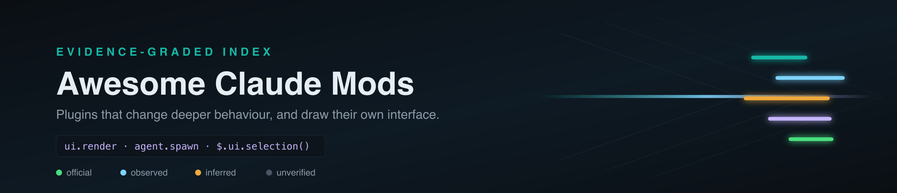

  

<h1 align="center">Hervorragende Claude-Mods</h1>

<b>Das evidenzbasiert bewertete Verzeichnis der Claude-Code-Mods und -Plugins sowie des tiefergehenden Verhaltens, das sie verändern.</b>

  
  
  
  
  
  

<a href="../README.md">English</a> · <a href="README.zh-CN.md">简体中文</a> · <a href="README.zh-TW.md">繁體中文</a> · <a href="README.ja.md">日本語</a> · <a href="README.ko.md">한국어</a> · <a href="README.es.md">Español</a> · <a href="README.fr.md">Français</a> · <b>Deutsch</b> · <a href="README.pt-BR.md">Português</a> · <a href="README.ru.md">Русский</a> · <a href="README.it.md">Italiano</a> · <a href="README.ar.md">العربية</a> · <a href="README.hi.md">हिन्दी</a> · <a href="README.tr.md">Türkçe</a> · <a href="README.vi.md">Tiếng Việt</a> · <a href="README.th.md">ไทย</a> · <a href="README.id.md">Bahasa Indonesia</a> · <a href="README.pl.md">Polski</a> · <a href="README.nl.md">Nederlands</a> · <a href="README.uk.md">Українська</a>

> [!NOTE]
> **Aktuelles Verzeichnis** · Letzte Synchronisierung: `2026-10-11T12:27:08+08:00` (UTC+8)
> · Einträge: **592** · Mit der letzten Aktualisierung hinzugefügt: **0** · Implementierungssprachen: **13**

Jeder Eintrag unten wurde automatisch erfasst, gefiltert und erneut überprüft. Nichts davon ist bezahlte Platzierung.

## Auswahl des Augenblicks

Ein Eintrag pro Kategorie, sortiert nach Evidenzgrad und Sternen und bei jeder Aktualisierung neu berechnet. Eine Rangliste, keine Empfehlung; jede Auswahl führt weiter zur vollständigen Karte unten. Projekte, die einen Screenshot oder eine Aufzeichnung veröffentlicht haben, werden bevorzugt, damit die Leiste visuell bleibt.

<table>
<tr>
<td width="50%" valign="top">

<b>🏛️ <a href="https://github.com/anthropics/claude-code-action">anthropics/claude-code-action</a></b>
⭐9469 · TypeScript · ✅ official
</td>
<td width="50%" valign="top">

<b>🧩 <a href="https://github.com/alexgreensh/token-optimizer">alexgreensh/token-optimizer</a></b>
⭐2533 · Python · 👁️ observed
Finde die Geister-Token. Behebe sie. Überlebe die Komprimierung. Vermeide den Verfall der Kontextqualität.
</td>
</tr>
<tr>
<td width="50%" valign="top">

<b>🧵 <a href="https://github.com/ruvnet/ruflo">ruvnet/ruflo</a></b>
⭐74299 · TypeScript · 👁️ observed
🌊 Der ursprüngliche Agent-Harness. Setze intelligente Multiplayer-Schwärme ein, koordiniere autonome Workflows und entwickle konversationelle KI-Systeme. Mit…
</td>
<td width="50%" valign="top">
<b>📰 <a href="https://news.ycombinator.com/item?id=49925102">Claude Code Mods</a></b>
⭐6 · 👁️ observed
</td>
</tr>
</table>

## Inhalt

- [Was ein Claude-Code-Mod ist](#was-ein-claude-code-mod-ist)
- [Wie Einträge bewertet werden](#wie-einträge-bewertet-werden)
- [Offiziell: Eigene Repositories und Release Notes von Anthropic](#offiziell-eigene-repositories-und-release-notes-von-anthropic) — **16**
- [Mods: mit der Mod-Funktion erstellt](#mods-mit-der-mod-funktion-erstellt) — **470**
- [DSH- und Cordis-Plugin-Ökosysteme](#dsh--und-cordis-plugin-ökosysteme) — **95**
- [Texte, Diskussionen und Videos](#texte-diskussionen-und-videos) — **11**
- [Projekte nach Implementierungssprache](#projekte-nach-implementierungssprache)

## Was ein Claude-Code-Mod ist

Claude Code erhielt in Version 2.1.287 **Mods**: Erweiterungen, die tiefer in das Verhalten eingreifen können als ein Plugin und ihre eigene Benutzeroberfläche zeichnen.

Ein Mod kann sich in `ui.render` einklinken, um eine **Zeile, Leiste, einen Bereich oder eine Karte** rund um die Eingabeaufforderung zu zeichnen, den zuletzt mit `$.ui.selection()` ausgewählten Text lesen, mit `agent.spawn` Teammitglieder starten und einen `Client`-Bereich verwalten. Wenn ein Mod beim Zeichnen scheitert, fällt nur er selbst aus — `ui.fault` verhindert, dass ein defekter Mod die Sitzung beendet.

Diese Liste umfasst Mods, die Plugin- und Hook-Schnittstelle, auf der sie aufbauen, sowie die Entsprechungen in DSH und Cordis. Das weitere Claude Code-Ökosystem wird bewusst **nicht** abgedeckt: Ein Prompt-Paket ist kein Mod.

## Wie Einträge bewertet werden

Die meisten Listen in diesem Bereich behaupten lediglich, was dazugehört. Diese hier zeigt, wie viel tatsächlich überprüft wurde, und ermöglicht anschließend eine entsprechende Filterung. Eine Einstufung beschreibt die Belege, nicht die Qualität des Projekts — ein gut entwickelter Mod, über den bisher niemand geschrieben hat, ist weiterhin `inferred`.

| Bewertung                                                                                      | Bedeutung                                                                                                                                                                                                                               |
| ---------------------------------------------------------------------------------------------- | --------------------------------------------------------------------------------------------------------------------------------------------------------------------------------------------------------------------------------------- |
| `von Anthropic selbst veröffentlicht`                                                          | Von Anthropic selbst veröffentlicht oder direkt aus dem offiziellen Changelog übernommen.                                                                                                                                               |
| `der eigene Text nennt einen Mod API oder erklärt die Mod-Funktionalität`                      | Der eigene Text nennt einen Teil der Mod-Schnittstelle — `ui.render`, `ui.fault`, `agent.spawn`, `$.ui.selection()`, einen Bereich, eine Leiste oder eine Karte — und beschreibt damit etwas, das gegen die echte API entwickelt wurde. |
| `nennt einen Mod, ein Plugin oder einen Hook, aber nichts speziell über die Mod-Schnittstelle` | Bezeichnet sich selbst als Mod, Plugin oder Hook, aber nichts im Text nennt die Mod-Schnittstelle ausdrücklich. Echt, aber unbestätigt.                                                                                                 |
| `allein aufgrund des Vokabulars gefunden`                                                      | Allein aufgrund des Vokabulars gefunden. Aufgenommen, damit der Filter überprüfbar ist, nicht weil der Eintrag als zutreffend gilt.                                                                                                     |

## Offiziell: Eigene Repositories und Release Notes von Anthropic

Eigene Claude-Code-Repositories von Anthropic sowie die Releases, die die Mod-Oberfläche definiert haben. Aus der Quelle gelesen statt zusammengefasst.

🏛️ <b><a href="https://github.com/anthropics/claude-code">anthropics/claude-code</a></b> · ⭐150091 · TypeScript · ✅ official · 0 天

##### 📝 Zusammenfassung

Claude Code ist ein agentisches Programmierwerkzeug, das in deinem Terminal ausgeführt wird, deine Codebasis versteht und dich durch die Ausführung routinemäßiger Aufgaben, die Erklärung komplexen Codes und die Verwaltung von Git-Workflows schneller programmieren lässt – alles über Befehle in natürlicher Sprache.

🔧 Im Code gefunden: `feed.xml`

##### 📌 Grundlegende Fakten

| Feld      | Wert                                                             |
| --------- | ---------------------------------------------------------------- |
| Kategorie | `Offiziell: Eigene Repositories und Release Notes von Anthropic` |
| Beleg     | `von Anthropic selbst veröffentlicht`                            |
| Sprache   | TypeScript                                                       |

##### 📊 Daten

| Messwert          | Wert       |
| ----------------- | ---------- |
| Sterne            | **150091** |
| Letzter Push      | 2026-10-10 |
| Erstmals gelistet | 2026-10-04 |

🏛️ <b><a href="https://github.com/anthropics/claude-code-action">anthropics/claude-code-action</a></b> · ⭐9469 · TypeScript · ✅ official · 1 天

##### 📝 Zusammenfassung

Es wurde keine Beschreibung vom Upstream veröffentlicht.

##### 📌 Grundlegende Fakten

| Feld      | Wert                                                             |
| --------- | ---------------------------------------------------------------- |
| Kategorie | `Offiziell: Eigene Repositories und Release Notes von Anthropic` |
| Beleg     | `von Anthropic selbst veröffentlicht`                            |
| Sprache   | TypeScript                                                       |

##### 📊 Daten

| Messwert          | Wert       |
| ----------------- | ---------- |
| Sterne            | **9469**   |
| Letzter Push      | 2026-10-09 |
| Erstmals gelistet | 2026-10-04 |

---

<table><tr><th align="center" width="50%">🖼 Bild</th><th align="center" width="50%">🎬 Video</th></tr><tr>
<td align="center" valign="top"></td>
<td align="center" valign="top">keine Medien veröffentlicht</td>
</tr></table>

🏛️ <b><a href="https://github.com/anthropics/claude-agent-sdk-python">anthropics/claude-agent-sdk-python</a></b> · ⭐8246 · Python · ✅ official · 1 天

##### 📝 Zusammenfassung

Es wurde keine Beschreibung vom Upstream veröffentlicht.

##### 📌 Grundlegende Fakten

| Feld      | Wert                                                             |
| --------- | ---------------------------------------------------------------- |
| Kategorie | `Offiziell: Eigene Repositories und Release Notes von Anthropic` |
| Beleg     | `von Anthropic selbst veröffentlicht`                            |
| Sprache   | Python                                                           |

##### 📊 Daten

| Messwert          | Wert       |
| ----------------- | ---------- |
| Sterne            | **8246**   |
| Letzter Push      | 2026-10-09 |
| Erstmals gelistet | 2026-10-04 |

🏛️ <b><a href="https://github.com/anthropics/claude-code-security-review">anthropics/claude-code-security-review</a></b> · ⭐6337 · Python · ✅ official · 241 天

##### 📝 Zusammenfassung

Eine KI-gestützte Sicherheitsprüfungs-GitHub-Action, die Claude verwendet, um Codeänderungen auf Sicherheitslücken zu analysieren.

##### 📌 Grundlegende Fakten

| Feld      | Wert                                                             |
| --------- | ---------------------------------------------------------------- |
| Kategorie | `Offiziell: Eigene Repositories und Release Notes von Anthropic` |
| Beleg     | `von Anthropic selbst veröffentlicht`                            |
| Sprache   | Python                                                           |

##### 📊 Daten

| Messwert          | Wert       |
| ----------------- | ---------- |
| Sterne            | **6337**   |
| Letzter Push      | 2026-02-11 |
| Erstmals gelistet | 2026-10-04 |

🏛️ <b><a href="https://github.com/anthropics/claude-agent-sdk-typescript">anthropics/claude-agent-sdk-typescript</a></b> · ⭐1798 · Shell · ✅ official · 1 天

##### 📝 Zusammenfassung

Es wurde keine Beschreibung vom Upstream veröffentlicht.

##### 📌 Grundlegende Fakten

| Feld      | Wert                                                             |
| --------- | ---------------------------------------------------------------- |
| Kategorie | `Offiziell: Eigene Repositories und Release Notes von Anthropic` |
| Beleg     | `von Anthropic selbst veröffentlicht`                            |
| Sprache   | Shell                                                            |

##### 📊 Daten

| Messwert          | Wert       |
| ----------------- | ---------- |
| Sterne            | **1798**   |
| Letzter Push      | 2026-10-09 |
| Erstmals gelistet | 2026-10-04 |

🏛️ <b><a href="https://github.com/anthropics/model-cards">anthropics/model-cards</a></b> · ⭐25 · ✅ official · 309 天

##### 📝 Zusammenfassung

Zusatzmaterialien für Claude Model Cards

##### 📌 Grundlegende Fakten

| Feld      | Wert                                                             |
| --------- | ---------------------------------------------------------------- |
| Kategorie | `Offiziell: Eigene Repositories und Release Notes von Anthropic` |
| Beleg     | `von Anthropic selbst veröffentlicht`                            |

##### 📊 Daten

| Messwert          | Wert       |
| ----------------- | ---------- |
| Sterne            | **25**     |
| Letzter Push      | 2025-12-05 |
| Erstmals gelistet | 2026-10-05 |

🏛️ <b><a href="https://github.com/anthropics/claude-code/blob/main/CHANGELOG.md">Claude Code 2.1.287 — the mod surface</a></b> · ✅ official

##### 📝 Zusammenfassung

Claude Mods hinzugefügt: Plugins können nun tieferes Verhalten verändern. „You should know“ hinzugefügt, ein integriertes Mod, bei dem ein Seitenagent dir den Rücken freihält und auf Dinge hinweist, die du oder Claude übersehen könnten. Mit `/plugin enable cc-plugin-you-should-know@builtin` aktivieren (für First-Party-Sitzungen mit aktivierter Telemetrie)

##### 📌 Grundlegende Fakten

| Feld      | Wert                                                             |
| --------- | ---------------------------------------------------------------- |
| Kategorie | `Offiziell: Eigene Repositories und Release Notes von Anthropic` |
| Beleg     | `von Anthropic selbst veröffentlicht`                            |

##### 📊 Daten

| Messwert          | Wert       |
| ----------------- | ---------- |
| Erstmals gelistet | 2026-10-04 |

🏛️ <b><a href="https://github.com/anthropics/claude-code/blob/main/CHANGELOG.md">Claude Code 2.1.288 — the mod surface</a></b> · ✅ official

##### 📝 Zusammenfassung

`$.ui.selection()` für Mods hinzugefügt: Gibt den zuletzt im Vollbildmodus ausgewählten Text zurück und, wenn die Auswahl innerhalb einer Transkriptzeile liegt, diese Zeile. Behoben: Die Schaltfläche eines Mods führte beim Drücken in einer Ansicht, die vor dem Neustart von Claude Code gezeichnet wurde, manchmal die Aktion einer anderen Schaltfläche aus. Behoben: Vollbildsitzungen wurden beim Öffnen des Dialogs für Hintergrundaufgaben mit „unrecoverable interface error“ beendet, wenn ein Plugin oder Mod Zeilen über der Eingabe anzeigte. Behoben: `claude plugin test` meldete Mods aus der Ferne als deaktiviert, obwohl lediglich eine veraltete gespeicherte Einstellung gelesen worden war

##### 📌 Grundlegende Fakten

| Feld      | Wert                                                             |
| --------- | ---------------------------------------------------------------- |
| Kategorie | `Offiziell: Eigene Repositories und Release Notes von Anthropic` |
| Beleg     | `von Anthropic selbst veröffentlicht`                            |

##### 📊 Daten

| Messwert          | Wert       |
| ----------------- | ---------- |
| Erstmals gelistet | 2026-10-04 |

🏛️ <b><a href="https://github.com/anthropics/claude-code/blob/main/CHANGELOG.md">Claude Code 2.1.289 — the mod surface</a></b> · ✅ official

##### 📝 Zusammenfassung

Behoben: Eine Verweigerungs- oder Abfrageregel für einen verschachtelten Teil eines zusammengesetzten Shell-Befehls blieb auf verwalteten Rechnern nicht über die Genehmigung eines benutzerinstallierten Mods hinweg bestehen. Behoben: Installierte Mods wurden in der ersten Sitzung nach einem Upgrade nicht geladen. `agent.spawn` für Teammitglieder hinzugefügt, eine Agenten-ID über Plugin-Hook-Ereignisse hinweg sowie in den Zuständen „idle“ und „waiting“ in `$.agent.list()`. Behoben: Sitzungen wurden mit „unrecoverable interface error“ beendet, wenn ein Wert, den der `ui.render`-Hook eines Mods schrieb, beim Zeichnen einen Fehler in einer Zeile verursachte; die Engine zeichnet nun stattdessen ihre eigene Zeile. Behoben: Rechtsbündiger Inhalt im Bereich oder Band eines Mods wurde unter dem Schließen-Symbol oder `\[-\]` gezeichnet, wh

##### 📌 Grundlegende Fakten

| Feld      | Wert                                                             |
| --------- | ---------------------------------------------------------------- |
| Kategorie | `Offiziell: Eigene Repositories und Release Notes von Anthropic` |
| Beleg     | `von Anthropic selbst veröffentlicht`                            |

##### 📊 Daten

| Messwert          | Wert       |
| ----------------- | ---------- |
| Erstmals gelistet | 2026-10-04 |

🏛️ <b><a href="https://github.com/anthropics/claude-code/blob/main/CHANGELOG.md">Claude Code 2.1.290 — the mod surface</a></b> · ✅ official

##### 📝 Zusammenfassung

`serverToolUses` zum Ergebnis des Hooks `turn.step` eines Mods hinzugefügt: Das Tool ruft API selbst auf (den Advisor), jeweils mit ID, Name, Eingabe, Start und Ende. `ceiling` zur Frage und zum Urteil hinzugefügt, die der Hook `tool.check` eines Mods liest, wobei die Genehmigung benannt wird, die eine Organisation für ein Tool verlangt. Die Typen `ThemeKey` und `Color` zu den Plugin-Hook-Typdefinitionen hinzugefügt, damit ein Editor die Theme-Farben auflistet, die die Darstellung eines Mods benennen kann. Zu `claude plugin validate` hinzugefügt: Jeder Hook, den ein Mod an einer Prüfstelle registriert, wird mit der Information aufgelistet, ob er über ein `.catch` verfügt (`gatingHooks` unter `--json`). Das Ergebnis `turn.step` eines Mods korrigiert.

##### 📌 Grundlegende Fakten

| Feld      | Wert                                                             |
| --------- | ---------------------------------------------------------------- |
| Kategorie | `Offiziell: Eigene Repositories und Release Notes von Anthropic` |
| Beleg     | `von Anthropic selbst veröffentlicht`                            |

##### 📊 Daten

| Messwert          | Wert       |
| ----------------- | ---------- |
| Erstmals gelistet | 2026-10-06 |

🏛️ <b><a href="https://github.com/anthropics/claude-code/blob/main/CHANGELOG.md">Claude Code 2.1.292 — the mod surface</a></b> · ✅ official

##### 📝 Zusammenfassung

`prompt.autocomplete` hinzugefügt, ein Ereignis, an das sich ein Mod hängt, um der Autovervollständigungsliste der Prompt-Box eigene Zeilen hinzuzufügen. Prompt-Caching zu `$.model.complete` für Mods hinzugefügt: `prompt` und `system` nehmen Textblöcke entgegen, und `cache: true` auf einem Block cached die Anfrage bis dorthin. Workflow-Agenten zum `agent.spawn`-Mod-Hook hinzugefügt, mit ihrem Lauf und Index, damit ein Mod sie ablehnen kann. Write-, Edit-, NotebookEdit- und LSP-Zeilen sowie einzelne Read-, Grep- und Glob-Zeilen korrigiert, die verbergen, warum ein Mod den Aufruf verweigert hat: Die Zeile zeigt nun den Grund. Einen `config.set`-, `state.set`-, `env.set`- oder `agent.spawn`-Hook eines Mods korrigiert, der ablehnt, nachde

##### 📌 Grundlegende Fakten

| Feld      | Wert                                                             |
| --------- | ---------------------------------------------------------------- |
| Kategorie | `Offiziell: Eigene Repositories und Release Notes von Anthropic` |
| Beleg     | `von Anthropic selbst veröffentlicht`                            |

##### 📊 Daten

| Messwert          | Wert       |
| ----------------- | ---------- |
| Erstmals gelistet | 2026-10-07 |

🏛️ <b><a href="https://github.com/anthropics/claude-code/blob/main/CHANGELOG.md">Claude Code 2.1.293 — the mod surface</a></b> · ✅ official

##### 📝 Zusammenfassung

`isDeferred` zu `$.tool.register` für Mods hinzugefügt: `false` listet das Schema des Tools von Anfang an im Prompt statt hinter der Tool-Suche auf. Einen Mod-Hook für `classic.*`-Ereignisse korrigiert, der übersprungen wurde, während der Plugin-Hooks-Worker neu gestartet wurde, wodurch Settings-Hooks ohne ihn antworten mussten. `claude plugin test` behoben, das bei Mods fehlschlug, die `$.session.append` aufrufen; Tests können die angehängten Zeilen mit dem neuen `mock.session` wieder einlesen.

##### 📌 Grundlegende Fakten

| Feld      | Wert                                                             |
| --------- | ---------------------------------------------------------------- |
| Kategorie | `Offiziell: Eigene Repositories und Release Notes von Anthropic` |
| Beleg     | `von Anthropic selbst veröffentlicht`                            |

##### 📊 Daten

| Messwert          | Wert       |
| ----------------- | ---------- |
| Erstmals gelistet | 2026-10-08 |

🏛️ <b><a href="https://github.com/Enc-hanted/dsh-pulse">Enc-hanted/dsh-pulse</a></b> · ⭐3 · JavaScript · 🔎 inferred · 0 天

##### 📝 Zusammenfassung

Cross-session usage & cost observatory for the DeepSeek Harness web profile — trend/heatmap dashboards, per-model peak-hour pricing (CNY/USD), official DeepSeek balance with spend reconciliation.

##### 📌 Grundlegende Fakten

| Feld      | Wert                                                                                           |
| --------- | ---------------------------------------------------------------------------------------------- |
| Kategorie | `Offiziell: Eigene Repositories und Release Notes von Anthropic`                               |
| Beleg     | `nennt einen Mod, ein Plugin oder einen Hook, aber nichts speziell über die Mod-Schnittstelle` |
| Sprache   | JavaScript                                                                                     |

##### 📊 Daten

| Messwert          | Wert       |
| ----------------- | ---------- |
| Sterne            | **3**      |
| Letzter Push      | 2026-10-11 |
| Erstmals gelistet | 2026-10-11 |

🏷 `billing` · `cordis` · `cost` · `cost-estimation` · `dashboard` · `deepseek` · `deepseek-harness` · `dsh-plugin`

---

<table><tr><th align="center" width="50%">🖼 Bild</th><th align="center" width="50%">🎬 Video</th></tr><tr>
<td align="center" valign="top"></td>
<td align="center" valign="top">keine Medien veröffentlicht</td>
</tr></table>

🏛️ <b><a href="https://github.com/MIHassan3/DSH-Launcher">MIHassan3/DSH-Launcher</a></b> · ⭐3 · JavaScript · 🔎 inferred · 0 天

##### 📝 Zusammenfassung

Dies ist ein Launcher für das offizielle DeepSeek Harness. Keine Änderungen; er startet lediglich, was DeepSeek entwickelt.

##### 📌 Grundlegende Fakten

| Feld      | Wert                                                                                           |
| --------- | ---------------------------------------------------------------------------------------------- |
| Kategorie | `Offiziell: Eigene Repositories und Release Notes von Anthropic`                               |
| Beleg     | `nennt einen Mod, ein Plugin oder einen Hook, aber nichts speziell über die Mod-Schnittstelle` |
| Sprache   | JavaScript                                                                                     |

##### 📊 Daten

| Messwert          | Wert       |
| ----------------- | ---------- |
| Sterne            | **3**      |
| Letzter Push      | 2026-10-10 |
| Erstmals gelistet | 2026-10-10 |

🏷 `ai-agent` · `ai-agents` · `ai-tools` · `cordis` · `deepseek` · `deepseek-harness` · `dsh` · `dsh-desktop`

---

<table><tr><th align="center" width="50%">🖼 Bild</th><th align="center" width="50%">🎬 Video</th></tr><tr>
<td align="center" valign="top"></td>
<td align="center" valign="top">keine Medien veröffentlicht</td>
</tr></table>

<b>Mehr in dieser Kategorie</b> · 2

- [Claude Code 2.1.295 — the mod surface](https://github.com/anthropics/claude-code/blob/main/CHANGELOG.md) - `$.ui.notify` für Mods hinzugefügt: sendet über deine eigene…
- [Claude Code 2.1.296 — the mod surface](https://github.com/anthropics/claude-code/blob/main/CHANGELOG.md) - Behoben: Esc oder ein Interrupt während eines `UserPromptSubmit`-Hooks oder des…

## Mods: mit der Mod-Funktion erstellt

Jeder Eintrag hier belegt die Verwendung der Funktion, die Claude Code in 2.1.287 erhalten hat: Er zeichnet über `ui.render`, besitzt ein Pane, Band oder eine Karte, liest `$.ui.selection()`, startet mit `agent.spawn` Teammitglieder oder bezeichnet sich ausdrücklich als Mod.

🧩 <b><a href="https://github.com/alexgreensh/token-optimizer">alexgreensh/token-optimizer</a></b> · ⭐2533 · Python · 👁️ observed · 0 天

##### 📝 Zusammenfassung

Finde die Geister-Token. Behebe sie. Überlebe die Komprimierung. Vermeide den Verfall der Kontextqualität.

##### 📌 Grundlegende Fakten

| Feld      | Wert                                                                      |
| --------- | ------------------------------------------------------------------------- |
| Kategorie | `Mods: mit der Mod-Funktion erstellt`                                     |
| Beleg     | `der eigene Text nennt einen Mod API oder erklärt die Mod-Funktionalität` |
| Sprache   | Python                                                                    |

##### 📊 Daten

| Messwert          | Wert       |
| ----------------- | ---------- |
| Sterne            | **2533**   |
| Letzter Push      | 2026-10-10 |
| Erstmals gelistet | 2026-10-11 |

🏷 `agentskills` · `claude-code` · `claude-code-mod` · `claude-code-skill` · `claude-plugin` · `codex` · `context-engineering` · `context-window`

---

<table><tr><th align="center" width="50%">🖼 Bild</th><th align="center" width="50%">🎬 Video</th></tr><tr>
<td align="center" valign="top"></td>
<td align="center" valign="top"> animierte Aufzeichnung</td>
</tr></table>

Das Asset wird per Hotlink aus dem Upstream-Repository eingebunden, da keine lizenzfreundliche Weiterverwendungslizenz angegeben wurde.

🧩 <b><a href="https://github.com/karanb192/awesome-claude-code-mods">karanb192/awesome-claude-code-mods</a></b> · ⭐474 · JavaScript · 👁️ observed · 0 天

##### 📝 Zusammenfassung

Community-Katalog öffentlicher Claude Code-Mods (Funktions-Hooks), aus GitHub gescannt, einschließlich der Informationen, was jeder Mod lesen, schreiben, ausführen oder über das Netzwerk senden kann. https://mods.aidojo.si/ durchsuchen

🔧 Im Code gefunden: `data/seeds.txt`, `data/duplicates.txt`, `data/repos.txt`

##### 📌 Grundlegende Fakten

| Feld      | Wert                                                                      |
| --------- | ------------------------------------------------------------------------- |
| Kategorie | `Mods: mit der Mod-Funktion erstellt`                                     |
| Beleg     | `der eigene Text nennt einen Mod API oder erklärt die Mod-Funktionalität` |
| Sprache   | JavaScript                                                                |

##### 📊 Daten

| Messwert          | Wert       |
| ----------------- | ---------- |
| Sterne            | **474**    |
| Letzter Push      | 2026-10-11 |
| Erstmals gelistet | 2026-10-04 |

🏷 `anthropic` · `awesome` · `awesome-list` · `claude` · `claude-code` · `claude-code-hooks` · `claude-code-mods` · `claude-code-plugin`

🧩 <b><a href="https://github.com/hamzafer/claude-code-mods">hamzafer/claude-code-mods</a></b> · ⭐182 · TypeScript · 👁️ observed · 1 天

##### 📝 Zusammenfassung

Claude Code-Mods: Plugins auf Basis von Hooks, die Live-Zeilen über dem Prompt, Guards, Panes und Spiele hinzufügen. Kontextleiste, Nutzungsanzeige, Codex Review Watch, Markdown-Vorschau, Spotify Now Playing und mehr.

🔧 Im Code gefunden: `mods/next-steps/hooks/register.tsx`, `mods/agent-radar/hooks/register.tsx`

##### 📌 Grundlegende Fakten

| Feld      | Wert                                                                      |
| --------- | ------------------------------------------------------------------------- |
| Kategorie | `Mods: mit der Mod-Funktion erstellt`                                     |
| Beleg     | `der eigene Text nennt einen Mod API oder erklärt die Mod-Funktionalität` |
| Sprache   | TypeScript                                                                |

##### 📊 Daten

| Messwert          | Wert       |
| ----------------- | ---------- |
| Sterne            | **182**    |
| Letzter Push      | 2026-10-09 |
| Erstmals gelistet | 2026-10-04 |

🏷 `ai-agents` · `anthropic` · `claude` · `claude-code` · `claude-code-mod` · `claude-code-mods` · `claude-code-plugins` · `developer-tools`

---

<table><tr><th align="center" width="50%">🖼 Bild</th><th align="center" width="50%">🎬 Video</th></tr><tr>
<td align="center" valign="top"></td>
<td align="center" valign="top"> animierte Aufzeichnung</td>
</tr></table>

🧩 <b><a href="https://github.com/karanb192/cache-tax">karanb192/cache-tax</a></b> · ⭐119 · TypeScript · 👁️ observed · 6 天

##### 📝 Zusammenfassung

Halte den Prompt-Cache von Claude Code während Pausen warm und zeige die geschätzten Kosten vor dem Senden nach einem Kaltstart an.

##### 📌 Grundlegende Fakten

| Feld      | Wert                                                                      |
| --------- | ------------------------------------------------------------------------- |
| Kategorie | `Mods: mit der Mod-Funktion erstellt`                                     |
| Beleg     | `der eigene Text nennt einen Mod API oder erklärt die Mod-Funktionalität` |
| Sprache   | TypeScript                                                                |

##### 📊 Daten

| Messwert          | Wert       |
| ----------------- | ---------- |
| Sterne            | **119**    |
| Letzter Push      | 2026-10-04 |
| Erstmals gelistet | 2026-10-10 |

🏷 `claude-code` · `claude-code-plugin` · `claude-mods` · `function-hooks` · `prompt-caching`

---

<table><tr><th align="center" width="50%">🖼 Bild</th><th align="center" width="50%">🎬 Video</th></tr><tr>
<td align="center" valign="top"></td>
<td align="center" valign="top"> animierte Aufzeichnung · <a href="https://raw.githubusercontent.com/karanb192/cache-tax/main/docs/assets/cache-cost-explainer.mp4">Video öffnen</a></td>
</tr></table>

🧩 <b><a href="https://github.com/HeyCubit/effortless">HeyCubit/effortless</a></b> · ⭐110 · HTML · 👁️ observed · 0 天

##### 📝 Zusammenfassung

Claude Code-Mod: Wählt für jeden Prompt den Denkaufwand aus, zeigt Prompt-Cache und Kontext an und übergibt oder komprimiert mit einem Klick

🔧 Im Code gefunden: `docs/agent-panel/PLAN.md`, `hooks/register.tsx`

##### 📌 Grundlegende Fakten

| Feld      | Wert                                                                      |
| --------- | ------------------------------------------------------------------------- |
| Kategorie | `Mods: mit der Mod-Funktion erstellt`                                     |
| Beleg     | `der eigene Text nennt einen Mod API oder erklärt die Mod-Funktionalität` |
| Sprache   | HTML                                                                      |

##### 📊 Daten

| Messwert          | Wert       |
| ----------------- | ---------- |
| Sterne            | **110**    |
| Letzter Push      | 2026-10-10 |
| Erstmals gelistet | 2026-10-11 |

🏷 `ai-tools` · `anthropic` · `claude` · `claude-code` · `claude-code-plugin` · `developer-tools` · `prompt-caching`

---

<table><tr><th align="center" width="50%">🖼 Bild</th><th align="center" width="50%">🎬 Video</th></tr><tr>
<td align="center" valign="top"></td>
<td align="center" valign="top"> animierte Aufzeichnung</td>
</tr></table>

🧩 <b><a href="https://github.com/awss1i/assay">awss1i/assay</a></b> · ⭐104 · HTML · 👁️ observed · 0 天

##### 📝 Zusammenfassung

Ein agentenorientiertes QA-CLI für Webseiten. Deterministisch, keine Tests zu schreiben, kein LLM.

##### 📌 Grundlegende Fakten

| Feld      | Wert                                                                      |
| --------- | ------------------------------------------------------------------------- |
| Kategorie | `Mods: mit der Mod-Funktion erstellt`                                     |
| Beleg     | `der eigene Text nennt einen Mod API oder erklärt die Mod-Funktionalität` |
| Sprache   | HTML                                                                      |

##### 📊 Daten

| Messwert          | Wert       |
| ----------------- | ---------- |
| Sterne            | **104**    |
| Letzter Push      | 2026-10-10 |
| Erstmals gelistet | 2026-10-10 |

🏷 `agentic-ai` · `ai-agents` · `browser-automation` · `claude-code` · `claude-code-mod` · `cli` · `code-generation` · `developer-tools`

🧩 <b><a href="https://github.com/hellosverre/claude-skins">hellosverre/claude-skins</a></b> · ⭐89 · TypeScript · 👁️ observed · 0 天

##### 📝 Zusammenfassung

Skins für Claude Code: Werkzeugzeilen mit Icons, Diff-, Tabellen- und Mermaid-Diagrammkarten, ein Nutzungsband und fünfzehn Themes. /skin wechselt sie live.

##### 📌 Grundlegende Fakten

| Feld      | Wert                                                                      |
| --------- | ------------------------------------------------------------------------- |
| Kategorie | `Mods: mit der Mod-Funktion erstellt`                                     |
| Beleg     | `der eigene Text nennt einen Mod API oder erklärt die Mod-Funktionalität` |
| Sprache   | TypeScript                                                                |

##### 📊 Daten

| Messwert          | Wert       |
| ----------------- | ---------- |
| Sterne            | **89**     |
| Letzter Push      | 2026-10-10 |
| Erstmals gelistet | 2026-10-10 |

🏷 `claude-code` · `claude-code-mod` · `claude-code-mods` · `claude-code-plugin` · `terminal` · `theme`

---

<table><tr><th align="center" width="50%">🖼 Bild</th><th align="center" width="50%">🎬 Video</th></tr><tr>
<td align="center" valign="top">keine Medien veröffentlicht</td>
<td align="center" valign="top"> animierte Aufzeichnung</td>
</tr></table>

🧩 <b><a href="https://github.com/Tickloop/claude-mods">Tickloop/claude-mods</a></b> · ⭐77 · TypeScript · 👁️ observed · 2 天

##### 📝 Zusammenfassung

Eine Sammlung von Claude-Code-Mods

##### 📌 Grundlegende Fakten

| Feld      | Wert                                                                      |
| --------- | ------------------------------------------------------------------------- |
| Kategorie | `Mods: mit der Mod-Funktion erstellt`                                     |
| Beleg     | `der eigene Text nennt einen Mod API oder erklärt die Mod-Funktionalität` |
| Sprache   | TypeScript                                                                |

##### 📊 Daten

| Messwert          | Wert       |
| ----------------- | ---------- |
| Sterne            | **77**     |
| Letzter Push      | 2026-10-08 |
| Erstmals gelistet | 2026-10-08 |

🧩 <b><a href="https://github.com/NahumLitvin/prismantis">NahumLitvin/prismantis</a></b> · ⭐74 · TypeScript · 👁️ observed · 0 天

##### 📝 Zusammenfassung

Farbenfrohe, anpassbare Claude Code-Antworten: Tabellen, Code, Diagramme, Grafiken und Tool-Zeilen in 15 Themes mit Kopierschaltflächen. Ein Claude Code-Mod.

##### 📌 Grundlegende Fakten

| Feld      | Wert                                                                      |
| --------- | ------------------------------------------------------------------------- |
| Kategorie | `Mods: mit der Mod-Funktion erstellt`                                     |
| Beleg     | `der eigene Text nennt einen Mod API oder erklärt die Mod-Funktionalität` |
| Sprache   | TypeScript                                                                |

##### 📊 Daten

| Messwert          | Wert       |
| ----------------- | ---------- |
| Sterne            | **74**     |
| Letzter Push      | 2026-10-10 |
| Erstmals gelistet | 2026-10-11 |

🏷 `claude-code` · `claude-code-mod` · `claude-code-plugin` · `markdown` · `mermaid` · `terminal` · `theme`

---

<table><tr><th align="center" width="50%">🖼 Bild</th><th align="center" width="50%">🎬 Video</th></tr><tr>
<td align="center" valign="top"></td>
<td align="center" valign="top"> animierte Aufzeichnung</td>
</tr></table>

🧩 <b><a href="https://github.com/darrell-tw/darrelltw-mods">darrell-tw/darrelltw-mods</a></b> · ⭐65 · HTML · 👁️ observed · 5 天

##### 📝 Zusammenfassung

Claude Code-Mods von Darrell Wang – Bänder über dem Prompt, null Modell-Tokens. Börsenübersichten für Taiwan／USA + weitere geplant.

##### 📌 Grundlegende Fakten

| Feld      | Wert                                                                      |
| --------- | ------------------------------------------------------------------------- |
| Kategorie | `Mods: mit der Mod-Funktion erstellt`                                     |
| Beleg     | `der eigene Text nennt einen Mod API oder erklärt die Mod-Funktionalität` |
| Sprache   | HTML                                                                      |

##### 📊 Daten

| Messwert          | Wert       |
| ----------------- | ---------- |
| Sterne            | **65**     |
| Letzter Push      | 2026-10-05 |
| Erstmals gelistet | 2026-10-04 |

🧩 <b><a href="https://github.com/scasella/claude-flightdeck">scasella/claude-flightdeck</a></b> · ⭐63 · TypeScript · 👁️ observed · 8 天

##### 📝 Zusammenfassung

Ein Claude Code-Mod, der ein Live-Agent-Dashboard in dein Terminal bringt: Kontext und Kosten, Berater-Zeitachse, jede Berechtigungsprüfung, Subagent-Karten und Swimlanes.

##### 📌 Grundlegende Fakten

| Feld      | Wert                                                                      |
| --------- | ------------------------------------------------------------------------- |
| Kategorie | `Mods: mit der Mod-Funktion erstellt`                                     |
| Beleg     | `der eigene Text nennt einen Mod API oder erklärt die Mod-Funktionalität` |
| Sprache   | TypeScript                                                                |

##### 📊 Daten

| Messwert          | Wert       |
| ----------------- | ---------- |
| Sterne            | **63**     |
| Letzter Push      | 2026-10-02 |
| Erstmals gelistet | 2026-10-10 |

🏷 `agent-observability` · `agent-visualization` · `anthropic` · `claude` · `claude-code` · `claude-code-mod` · `claude-code-mods` · `claude-code-plugin`

---

<table><tr><th align="center" width="50%">🖼 Bild</th><th align="center" width="50%">🎬 Video</th></tr><tr>
<td align="center" valign="top"></td>
<td align="center" valign="top"> animierte Aufzeichnung</td>
</tr></table>

🧩 <b><a href="https://github.com/0xDarkMatter/claude-mods">0xDarkMatter/claude-mods</a></b> · ⭐58 · Shell · 👁️ observed · 4 天

##### 📝 Zusammenfassung

Experten-Skills, Agenten, Befehle, Regeln, Hooks und Output Styles für Claude Code – Sitzungskontinuität plus moderne CLI-Werkzeuge für praxisnahe Entwicklungsworkflows

🔧 Im Code gefunden: `justfile`, `skills/auto-skill/SKILL.md`, `skills/task-runner/SKILL.md`, `skills/find-replace/SKILL.md`

##### 📌 Grundlegende Fakten

| Feld      | Wert                                                                      |
| --------- | ------------------------------------------------------------------------- |
| Kategorie | `Mods: mit der Mod-Funktion erstellt`                                     |
| Beleg     | `der eigene Text nennt einen Mod API oder erklärt die Mod-Funktionalität` |
| Sprache   | Shell                                                                     |

##### 📊 Daten

| Messwert          | Wert       |
| ----------------- | ---------- |
| Sterne            | **58**     |
| Letzter Push      | 2026-10-07 |
| Erstmals gelistet | 2026-10-04 |

🏷 `agent-skills` · `ai-agents` · `ai-tools` · `anthropic` · `claude` · `claude-code` · `claude-skills` · `developer-tools`

🧩 <b><a href="https://github.com/zycck/claude-mods">zycck/claude-mods</a></b> · ⭐46 · TypeScript · 👁️ observed · 2 天

##### 📝 Zusammenfassung

Claude Code-Mods: Live-Fortschrittsbalken für Pläne oberhalb des Prompts

##### 📌 Grundlegende Fakten

| Feld      | Wert                                                                      |
| --------- | ------------------------------------------------------------------------- |
| Kategorie | `Mods: mit der Mod-Funktion erstellt`                                     |
| Beleg     | `der eigene Text nennt einen Mod API oder erklärt die Mod-Funktionalität` |
| Sprache   | TypeScript                                                                |

##### 📊 Daten

| Messwert          | Wert       |
| ----------------- | ---------- |
| Sterne            | **46**     |
| Letzter Push      | 2026-10-08 |
| Erstmals gelistet | 2026-10-04 |

---

<table><tr><th align="center" width="50%">🖼 Bild</th><th align="center" width="50%">🎬 Video</th></tr><tr>
<td align="center" valign="top"></td>
<td align="center" valign="top"> animierte Aufzeichnung · <a href="https://raw.githubusercontent.com/zycck/claude-mods/main/media/plan-progress.mp4">Video öffnen</a></td>
</tr></table>

🧩 <b><a href="https://github.com/henrik-thevibe/Claude-Fables">henrik-thevibe/Claude-Fables</a></b> · ⭐32 · TypeScript · 👁️ observed · 8 天

##### 📝 Zusammenfassung

Sieh zu, wie Claude Code während deiner Arbeit einen kleinen Cartoon erstellt.

##### 📌 Grundlegende Fakten

| Feld      | Wert                                                                      |
| --------- | ------------------------------------------------------------------------- |
| Kategorie | `Mods: mit der Mod-Funktion erstellt`                                     |
| Beleg     | `der eigene Text nennt einen Mod API oder erklärt die Mod-Funktionalität` |
| Sprache   | TypeScript                                                                |

##### 📊 Daten

| Messwert          | Wert       |
| ----------------- | ---------- |
| Sterne            | **32**     |
| Letzter Push      | 2026-10-02 |
| Erstmals gelistet | 2026-10-10 |

🏷 `ai-narration` · `claude` · `claude-code` · `claude-code-plugin` · `claude-mod` · `claude-mods` · `developer-tools` · `fun`

---

<table><tr><th align="center" width="50%">🖼 Bild</th><th align="center" width="50%">🎬 Video</th></tr><tr>
<td align="center" valign="top"></td>
<td align="center" valign="top"> animierte Aufzeichnung</td>
</tr></table>

🧩 <b><a href="https://github.com/oikon48/prompt-rail">oikon48/prompt-rail</a></b> · ⭐27 · TypeScript · 👁️ observed · 7 天

##### 📝 Zusammenfassung

Eine Leiste mit den Prompts deiner Claude Code-Sitzung: Zum Lesen darüberfahren, zum Springen anklicken (Funktions-Hooks / Mods)

##### 📌 Grundlegende Fakten

| Feld      | Wert                                                                      |
| --------- | ------------------------------------------------------------------------- |
| Kategorie | `Mods: mit der Mod-Funktion erstellt`                                     |
| Beleg     | `der eigene Text nennt einen Mod API oder erklärt die Mod-Funktionalität` |
| Sprache   | TypeScript                                                                |

##### 📊 Daten

| Messwert          | Wert       |
| ----------------- | ---------- |
| Sterne            | **27**     |
| Letzter Push      | 2026-10-03 |
| Erstmals gelistet | 2026-10-04 |

🏷 `claude-code` · `claude-code-plugin` · `claude-mods` · `function-hooks`

---

<table><tr><th align="center" width="50%">🖼 Bild</th><th align="center" width="50%">🎬 Video</th></tr><tr>
<td align="center" valign="top"></td>
<td align="center" valign="top"> animierte Aufzeichnung</td>
</tr></table>

🧩 <b><a href="https://github.com/NovusEdge/glowup">NovusEdge/glowup</a></b> · ⭐23 · TypeScript · 👁️ observed · 0 天

##### 📝 Zusammenfassung

Eine Aufwertung für Claude Code: ein Live-Cockpit-Bereich, teilbare Themes und ein Pixel-Haustier, das darstellt, was Claude gerade tut

##### 📌 Grundlegende Fakten

| Feld      | Wert                                                                      |
| --------- | ------------------------------------------------------------------------- |
| Kategorie | `Mods: mit der Mod-Funktion erstellt`                                     |
| Beleg     | `der eigene Text nennt einen Mod API oder erklärt die Mod-Funktionalität` |
| Sprache   | TypeScript                                                                |

##### 📊 Daten

| Messwert          | Wert       |
| ----------------- | ---------- |
| Sterne            | **23**     |
| Letzter Push      | 2026-10-10 |
| Erstmals gelistet | 2026-10-11 |

🏷 `ai-coding` · `anthropic` · `claude` · `claude-code` · `claude-code-mod` · `developer-tools` · `eye-candy` · `terminal`

---

<table><tr><th align="center" width="50%">🖼 Bild</th><th align="center" width="50%">🎬 Video</th></tr><tr>
<td align="center" valign="top"></td>
<td align="center" valign="top"> animierte Aufzeichnung</td>
</tr></table>

🧩 <b><a href="https://github.com/artemnovichkov/xcode-mods">artemnovichkov/xcode-mods</a></b> · ⭐20 · TypeScript · 👁️ observed · 8 天

##### 📝 Zusammenfassung

Xcodes Build, Tests, Konsole und SwiftUI-Previews innerhalb von Claude Code

##### 📌 Grundlegende Fakten

| Feld      | Wert                                                                      |
| --------- | ------------------------------------------------------------------------- |
| Kategorie | `Mods: mit der Mod-Funktion erstellt`                                     |
| Beleg     | `der eigene Text nennt einen Mod API oder erklärt die Mod-Funktionalität` |
| Sprache   | TypeScript                                                                |

##### 📊 Daten

| Messwert          | Wert       |
| ----------------- | ---------- |
| Sterne            | **20**     |
| Letzter Push      | 2026-10-02 |
| Erstmals gelistet | 2026-10-04 |

🏷 `claude-code` · `claude-code-mods` · `claude-code-plugin` · `ghostty` · `ios` · `mcp` · `swift` · `swiftui`

---

<table><tr><th align="center" width="50%">🖼 Bild</th><th align="center" width="50%">🎬 Video</th></tr><tr>
<td align="center" valign="top"></td>
<td align="center" valign="top">keine Medien veröffentlicht</td>
</tr></table>

🧩 <b><a href="https://github.com/lemomo-ai/lemo-mod">lemomo-ai/lemo-mod</a></b> · ⭐20 · TypeScript · 👁️ observed · 6 天

##### 📝 Zusammenfassung

Claude Code-Mods: 21 Stile und ein vollständiger Funktionsumfang, den du bei Bedarf für Terminal und Desktop-App aktivierst. · Verpasse Claude mit einem Klick einen neuen Stil und erhalte einen vollständigen Satz bedarfsgesteuert aktivierbarer Funktionen.

##### 📌 Grundlegende Fakten

| Feld      | Wert                                                                      |
| --------- | ------------------------------------------------------------------------- |
| Kategorie | `Mods: mit der Mod-Funktion erstellt`                                     |
| Beleg     | `der eigene Text nennt einen Mod API oder erklärt die Mod-Funktionalität` |
| Sprache   | TypeScript                                                                |

##### 📊 Daten

| Messwert          | Wert       |
| ----------------- | ---------- |
| Sterne            | **20**     |
| Letzter Push      | 2026-10-04 |
| Erstmals gelistet | 2026-10-04 |

🏷 `claude` · `claude-code` · `claude-code-mods` · `claude-code-plugins` · `developer-tools` · `mods` · `pixel-art` · `terminal`

---

<table><tr><th align="center" width="50%">🖼 Bild</th><th align="center" width="50%">🎬 Video</th></tr><tr>
<td align="center" valign="top"></td>
<td align="center" valign="top">keine Medien veröffentlicht</td>
</tr></table>

🧩 <b><a href="https://github.com/promptadvisers/claude-mods-starter-kit">promptadvisers/claude-mods-starter-kit</a></b> · ⭐20 · JavaScript · 👁️ observed · 8 天

##### 📝 Zusammenfassung

Zehn Claude-Code-Mods, Anleitungen für Anfänger, Erstellungs-Prompts, sichere Demos und eine Vorlage zum Erstellen eigener Mods.

##### 📌 Grundlegende Fakten

| Feld      | Wert                                                                      |
| --------- | ------------------------------------------------------------------------- |
| Kategorie | `Mods: mit der Mod-Funktion erstellt`                                     |
| Beleg     | `der eigene Text nennt einen Mod API oder erklärt die Mod-Funktionalität` |
| Sprache   | JavaScript                                                                |

##### 📊 Daten

| Messwert          | Wert       |
| ----------------- | ---------- |
| Sterne            | **20**     |
| Letzter Push      | 2026-10-02 |
| Erstmals gelistet | 2026-10-04 |

---

<table><tr><th align="center" width="50%">🖼 Bild</th><th align="center" width="50%">🎬 Video</th></tr><tr>
<td align="center" valign="top"></td>
<td align="center" valign="top">keine Medien veröffentlicht</td>
</tr></table>

Das Asset wird per Hotlink aus dem Upstream-Repository eingebunden, da keine lizenzfreundliche Weiterverwendungslizenz angegeben wurde.

🧩 <b><a href="https://github.com/JetsonChan/CC-Usage-Band">JetsonChan/CC-Usage-Band</a></b> · ⭐12 · TypeScript · 👁️ observed · 7 天

##### 📝 Zusammenfassung

Claude-Code-Mods: usage-band zeigt deine 5-Stunden-/7-Tage-Limits, das Kontextfenster und die Cache-Trefferrate über der Eingabeaufforderung an

##### 📌 Grundlegende Fakten

| Feld      | Wert                                                                      |
| --------- | ------------------------------------------------------------------------- |
| Kategorie | `Mods: mit der Mod-Funktion erstellt`                                     |
| Beleg     | `der eigene Text nennt einen Mod API oder erklärt die Mod-Funktionalität` |
| Sprache   | TypeScript                                                                |

##### 📊 Daten

| Messwert          | Wert       |
| ----------------- | ---------- |
| Sterne            | **12**     |
| Letzter Push      | 2026-10-03 |
| Erstmals gelistet | 2026-10-04 |

---

<table><tr><th align="center" width="50%">🖼 Bild</th><th align="center" width="50%">🎬 Video</th></tr><tr>
<td align="center" valign="top"></td>
<td align="center" valign="top">keine Medien veröffentlicht</td>
</tr></table>

🧩 <b><a href="https://github.com/aieo-product/claude_qamods">aieo-product/claude_qamods</a></b> · ⭐11 · TypeScript · 👁️ observed · 3 天

##### 📝 Zusammenfassung

Claude Code-Mods, die die Fragen von Claude leichter lesbar und beantwortbar machen (qa-guide).

##### 📌 Grundlegende Fakten

| Feld      | Wert                                                                      |
| --------- | ------------------------------------------------------------------------- |
| Kategorie | `Mods: mit der Mod-Funktion erstellt`                                     |
| Beleg     | `der eigene Text nennt einen Mod API oder erklärt die Mod-Funktionalität` |
| Sprache   | TypeScript                                                                |

##### 📊 Daten

| Messwert          | Wert       |
| ----------------- | ---------- |
| Sterne            | **11**     |
| Letzter Push      | 2026-10-07 |
| Erstmals gelistet | 2026-10-04 |

🏷 `askuserquestion` · `claude-code` · `claude-code-plugin` · `mod`

---

<table><tr><th align="center" width="50%">🖼 Bild</th><th align="center" width="50%">🎬 Video</th></tr><tr>
<td align="center" valign="top"></td>
<td align="center" valign="top"> animierte Aufzeichnung · <a href="https://raw.githubusercontent.com/aieo-product/claude_qamods/main/docs/media/qa-guide-pv-16x9.mp4">Video öffnen</a></td>
</tr></table>

🧩 <b><a href="https://github.com/augiefra/claude-mods">augiefra/claude-mods</a></b> · ⭐11 · JavaScript · 👁️ observed · 1 天

##### 📝 Zusammenfassung

Claude Code-Mod: Kontext in Tokens, 5-Stunden- und Wochenlimits im Vergleich zur Uhrzeit, Countdown für den Prompt-Cache, Sitzungskosten und laufende Agenten – alles in einer Leiste über dem Prompt.

##### 📌 Grundlegende Fakten

| Feld      | Wert                                                                      |
| --------- | ------------------------------------------------------------------------- |
| Kategorie | `Mods: mit der Mod-Funktion erstellt`                                     |
| Beleg     | `der eigene Text nennt einen Mod API oder erklärt die Mod-Funktionalität` |
| Sprache   | JavaScript                                                                |

##### 📊 Daten

| Messwert          | Wert       |
| ----------------- | ---------- |
| Sterne            | **11**     |
| Letzter Push      | 2026-10-09 |
| Erstmals gelistet | 2026-10-04 |

🏷 `anthropic` · `claude` · `claude-code` · `claude-code-mod` · `claude-code-mods` · `claude-code-plugin` · `claude-code-plugins` · `claude-code-statusline`

---

<table><tr><th align="center" width="50%">🖼 Bild</th><th align="center" width="50%">🎬 Video</th></tr><tr>
<td align="center" valign="top"></td>
<td align="center" valign="top"> animierte Aufzeichnung</td>
</tr></table>

🧩 <b><a href="https://github.com/OneWave-AI/claude-code-mods">OneWave-AI/claude-code-mods</a></b> · ⭐11 · TypeScript · 👁️ observed · 7 天

##### 📝 Zusammenfassung

Zehn Open-Source-Mods für Claude Code: Live-Bereiche, Bänder, Statuszeilen und Schutzvorrichtungen für Tool-Aufrufe. Burn Meter, Launch Codes, Session Wrapped, Boss Fight, Code Pet und mehr.

🔧 Im Code gefunden: `swarm/README.md`

##### 📌 Grundlegende Fakten

| Feld      | Wert                                                                      |
| --------- | ------------------------------------------------------------------------- |
| Kategorie | `Mods: mit der Mod-Funktion erstellt`                                     |
| Beleg     | `der eigene Text nennt einen Mod API oder erklärt die Mod-Funktionalität` |
| Sprache   | TypeScript                                                                |

##### 📊 Daten

| Messwert          | Wert       |
| ----------------- | ---------- |
| Sterne            | **11**     |
| Letzter Push      | 2026-10-03 |
| Erstmals gelistet | 2026-10-04 |

🏷 `anthropic` · `claude` · `claude-code` · `claude-code-mods` · `claude-code-plugins`

---

<table><tr><th align="center" width="50%">🖼 Bild</th><th align="center" width="50%">🎬 Video</th></tr><tr>
<td align="center" valign="top"></td>
<td align="center" valign="top">keine Medien veröffentlicht</td>
</tr></table>

🧩 <b><a href="https://github.com/promptadvisers/claude-mods-computer-use-threads">promptadvisers/claude-mods-computer-use-threads</a></b> · ⭐11 · JavaScript · 👁️ observed · 5 天

##### 📝 Zusammenfassung

Zwei Claude-Code-Mods: Codex-Computer-Use-Bridge und koordinierte Claude-Sitzungen. Quelltext, Build-Prompts, Einrichtung und Tests.

##### 📌 Grundlegende Fakten

| Feld      | Wert                                                                      |
| --------- | ------------------------------------------------------------------------- |
| Kategorie | `Mods: mit der Mod-Funktion erstellt`                                     |
| Beleg     | `der eigene Text nennt einen Mod API oder erklärt die Mod-Funktionalität` |
| Sprache   | JavaScript                                                                |

##### 📊 Daten

| Messwert          | Wert       |
| ----------------- | ---------- |
| Sterne            | **11**     |
| Letzter Push      | 2026-10-05 |
| Erstmals gelistet | 2026-10-06 |

---

<table><tr><th align="center" width="50%">🖼 Bild</th><th align="center" width="50%">🎬 Video</th></tr><tr>
<td align="center" valign="top"></td>
<td align="center" valign="top">keine Medien veröffentlicht</td>
</tr></table>

🧩 <b><a href="https://github.com/furqan-khan07/pixelband">furqan-khan07/pixelband</a></b> · ⭐10 · TypeScript · 👁️ observed · 7 天

##### 📝 Zusammenfassung

Animierte Pixelgrafik über deiner Claude-Code-Eingabeaufforderung, die reagiert, während Claude arbeitet. Sieben Szenen oder dein eigenes Bild bzw. GIF. Keine Tokens.

##### 📌 Grundlegende Fakten

| Feld      | Wert                                                                      |
| --------- | ------------------------------------------------------------------------- |
| Kategorie | `Mods: mit der Mod-Funktion erstellt`                                     |
| Beleg     | `der eigene Text nennt einen Mod API oder erklärt die Mod-Funktionalität` |
| Sprache   | TypeScript                                                                |

##### 📊 Daten

| Messwert          | Wert       |
| ----------------- | ---------- |
| Sterne            | **10**     |
| Letzter Push      | 2026-10-04 |
| Erstmals gelistet | 2026-10-10 |

🏷 `animation` · `ascii-art` · `claude` · `claude-code` · `claude-mods` · `pixel-art` · `plugin` · `terminal`

---

<table><tr><th align="center" width="50%">🖼 Bild</th><th align="center" width="50%">🎬 Video</th></tr><tr>
<td align="center" valign="top"></td>
<td align="center" valign="top"> animierte Aufzeichnung</td>
</tr></table>

🧩 <b><a href="https://github.com/deepsteve/deepsteve">deepsteve/deepsteve</a></b> · ⭐9 · JavaScript · 👁️ observed · 2 天

##### 📝 Zusammenfassung

Eine Benutzeroberfläche für deine Claude-Code- und Codex-Terminals, die deine Agenten erstellen, sodass das einzige Modell in deinem Kopf deines ist.

🔧 Im Code gefunden: `CLAUDE.md`

##### 📌 Grundlegende Fakten

| Feld      | Wert                                                                      |
| --------- | ------------------------------------------------------------------------- |
| Kategorie | `Mods: mit der Mod-Funktion erstellt`                                     |
| Beleg     | `der eigene Text nennt einen Mod API oder erklärt die Mod-Funktionalität` |
| Sprache   | JavaScript                                                                |

##### 📊 Daten

| Messwert          | Wert       |
| ----------------- | ---------- |
| Sterne            | **9**      |
| Letzter Push      | 2026-10-08 |
| Erstmals gelistet | 2026-10-04 |

🏷 `ai-coding` · `ai-tools` · `browser-terminal` · `claude-code` · `codex` · `coding-agent` · `developer-tools` · `devtools`

---

<table><tr><th align="center" width="50%">🖼 Bild</th><th align="center" width="50%">🎬 Video</th></tr><tr>
<td align="center" valign="top"></td>
<td align="center" valign="top">keine Medien veröffentlicht</td>
</tr></table>

🧩 <b><a href="https://github.com/ersinkoc/claude-mods">ersinkoc/claude-mods</a></b> · ⭐9 · TypeScript · 👁️ observed · 0 天

##### 📝 Zusammenfassung

KOZMOS – Live-Visual-Mods für Claude Code (CLI + Desktop): Leisten über der Eingabeaufforderung, Seitenleisten, Status-Ticker, Begleiter, Schutzfunktionen und Sound.

🔧 Im Code gefunden: `mods/compass/README.md`, `mods/blackbox/README.md`, `mods/orrery/README.md`

##### 📌 Grundlegende Fakten

| Feld      | Wert                                                                      |
| --------- | ------------------------------------------------------------------------- |
| Kategorie | `Mods: mit der Mod-Funktion erstellt`                                     |
| Beleg     | `der eigene Text nennt einen Mod API oder erklärt die Mod-Funktionalität` |
| Sprache   | TypeScript                                                                |

##### 📊 Daten

| Messwert          | Wert       |
| ----------------- | ---------- |
| Sterne            | **9**      |
| Letzter Push      | 2026-10-10 |
| Erstmals gelistet | 2026-10-09 |

🏷 `anthropic` · `claude-code` · `claude-code-mods` · `claude-code-plugin` · `tui`

---

<table><tr><th align="center" width="50%">🖼 Bild</th><th align="center" width="50%">🎬 Video</th></tr><tr>
<td align="center" valign="top"></td>
<td align="center" valign="top">keine Medien veröffentlicht</td>
</tr></table>

🧩 <b><a href="https://github.com/Arunjay4213/claude-mods">Arunjay4213/claude-mods</a></b> · ⭐8 · TypeScript · 👁️ observed · 25 天

##### 📝 Zusammenfassung

Als Mods entwickelte Sitzungs-Tracker für Claude Code: Kontextfenster, Verbrauchsrate des Plan-Kontingents und Kosten pro Durchlauf

##### 📌 Grundlegende Fakten

| Feld      | Wert                                                                      |
| --------- | ------------------------------------------------------------------------- |
| Kategorie | `Mods: mit der Mod-Funktion erstellt`                                     |
| Beleg     | `der eigene Text nennt einen Mod API oder erklärt die Mod-Funktionalität` |
| Sprache   | TypeScript                                                                |

##### 📊 Daten

| Messwert          | Wert       |
| ----------------- | ---------- |
| Sterne            | **8**      |
| Letzter Push      | 2026-09-15 |
| Erstmals gelistet | 2026-10-04 |

🏷 `claude-code` · `claude-code-plugin` · `claude-mods` · `developer-tools` · `function-hooks` · `terminal`

---

<table><tr><th align="center" width="50%">🖼 Bild</th><th align="center" width="50%">🎬 Video</th></tr><tr>
<td align="center" valign="top"></td>
<td align="center" valign="top"> animierte Aufzeichnung</td>
</tr></table>

Das Asset wird per Hotlink aus dem Upstream-Repository eingebunden, da keine lizenzfreundliche Weiterverwendungslizenz angegeben wurde.

🧩 <b><a href="https://github.com/az9713/claude-mod-pack">az9713/claude-mod-pack</a></b> · ⭐8 · TypeScript · 👁️ observed · 6 天

##### 📝 Zusammenfassung

Sechs Claude Code-Mods in einem Plugin (Token Weather, Cache Keeper, Wait What, Prompt Queue, Snake, Blast Radius) mit Schaltern pro Mod, plus ein Mods-vs-Hooks-Bericht.

##### 📌 Grundlegende Fakten

| Feld      | Wert                                                                      |
| --------- | ------------------------------------------------------------------------- |
| Kategorie | `Mods: mit der Mod-Funktion erstellt`                                     |
| Beleg     | `der eigene Text nennt einen Mod API oder erklärt die Mod-Funktionalität` |
| Sprache   | TypeScript                                                                |

##### 📊 Daten

| Messwert          | Wert       |
| ----------------- | ---------- |
| Sterne            | **8**      |
| Letzter Push      | 2026-10-04 |
| Erstmals gelistet | 2026-10-06 |

---

<table><tr><th align="center" width="50%">🖼 Bild</th><th align="center" width="50%">🎬 Video</th></tr><tr>
<td align="center" valign="top"></td>
<td align="center" valign="top">keine Medien veröffentlicht</td>
</tr></table>

🧩 <b><a href="https://github.com/devbrother2024/devbrothers-mods">devbrother2024/devbrothers-mods</a></b> · ⭐7 · TypeScript · 👁️ observed · 6 天

##### 📝 Zusammenfassung

Sammlung von Claude Code-Mods von 개발동생. Taxi-Paket: Taxameter, Navigation, Geschwindigkeitsüberwachungskamera, Dashcam

##### 📌 Grundlegende Fakten

| Feld      | Wert                                                                      |
| --------- | ------------------------------------------------------------------------- |
| Kategorie | `Mods: mit der Mod-Funktion erstellt`                                     |
| Beleg     | `der eigene Text nennt einen Mod API oder erklärt die Mod-Funktionalität` |
| Sprache   | TypeScript                                                                |

##### 📊 Daten

| Messwert          | Wert       |
| ----------------- | ---------- |
| Sterne            | **7**      |
| Letzter Push      | 2026-10-04 |
| Erstmals gelistet | 2026-10-04 |

---

<table><tr><th align="center" width="50%">🖼 Bild</th><th align="center" width="50%">🎬 Video</th></tr><tr>
<td align="center" valign="top"></td>
<td align="center" valign="top"> <a href="https://www.youtube.com/@%EA%B0%9C%EB%B0%9C%EB%8F%99%EC%83%9D">Ansehen auf youtube.com</a> · Die Wiedergabe wird auf der Host-Website geöffnet; GitHub kann sie nicht inline einbetten</td>
</tr></table>

🧩 <b><a href="https://github.com/nogu66/md-prompt">nogu66/md-prompt</a></b> · ⭐7 · TypeScript · 👁️ observed · 8 天

##### 📝 Zusammenfassung

Markdown, das während der Eingabe in das Prompt-Feld von Claude Code gezeichnet wird. Abgetrennter Code wird als Karte mit Syntaxhervorhebung dargestellt, noch bevor du den Fence schließt.

##### 📌 Grundlegende Fakten

| Feld      | Wert                                                                      |
| --------- | ------------------------------------------------------------------------- |
| Kategorie | `Mods: mit der Mod-Funktion erstellt`                                     |
| Beleg     | `der eigene Text nennt einen Mod API oder erklärt die Mod-Funktionalität` |
| Sprache   | TypeScript                                                                |

##### 📊 Daten

| Messwert          | Wert       |
| ----------------- | ---------- |
| Sterne            | **7**      |
| Letzter Push      | 2026-10-03 |
| Erstmals gelistet | 2026-10-10 |

🏷 `claude-code` · `claude-code-plugin` · `claude-mods` · `function-hooks`

---

<table><tr><th align="center" width="50%">🖼 Bild</th><th align="center" width="50%">🎬 Video</th></tr><tr>
<td align="center" valign="top"></td>
<td align="center" valign="top"> animierte Aufzeichnung</td>
</tr></table>

🧩 <b><a href="https://github.com/ronanworks/claude-code-mods">ronanworks/claude-code-mods</a></b> · ⭐7 · TypeScript · 👁️ observed · 2 天

##### 📝 Zusammenfassung

Claude Code-Mods: 像素螃蟹用量面板 usage-hud + im Terminal anklickbare HTML-Links und Codekarten mit Ein-Klick-Kopieren html-shelf

##### 📌 Grundlegende Fakten

| Feld      | Wert                                                                      |
| --------- | ------------------------------------------------------------------------- |
| Kategorie | `Mods: mit der Mod-Funktion erstellt`                                     |
| Beleg     | `der eigene Text nennt einen Mod API oder erklärt die Mod-Funktionalität` |
| Sprache   | TypeScript                                                                |

##### 📊 Daten

| Messwert          | Wert       |
| ----------------- | ---------- |
| Sterne            | **7**      |
| Letzter Push      | 2026-10-08 |
| Erstmals gelistet | 2026-10-07 |

---

<table><tr><th align="center" width="50%">🖼 Bild</th><th align="center" width="50%">🎬 Video</th></tr><tr>
<td align="center" valign="top"></td>
<td align="center" valign="top"> animierte Aufzeichnung</td>
</tr></table>

🧩 <b><a href="https://github.com/arasovic/claude-code-mods">arasovic/claude-code-mods</a></b> · ⭐6 · TypeScript · 👁️ observed · 0 天

##### 📝 Zusammenfassung

Mods für Claude Code: Function-Hook-Plugins, die Live-Bereiche und Verhalten zur Terminal-Oberfläche hinzufügen

##### 📌 Grundlegende Fakten

| Feld      | Wert                                                                      |
| --------- | ------------------------------------------------------------------------- |
| Kategorie | `Mods: mit der Mod-Funktion erstellt`                                     |
| Beleg     | `der eigene Text nennt einen Mod API oder erklärt die Mod-Funktionalität` |
| Sprache   | TypeScript                                                                |

##### 📊 Daten

| Messwert          | Wert       |
| ----------------- | ---------- |
| Sterne            | **6**      |
| Letzter Push      | 2026-10-10 |
| Erstmals gelistet | 2026-10-04 |

🏷 `ai-agents` · `ai-coding` · `anthropic` · `claude` · `claude-code` · `claude-code-mods` · `claude-code-plugin` · `claude-code-plugins`

---

<table><tr><th align="center" width="50%">🖼 Bild</th><th align="center" width="50%">🎬 Video</th></tr><tr>
<td align="center" valign="top"></td>
<td align="center" valign="top">keine Medien veröffentlicht</td>
</tr></table>

🧩 <b><a href="https://github.com/helenkwok/gsd-status-mod">helenkwok/gsd-status-mod</a></b> · ⭐6 · JavaScript · 👁️ observed · 0 天

##### 📝 Zusammenfassung

Live GSD dashboard for Claude Code: roadmap, agent tree with forks, context and cost, work streams, and a markdown reader for .planning. Read-only.

##### 📌 Grundlegende Fakten

| Feld      | Wert                                                                      |
| --------- | ------------------------------------------------------------------------- |
| Kategorie | `Mods: mit der Mod-Funktion erstellt`                                     |
| Beleg     | `der eigene Text nennt einen Mod API oder erklärt die Mod-Funktionalität` |
| Sprache   | JavaScript                                                                |

##### 📊 Daten

| Messwert          | Wert       |
| ----------------- | ---------- |
| Sterne            | **6**      |
| Letzter Push      | 2026-10-11 |
| Erstmals gelistet | 2026-10-11 |

🏷 `agents` · `claude-code` · `claude-code-mod` · `claude-code-plugin` · `dashboard` · `gsd` · `markdown-reader` · `planning`

---

<table><tr><th align="center" width="50%">🖼 Bild</th><th align="center" width="50%">🎬 Video</th></tr><tr>
<td align="center" valign="top"></td>
<td align="center" valign="top"> animierte Aufzeichnung</td>
</tr></table>

<b>Mehr in dieser Kategorie</b> · 436

- [whyashthakker/awesome-claude-code-mods](https://github.com/whyashthakker/awesome-claude-code-mods) - Sammlung von mehr als 100 Mods, die du mit Claude Code verwenden kannst.
- [karanb192/claude-code-mods](https://github.com/karanb192/claude-code-mods) - Claude Mods und die Werkzeuge zu ihrer Erstellung: zuerst ein Builder-Skill…
- [ucsandman/claude-harness](https://github.com/ucsandman/claude-harness) - Das Claude Code-Harness, das ich täglich ausführe, seit dem ersten Tag unter…
- [kagamiurayama/claude-code-roof-mod](https://github.com/kagamiurayama/claude-code-roof-mod) - Gib Claude Code mit Claude Mods ein neues Dach: Ändere die Binärdatei nicht…
- [nateherkai/claude-code-mods](https://github.com/nateherkai/claude-code-mods) - Vier Claude-Code-Mods: Cache Keeper, Recording Mode, Goal Meter und Collision…
- [Hangghost/learning-hacker-claude-mod](https://github.com/Hangghost/learning-hacker-claude-mod) - Claude-Code-Mods von Learning Hacker: Die Arbeitsweise des Agenten verständlich…
- [kakha13/claude](https://github.com/kakha13/claude) - Claude Code-Mods, die deine Prompts korrigieren und übersetzen, bevor Claude…
- [xuanji86/claude-agentpane](https://github.com/xuanji86/claude-agentpane) - Ein Seitenbereich für Claude Code: die Subagenten, die eine Sitzung ausführt…
- [letswritetw/claude-mod-open-todos](https://github.com/letswritetw/claude-mod-open-todos) - Claude Desktop-Seitenleistenbereich (Code-Tab): listet alle unerledigten und…
- [nekyialabs/claude-code-toolkit](https://github.com/nekyialabs/claude-code-toolkit) - Claude Code-Mods und Skills von Nekyia Labs, erstellt und täglich genutzt von…
- [nvr0x5/claude-deck](https://github.com/nvr0x5/claude-deck) - Ein Cockpit für Claude Code: Live-Planbalken, Subagenten-Leisten…
- [AgriciDaniel/claude-mods-brain](https://github.com/AgriciDaniel/claude-mods-brain) - Mit Quellen belegte Obsidian-Wissensdatenbank über Claude-Code-Mods: wie sie…
- [BeLazy167/claude-mods-skill](https://github.com/BeLazy167/claude-mods-skill) - Fähigkeit, die Claude-Code-Agenten beibringt, Claude-Mods…
- [letswritetw/claude-mod-token-usage](https://github.com/letswritetw/claude-mod-token-usage) - Nutzungsleiste über dem Eingabefeld von Claude Desktop (Code-Tab)…
- [KilimcininKorOglu/claude-code-mods](https://github.com/KilimcininKorOglu/claude-code-mods) - Claude Mods (Function-Hooks-Plugins) für Claude Code.
- [omarcevi/claudemods](https://github.com/omarcevi/claudemods) - Community-Claude-Mods, -Plugins und -Skills, über einen einzigen Marktplatz…
- [baselane-sh/mods-catalog](https://github.com/baselane-sh/mods-catalog) - Die Baselane-Mods-Galerie: überprüfte und angeheftete Claude Code-Mods.
- [eighteyes/cactus](https://github.com/eighteyes/cactus) - Eine Entscheidungswarteschlange CLI/TUI für Menschen, die mit…
- [jkf87/ide-mod](https://github.com/jkf87/ide-mod) - Claude Code IDE-Pane-Mod: Agenten-Board, Dateibaum und HWP/PDF-Viewer…
- [xuanji86/claude-statuspane](https://github.com/xuanji86/claude-statuspane) - Eine schwebende Statuskarte für Claude Code – Modell, Kontext, Ratenlimits…
- [danyuchn/claude-mods](https://github.com/danyuchn/claude-mods) - Claude-Code-Mods: screen-guard maskiert Namen und Geheimnisse während der…
- [magidandrew/cx](https://github.com/magidandrew/cx) - Claude-Code-Erweiterungen. Erschließe die volle Leistungsfähigkeit von Claude.
- [markneonin/paneline](https://github.com/markneonin/paneline) - Claude Code-Mod (Plugin), das einen Seitenbereich mit den Tabs Activity, Files…
- [mishgoldenberg/claude-mods](https://github.com/mishgoldenberg/claude-mods) - Bereiche, Leitplanken und Komfort-Mods für Claude Code: Kontext, Nutzung…
- [ofeklevy11/claude-code-hud](https://github.com/ofeklevy11/claude-code-hud) - Zwei Claude Code-Mods über dem Eingabefeld: Kontextfensteranzeige…
- [Shuffzord/RoadRaven](https://github.com/Shuffzord/RoadRaven) - Dein Plan, der sich selbst überwacht. Lokaler Desktop-Roadmap-Baum, den Claude…
- [xuanji86/claude-mdview](https://github.com/xuanji86/claude-mdview) - Lies die Markdown-Dateien, die Claude Code benennt, neben der Sitzung…
- [leopiney/wolfbud-claude-mod](https://github.com/leopiney/wolfbud-claude-mod) - Sprach-Coworker für Claude Code. Besprich Dinge mit einem 3D-Wolf, der von…
- [borabiricik/claude-mods](https://github.com/borabiricik/claude-mods) - Claude-Code-Mods: typing-speed, ein Live-Tachometer für die Tippgeschwindigkeit…
- [charimsma/dopa-mode](https://github.com/charimsma/dopa-mode) - Feuerwerk für Claude Code: Jeder Tastendruck, jeder Tool-Aufruf, jeder Commit…
- [DrishtantKaushal/AwesomeClaudeCodeMods](https://github.com/DrishtantKaushal/AwesomeClaudeCodeMods) - Entdecken Sie Claude Code-Mods, Plugins und Erweiterungen mit animierten Demos…
- [galElmalah/claude-mods](https://github.com/galElmalah/claude-mods) - Claude Code-Mod: Mermaid-Diagramme inline im Transkript gezeichnet.
- [ha-ptt0601/cc-mods](https://github.com/ha-ptt0601/cc-mods) - Kleine Claude Code-Mods (Function-Hook-Plugins): session-switcher und mehr.
- [hahmjuntae/claude-mods-image-preview](https://github.com/hahmjuntae/claude-mods-image-preview) - Claude Code-Mod: eingefügte Bild-Thumbnails über dem Prompt, in jedem Terminal.
- [joonhyukyim/redpen](https://github.com/joonhyukyim/redpen) - Redpen is a Claude Code mod for reviewing what Claude changed, line by line, in…
- [LeeHigma0201/claude-code-mods](https://github.com/LeeHigma0201/claude-code-mods) - Claude-Code-Mods: mod-scout.
- [Nongfsq/frank-claude-cockpit](https://github.com/Nongfsq/frank-claude-cockpit) - Zwei Claude-Code-Mods zum gleichzeitigen Ausführen vieler Sitzungen: eine…
- [scodge-24/workface](https://github.com/scodge-24/workface) - Claude-Code-Mod: Inhalt der automatischen Kompaktierung nativ über die TUI…
- [VedantAndhale/claude-pro-kit](https://github.com/VedantAndhale/claude-pro-kit) - Lass den Claude Pro-Tarif länger laufen: Claude Code-Mods für ein genaues…
- [Antreas-Strb/glanceflow](https://github.com/Antreas-Strb/glanceflow) - GlanceFlow für Claude Code: eine ruhige Checkliste über dem Prompt, die Plan…
- [claude-code-mods/best-claude-code-mods](https://github.com/claude-code-mods/best-claude-code-mods) - Beste Claude-Code-Mods: handverlesen, validiert, angeheftet.
- [dominicrico/jev-router](https://github.com/dominicrico/jev-router) - Claude-Code-Plugin: automatisches Routing des Claude-Modells.
- [FynnXland/fynn-mods](https://github.com/FynnXland/fynn-mods) - Sechs Mods für Claude Code: animiertes Clawd-Maskottchen, Nutzungsbegrenzungs…
- [Hula-Hoop-AI/supermods](https://github.com/Hula-Hoop-AI/supermods) - Ein Marktplatz für Mods für Claude Code: ein Step-Debugger für die…
- [Jhonatan-de-Souza/ClaudeMods](https://github.com/Jhonatan-de-Souza/ClaudeMods) - Claude-Code-Mods: Claude-Tools-Menü, Zen-Modus, Terminaldesigns, Steuerungen…
- [mertkayacs/ultramod](https://github.com/mertkayacs/ultramod) - Das beste All-in-one-Mod-Paket für Claude Code: Nutzungsgrenzen und…
- [mthli/cc-shorts](https://github.com/mthli/cc-shorts) - Spiele YouTube Shorts in deinem Claude Code 💃.
- [NarenDawar/narens-claude-toolkit](https://github.com/NarenDawar/narens-claude-toolkit) - Narens Claude-Toolkit: Skills, Mods und MCP-Server für Claude Code.
- [neteye-platform/cc-split-diff-view](https://github.com/neteye-platform/cc-split-diff-view) - Claude-Code-Mod, der Edit- und Write-Diffs in zwei nebeneinanderliegenden…
- [noash-xrc/claude-tools](https://github.com/noash-xrc/claude-tools) - Claude Code mod that lets Claude log unfinished work to Docs/todos.md, with a…
- [raresmun/claude-mods](https://github.com/raresmun/claude-mods) - Mods für Claude Code: Clawd, ein winziges Pixel-Maskottchen, das darstellt, was…
- [reporails/arcade](https://github.com/reporails/arcade) - Klassische Desktopspiele als Claude Code-Mods, die in einem Bereich gespielt…
- [testy-cool/awesome-claude-code-mods](https://github.com/testy-cool/awesome-claude-code-mods) - Eine kuratierte Liste von Claude Code-Mods, installierbar als…
- [xsyetopz/dotclaude](https://github.com/xsyetopz/dotclaude) - A very opinionated Claude Code plugin designed by a Rustacean obsessed with…
- [yash-gadodia/claude-mods](https://github.com/yash-gadodia/claude-mods) - Claude Code-Mods, die einen Agenten auf Kurs halten — Function-Hooks, die den…
- [alexcz-a11y/claude-mods](https://github.com/alexcz-a11y/claude-mods) - Meine Sammlung von Claude Code-Mods, ein Mod pro Verzeichnis.
- [Ankitrai97/rai-claude-mods](https://github.com/Ankitrai97/rai-claude-mods) - Fünf kostenlose Claude Code-Mods: Simple Mode, Usage Tally, Context Handoff…
- [Boom-Vitt/boombignose-mods](https://github.com/Boom-Vitt/boombignose-mods) - Claude Code-Mods: Kontextleiste, Agenten-Panel, PDPA-Unschärfe.
- [CodyAMaughan/meme-factory](https://github.com/CodyAMaughan/meme-factory) - Frisch aus der Fabrik. Ein Claude Code-Mod: Bitte um ein Meme und arbeite…
- [DarioFontanel/claude-code-mods](https://github.com/DarioFontanel/claude-code-mods) - Mod für Claude Code: Prompt-Cache-Leiste, nächste Schritte…
- [estruyf/claude-stats-mod](https://github.com/estruyf/claude-stats-mod) - Ein Claude Code-Mod, der deine Nutzungslimits und Ausgaben in der Leiste über…
- [gecm0/skill-router-mod](https://github.com/gecm0/skill-router-mod) - Der skill-router-Mod: Jev wählt die für jeden Prompt benötigten Skills aus und…
- [hellosverre/mod-store](https://github.com/hellosverre/mod-store) - Ein App Store für Claude Code-Mods, innerhalb von Claude Code: /mods zum…
- [herman925/925-cc-plugins](https://github.com/herman925/925-cc-plugins) - Hermans Claude Code Mods (Marktplatz herman-mods).
- [homieyangg/claude-code-mods](https://github.com/homieyangg/claude-code-mods) - Claude Code-Mods: Fortschrittsbalken für Pläne, ein Protokoll dessen, was…
- [ice-lfernandes/claude-code-mods](https://github.com/ice-lfernandes/claude-code-mods) - Six Claude Code mods: plan limits and context above the prompt, an allowlist…
- [macleodlabs-ai/claudeflow](https://github.com/macleodlabs-ai/claudeflow) - Claude Code-Mods von MacLeod Labs: streams entwirrt die ineinander…
- [MankhongGarden/claude-code-mods-field-notes](https://github.com/MankhongGarden/claude-code-mods-field-notes) - Feldnotizen vom ersten Tag zu Claude Code-Mods auf Windows: eine…
- [MichaelP17/claude-mods](https://github.com/MichaelP17/claude-mods) - Mods, die ich erstellt habe und persönlich in meiner Claude Code-Umgebung…
- [patitow/claude-mod-cost-visibility](https://github.com/patitow/claude-mod-cost-visibility) - Claude Code-Mod: Live-Kosten-, Kontext- und Plan-Kontingentanzeigen über dem…
- [rbartoli/agent-usage-guard](https://github.com/rbartoli/agent-usage-guard) - Ein Claude-Code-Mod, der Subagenten-Verteilung, Prompts mit umfangreichem…
- [schreibse/claude-code-mods](https://github.com/schreibse/claude-code-mods) - code-mods für claude.
- [shimo4228/harness-scope](https://github.com/shimo4228/harness-scope) - Ein Claude-Code-Mod, der deine globalen Skills, Agents, Regeln und Tools pro…
- [Sma1lboy/claude-mods](https://github.com/Sma1lboy/claude-mods) - Mods für Claude Code: Plugins auf Basis von Funktions-Hooks.
- [smukh/roll-credits](https://github.com/smukh/roll-credits) - Filmähnlicher Abspann für deine Coding-Sitzung.
- [theonly1me/claude-code-mods](https://github.com/theonly1me/claude-code-mods) - Eine Reihe von claude code-Mods, die ich erstellt habe.
- [Unayung/cc-mods-youtube](https://github.com/Unayung/cc-mods-youtube) - Ein auf cliamp basierender YouTube-Player innerhalb von Claude Code.
- [VladLeus/claude-mods](https://github.com/VladLeus/claude-mods) - Claude Code-Mods: Agentenflotten-Dashboard und Autopilot (local-mods-Marktplatz).
- [vynnlee/mods](https://github.com/vynnlee/mods) - Claude-Code-Mods von vynnlee. Ein Ordner pro Mod, aus einem Marktplatz…
- [yodakeisuke/claudelingo](https://github.com/yodakeisuke/claudelingo) - Lerne eine Fremdsprache, während du mit Claude Code arbeitest.
- [20alexl/windvane](https://github.com/20alexl/windvane) - Überwacht eine lange Claude-Code-Sitzung, damit du es nicht musst: beobachtet…
- [AdamCaviness/prompt-marks](https://github.com/AdamCaviness/prompt-marks) - Claude Code mod: marks your prompts in the transcript and jumps between them.
- [AlexeyHRDesign/colorwheel](https://github.com/AlexeyHRDesign/colorwheel) - Thematisierte Antworten, Diagramme über die volle Breite sowie Kontext und…
- [alexlifexyz/p3c-guard](https://github.com/alexlifexyz/p3c-guard) - Wenn ein Agent Java schreibt, können Codezeilen, die gegen Alibabas Java-Regeln…
- [andrewbakercloudscale/claude-code-cost-sidebar](https://github.com/andrewbakercloudscale/claude-code-cost-sidebar) - Seitenleiste für Live-Kosten, Token- und Kontextnutzung in Claude Code: ein…
- [aosmcleod/next-up-mod](https://github.com/aosmcleod/next-up-mod) - Claude Code mod: a backlog of the follow-ups Claude suggests across every…
- [ben-rogerson/claude-counter-strike](https://github.com/ben-rogerson/claude-counter-strike) - Counter-Strike-1.6-Funksprüche für Claude Code – „Fire in the hole“ beim…
- [BjoernSchotte/ccmod-amp](https://github.com/BjoernSchotte/ccmod-amp) - Internet radio inside Claude Code: a cliamp sidebar, mini player, favorites…
- [CalvoSeko/claude-factory-mod](https://github.com/CalvoSeko/claude-factory-mod) - agent-graph: ein Claude Code-Mod zum Entwerfen und Ausführen von Agentengraphen…
- [cephalofoil/kitt](https://github.com/cephalofoil/kitt) - Herdr-Einrichtung + Claude Code-Mods für Produktentwicklungsarbeit.
- [chenyuxiaojin/cyxj-notch](https://github.com/chenyuxiaojin/cyxj-notch) - macOS-Notch-Dashboard für Claude Code: Nutzungslimits, offene Sitzungen…
- [chrisluo5311/squad-chat](https://github.com/chrisluo5311/squad-chat) - Claude kocht. Chatten Sie mit Ihrem Squad.
- [danielpg95/modster-hunter](https://github.com/danielpg95/modster-hunter) - Eine Claude Code-Mod: Fange Pixel-Art-Modsters in einem Idle-Spiel, während…
- [Davron2004/slash-coverage](https://github.com/Davron2004/slash-coverage) - Sieh, welche Dateien jeder Claude Code-Agent in seinem Kontext hat und wie viel…
- [dougcunha/claude-mods](https://github.com/dougcunha/claude-mods) - Mods for Claude Code: panes, commands and hooks built with the plugin…
- [drakulavich/cogload](https://github.com/drakulavich/cogload) - Behalte einen kühlen Kopf. Ein Thermometer für deine Claude-Code-Tage: Jede…
- [ElirazKed/claude-code-pr-watch](https://github.com/ElirazKed/claude-code-pr-watch) - Claude Code mod: a live pane of the GitHub PRs a session opens or pushes to…
- [enhki/claude-mods](https://github.com/enhki/claude-mods) - Kleine Claude Code-Mods für das Terminal und die Desktop-App.
- [ewxgwy1987/claude-code-mods](https://github.com/ewxgwy1987/claude-code-mods) - Collection of Claude Code mods, each in its own repo: usage-meter…
- [ewxgwy1987/claude-code-progress-board](https://github.com/ewxgwy1987/claude-code-progress-board) - Claude Code mod: a progress pane for tasks, subagents, workflow runs, the goal…
- [ewxgwy1987/claude-code-session-toc](https://github.com/ewxgwy1987/claude-code-session-toc) - Claude Code mod: a clickable, timestamped table of contents of the whole…
- [ewxgwy1987/claude-code-usage-meter](https://github.com/ewxgwy1987/claude-code-usage-meter) - Claude Code mod: plan rate limits, context fill, session cost and per-task…
- [Exdenta/ambient-spanish](https://github.com/Exdenta/ambient-spanish) - Claude CLI-Skill + Mod, der spanische Wörter in Agentenantworten einfügt.
- [Fazzani/claude-mods](https://github.com/Fazzani/claude-mods) - Claude Mods.
- [gregdotca/ccmod-the-machine](https://github.com/gregdotca/ccmod-the-machine) - Ein Claude Code-Mod, das es als The Machine aus Person of Interest neu…
- [hellosverre/smart-compact](https://github.com/hellosverre/smart-compact) - Claude-Code-Mod: führt zum richtigen Zeitpunkt eine Komprimierung durch.
- [i-harsha-reddy/naruto-mod](https://github.com/i-harsha-reddy/naruto-mod) - Ein Pixel-Art-Naruto-Begleiter für Claude Code: 20 Ninja, 60 Jutsu, ausgeführt…
- [ibrahimkobeissy/claude-mods](https://github.com/ibrahimkobeissy/claude-mods) - Open-Source-Mods für Claude Code: Bereiche, Statuszeilen, Toasts, Tool-Wächter…
- [jduerrmann/agent-crew](https://github.com/jduerrmann/agent-crew) - Ein Claude Code-Mod: ein Bereich für jeden Subagenten, die von ihm berührten…
- [joeVenner/claude-code-mods](https://github.com/joeVenner/claude-code-mods) - Ein Community-Verzeichnis von Claude-Code-Mods, Plugins, Skills, Agenten, Hooks…
- [jonyfs/astrolabe](https://github.com/jonyfs/astrolabe) - 🧭 Claude Code-Mod: Sitzungsstatus, Live-Spec Kit-Fortschritt und…
- [kongyo2/context-view](https://github.com/kongyo2/context-view) - Das Kontextfenster als eine Zeile über der Eingabeaufforderung, dargestellt so…
- [KyongSik-Yoon/cc-desktop-mod](https://github.com/KyongSik-Yoon/cc-desktop-mod) - Claude-Code-Plugin (Mod), das die Terminaloberfläche von Claude Code wie die…
- [lorenzh/rabe](https://github.com/lorenzh/rabe) - Sieh, was Claude Code im Hintergrund ausführt: Subagenten, Codex-Jobs, Shells…
- [m4cd4r4/clear-resume](https://github.com/m4cd4r4/clear-resume) - A free, open-source plugin for Claude Code.
- [manuacl/claude-mods](https://github.com/manuacl/claude-mods) - Persönliche Claude Code-Mods: otto-hud, Otto der Oktopus mit Kontextwetter und…
- [meganemura/pull-request-pane](https://github.com/meganemura/pull-request-pane) - Ein Claude-Mod, der die GitHub Pull Requests der Sitzung in einem Bereich neben…
- [NMenzel/claude-devtools-mod](https://github.com/NMenzel/claude-devtools-mod) - Claude DevTools: ein Debugger für Claude-Code-Werkzeugaufrufe.
- [NotRedFox/NotRedFoxs-Claude-skills](https://github.com/NotRedFox/NotRedFoxs-Claude-skills) - Claude Code-Skills: ein Faktenprüfer für Dokumentation, ein Code-Auditor, ein…
- [rezzminator/buddy](https://github.com/rezzminator/buddy) - Claude Code-Buddy-Plugin: ein ASCII-Begleiter über deiner Eingabeaufforderung…
- [rezzminator/tool-visibility-controller](https://github.com/rezzminator/tool-visibility-controller) - Claude Code-Plugin für die Sichtbarkeit von Tools pro Agent — Subagenten…
- [samfrmr/barmkin-mod](https://github.com/samfrmr/barmkin-mod) - Claude Code-Mods: Sicherheitsschicht für Claude Code – Geheimnisredaktion…
- [seanrobertwright/claude-mods](https://github.com/seanrobertwright/claude-mods) - Eine Sammlung von Claude-Code-Mods.
- [Sennjen/claude-sdlc](https://github.com/Sennjen/claude-sdlc) - Claude Code-Plugin und -Mod: ein AI-nativer SDLC.
- [SeongGwangJu/k-mods](https://github.com/SeongGwangJu/k-mods) - Sammlung großartiger Claude Code-Mods | Sammlung von Claude-Code-Mods.
- [simplecore-inc/claude-mods](https://github.com/simplecore-inc/claude-mods) - Claude Code-Plugins (Mods): Wechsle zwischen mehreren Claude-Konten, beobachte…
- [Singh-AP/awesome-claude-mods](https://github.com/Singh-AP/awesome-claude-mods) - 🧩 Getestete Claude Code-Mods mit Installation per einem Befehl…
- [tanujarun/it-speaks](https://github.com/tanujarun/it-speaks) - It Speaks: ein Claude Code-Mod, der Claudes Antworten und deine Prompts auf…
- [timoncool/slapbox](https://github.com/timoncool/slapbox) - 🍑 Spank Claude when it messes up — a stress-relief mod for Claude Code: cartoon…
- [tommy5dollar/effort-router](https://github.com/tommy5dollar/effort-router) - Mit deinem Claude-Code-Verbrauch bis zu doppelt so weit kommen.
- [TroyJLorents-GH/mod-squad](https://github.com/TroyJLorents-GH/mod-squad) - Claude-Code-Mods: kleine Plugins für Live-Bereiche, kostenbewusstes…
- [valeryia-piatrova/token-hamster](https://github.com/valeryia-piatrova/token-hamster) - 🐹 Claude-Code-Mod und -Plugin: Nutzungsmonitor, Token-Tracker und Statuszeile.
- [vumichien/claude-code-mods-kit](https://github.com/vumichien/claude-code-mods-kit) - Three free Claude Code mods: hide .env values from tool results, watch a remote…
- [y-hirakaw/claude-code-mods](https://github.com/y-hirakaw/claude-code-mods) - Claude-Code-Mods. touch-map: Sieh als Baum und Aktivitätskarte, welche Dateien…
- [Yanir-R/catchup](https://github.com/Yanir-R/catchup) - Ein Claude-Code-Mod, der ungelesene Agentennachrichten in einfachem Englisch…
- [Yuvalz19500/claude-mods](https://github.com/Yuvalz19500/claude-mods) - Mods for Claude Code: live panes, bands and hooks. A plugin marketplace.
- [zchee/claude-code-mods](https://github.com/zchee/claude-code-mods)
- [0xnicholasy/claude-mod-collapse-tools](https://github.com/0xnicholasy/claude-mod-collapse-tools) - Claude Code mod: collapses every tool-call row in the transcript to one line;
- [0xnicholasy/claude-mods](https://github.com/0xnicholasy/claude-mods) - Claude Code plugin marketplace for 0xnicholasy.
- [AbyssCN/claude-lead-harness](https://github.com/AbyssCN/claude-lead-harness) - Claude Code-Mods + cheap-executor-Treiber: eine Claude-Sitzung als Leitung…
- [AdamCaviness/cache-magic](https://github.com/AdamCaviness/cache-magic) - Claude Code mod that offers a flexible alternative to the built-in…
- [ajkatom/claude-mods](https://github.com/ajkatom/claude-mods)
- [akixi-maison/usage-mods](https://github.com/akixi-maison/usage-mods) - Claude Code mod: usage progress bars (context, 5h, 7d) and a compact button…
- [Aler1x/claude-cat](https://github.com/Aler1x/claude-cat) - Eine animierte Braille-Katze über der Claude Code-Eingabeaufforderung.
- [alinaqi/mixture-of-models-claude-mod](https://github.com/alinaqi/mixture-of-models-claude-mod) - Claude-Code-Mod: Leitet kostengünstige Aufgaben über einen untergeordneten…
- [aloki-alok/omni-cat](https://github.com/aloki-alok/omni-cat) - Eine Pixelkatze über deinem Claude-Code-Prompt, die einen Testanruf mit einem…
- [ambervdberg/smartcompact](https://github.com/ambervdberg/smartcompact) - Ein Claude Code-Mod, der einen geeigneten Zeitpunkt für die Komprimierung…
- [an80sPWNstar/claude-mods](https://github.com/an80sPWNstar/claude-mods) - Claude-Mods für Claude Code: Token-Anzeige.
- [anderson-spider/claude-mods](https://github.com/anderson-spider/claude-mods) - Claude Code-Plugin-Marktplatz von anderson-spider.
- [androidZzT/claude-trading-mods](https://github.com/androidZzT/claude-trading-mods) - Claude Code mods for watching the market from the terminal: A股/港股/美股 pane with…
- [angomedia/claude-mods](https://github.com/angomedia/claude-mods) - Mods for Claude Code.
- [antonisPanos/claude-mods](https://github.com/antonisPanos/claude-mods)
- [Ashley-Pettit/lgtm-flash](https://github.com/Ashley-Pettit/lgtm-flash) - Das LGTM-Lines-Schiff segelt nach jeder Codeänderung vorbei — ein…
- [Ashley-Pettit/villager-hp](https://github.com/Ashley-Pettit/villager-hp) - Deine Claude-Nutzungslimits als animierte Dorfbewohner-Gesundheitskarte — ein…
- [AskTinNguyen/ather-mods](https://github.com/AskTinNguyen/ather-mods) - Claude Code-Mods für das S2-Team (der ather-Marktplatz).
- [Atanur/deskfit](https://github.com/Atanur/deskfit) - Kurze Workouts, während Claude arbeitet: ein Tagesziel, Streaks, Badges und…
- [aycandv/claude-usage-meter](https://github.com/aycandv/claude-usage-meter) - Ein Nutzungs-Dashboard für Claude Code: Ausgaben pro Modell.
- [barneym/claude-context-bar](https://github.com/barneym/claude-context-bar) - A Claude Code mod: live context-window breakdown above the prompt.
- [benjaminr/nowplaying](https://github.com/benjaminr/nowplaying) - Now-Playing-Mod für Claude Code: Apple Music und Spotify über der Eingabe, mit…
- [bennewton999/claude-code-mods](https://github.com/bennewton999/claude-code-mods) - Fünf Claude Code-Mods zum gleichzeitigen Ausführen vieler Sitzungen…
- [berkayburakk/berko-mods](https://github.com/berkayburakk/berko-mods) - Claude Code mod pack from the Berko video: Mask, View, Guard, Saving, Chime +…
- [bhargava-gumpula/claude-mods](https://github.com/bhargava-gumpula/claude-mods) - Claude-Code-Mods: Nutzungsband, Chat-Roster, /cube, /handoff, Prompt-Bereinigung.
- [broening/claude-mods](https://github.com/broening/claude-mods) - Mods für Claude Code: Cache-Uhr, Blast Radius, Vorschläge, Arbeitsliste, Grill.
- [C-M-Jones/suggestion-spotlight](https://github.com/C-M-Jones/suggestion-spotlight) - Claude Code-Mods: Suggestion Spotlight zeigt, worauf sich der nächste…
- [Carismarkus/clowl](https://github.com/Carismarkus/clowl) - Nur eine Eule für deinen Claude Code.
- [cGradying/claude-code-cockpit](https://github.com/cGradying/claude-code-cockpit) - Einzeiliges Claude Code-Band.
- [ChaseWNorton/claude-doom](https://github.com/ChaseWNorton/claude-doom) - Die originale Doom-Engine mit Freedoom, spielbar innerhalb von Claude Code.
- [Dandeppert/Claude-mods](https://github.com/Dandeppert/Claude-mods)
- [davidurco/cc-tamagotchi](https://github.com/davidurco/cc-tamagotchi) - Ein Tamagotchi, das in Claude Code lebt: Es schlüpft, frisst den Code, den…
- [DazzleML/claude-bookmarks](https://github.com/DazzleML/claude-bookmarks) - Lesezeichen und Markierungen im vim-Stil innerhalb von Claude…
- [delexw/codyssey](https://github.com/delexw/codyssey) - Verwandle jede Claude Code-Sitzung in ein kleines Abenteuer: generative Musik…
- [derekwden-droid/message-timestamps](https://github.com/derekwden-droid/message-timestamps) - Claude Code-Mod: zeigt die Zeit jedes Prompts und jeder Antwort im Terminal und…
- [devohmycode/ccmods](https://github.com/devohmycode/ccmods) - Claude-Code-Mods, als Funktions-Hooks geschrieben, und der Marktplatz, der sie…
- [DiegoCarrillo32/claude-plugins](https://github.com/DiegoCarrillo32/claude-plugins) - Claude Code-Mods und Designsysteme: crab-crew und das Crab Crew-Designsystem.
- [DiegoHeer/claude-mods](https://github.com/DiegoHeer/claude-mods) - My Claude Code mods, shared as a plugin marketplace.
- [divramod/divramod-claude-code-mods](https://github.com/divramod/divramod-claude-code-mods) - divramods Claude-Code-Mods: Live-Bereiche und Anpassungen für die…
- [DominikSch004/claude-mods](https://github.com/DominikSch004/claude-mods) - Die Claude-Code-Mods, die ich auf jedem Rechner verwende: savvy-progress…
- [dot-agi/arrester](https://github.com/dot-agi/arrester) - Claude Code mod: after a guard blocks a tool call, it stops recognized detours…
- [dot-agi/downrange](https://github.com/dot-agi/downrange) - Claude Code mod: background jobs in one view, with progress and ETAs read from…
- [dot-agi/high-command](https://github.com/dot-agi/high-command) - Claude Code mod: one inbox for messages from teammates, named subagents and…
- [dot-agi/sandbox-tuner](https://github.com/dot-agi/sandbox-tuner) - Claude Code mod: explains sandbox blocks and turns repeated blocks into…
- [drprofi114-star/claude-mods](https://github.com/drprofi114-star/claude-mods)
- [EggmanPDX/claude-mods](https://github.com/EggmanPDX/claude-mods) - mods.
- [Egrn/claude-code-mutedit](https://github.com/Egrn/claude-code-mutedit) - Hey, stummgeschaltet! Schluss mit Diff, kürzt den Riff, keine weiteren…
- [eric1hua/claudemods-desktop-statusline](https://github.com/eric1hua/claudemods-desktop-statusline) - Claude-Code-Mod: Abonnementnutzung.
- [evasuka/work-meter](https://github.com/evasuka/work-meter) - Claude Code mod：在輸入框上方顯示工作進度與帳號額度剩餘.
- [fanoisme/claude-mods](https://github.com/fanoisme/claude-mods) - Bewegungsdesign-Mods für Claude Code: ein Live-Monitor mit reaktionsfähiger…
- [Flo0806/fh-claude-mods](https://github.com/Flo0806/fh-claude-mods) - Claude Mod-Marktplatz.
- [floheissler/cc-worktree-radar](https://github.com/floheissler/cc-worktree-radar) - Ein Live-Radar deiner parallelen Branches und Worktrees über dem Prompt: welche…
- [Gabrielmtvp/claude-code-mods](https://github.com/Gabrielmtvp/claude-code-mods) - Meine Claude-Code-Mods.
- [GarvitNangru/claude-code-mods](https://github.com/GarvitNangru/claude-code-mods) - Mods und Skins für Claude Code: eine Live-Fortschrittsleiste für die Aufgaben…
- [Gat0rRex/claude-mods](https://github.com/Gat0rRex/claude-mods) - Claude Code mods (function-hook plugins): context band, loose ends, checkpoint…
- [gauravruhela07/claude-mods](https://github.com/gauravruhela07/claude-mods) - Seven Claude Code mods: savvy-progress, skins, filetree, cache-tax…
- [GeckoKing9/claude-code-copy-button](https://github.com/GeckoKing9/claude-code-copy-button) - Strg+Klick zum Kopieren des Links in jedem Codeblock in Claude Code-Antworten…
- [gecm0/jev-mod](https://github.com/gecm0/jev-mod) - Der jev-Mod: $.jev für Claude Code, typisierte Beurteilungen von TypeSafe Jev.
- [Gersom/claude-mod-cache-watch](https://github.com/Gersom/claude-mod-cache-watch) - Claude Code-Mod: Panel, das anzeigt, ob der Prompt-Cache warm oder kalt ist.
- [Gersom/gersom-claude-mods](https://github.com/Gersom/gersom-claude-mods) - Mods für Claude Code: Hook-Plugins wie usage-meter.
- [Gharib89/claude-mods](https://github.com/Gharib89/claude-mods) - Claude-Code-Mods (Function-Hook-Plugins), installiert über einen einzigen…
- [gonzalonicolasr/claude-code-nerv](https://github.com/gonzalonicolasr/claude-code-nerv) - Evangelion-Seitenleiste für Claude Code: Kontext, Kontingent, Aktivität, PRs…
- [gsporto226/claude-mods](https://github.com/gsporto226/claude-mods) - Nützliche claude code-Mods.
- [Gxrco/Screen-peek](https://github.com/Gxrco/Screen-peek) - Das Claude-Code-Plugin (Mod) lässt dich sehen, was das Modell während seiner…
- [hamTotk/better-rewind](https://github.com/hamTotk/better-rewind) - Claude Code mod: rewind or summarize from any prompt or AskUserQuestion answer.
- [hb03/claude-mods](https://github.com/hb03/claude-mods) - Deutschsprachige Mods für Claude Code: Kontext/Cache-Hinweise, offene Punkte…
- [hellosverre/redgreen](https://github.com/hellosverre/redgreen) - Testergebnisse in einem Claude Code-Bereich: Fehler, ihre Details und…
- [Huuuuung/think-meter](https://github.com/Huuuuung/think-meter) - Claude Code-Mod: wie lange jede Antwort dauerte, wie lange Claude nachdachte…
- [im-adarsh/claude-mods](https://github.com/im-adarsh/claude-mods)
- [jakerains/claudemods](https://github.com/jakerains/claudemods) - Kleine Claude Code-Mods: Anzeigen für Kontext- und Plan-Nutzung, ein…
- [Jang-seungminn/usage-hud](https://github.com/Jang-seungminn/usage-hud) - Claude Code mod: usage HUD above the prompt with two animated ASCII dogs.
- [jeffyfung/claude-mods](https://github.com/jeffyfung/claude-mods) - Ein Ort, um meine claude-Mods aufzubewahren.
- [jemsley06/reels-while-you-wait](https://github.com/jemsley06/reels-while-you-wait) - Claude Code mod: Instagram Reels in a small Safari window while Claude works.
- [jessetsai1024/claude-ctx-panel](https://github.com/jessetsai1024/claude-ctx-panel) - Kontextnutzungsbereich in der Seitenleiste: Gesamtmenge, Kategorien, Wachstum…
- [jessetsai1024/claude-files](https://github.com/jessetsai1024/claude-files) - Dateiliste in der Seitenleiste: Welche Dateien in dieser Unterhaltung neu…
- [jessetsai1024/claude-maomao](https://github.com/jessetsai1024/claude-maomao) - 毛毛 im 8-Bit-Stil (schwarz-weißes holländisches Hängeohrkaninchen) läuft und…
- [jessetsai1024/claude-prompts](https://github.com/jessetsai1024/claude-prompts) - „Meine Fragen“ in der Seitenleiste: Jede Nachricht, die der Benutzer in dieser…
- [jessetsai1024/claude-timeline](https://github.com/jessetsai1024/claude-timeline) - Zeitachse in der Seitenleiste: Wofür die Zeit in dieser Runde aufgewendet wurde…
- [jessetsai1024/claude-tokens](https://github.com/jessetsai1024/claude-tokens) - Token-Verkehr in der Seitenleiste: Wie viele Token die Hauptunterhaltung bei…
- [jessetsai1024/claude-whisper](https://github.com/jessetsai1024/claude-whisper) - Die ehrliche Bohnenpaste von claude code: Nach jeder abgeschlossenen Runde sagt…
- [jgilb17/claude-mods](https://github.com/jgilb17/claude-mods)
- [Jh-jaehyuk/plan-checklist](https://github.com/Jh-jaehyuk/plan-checklist) - Evidenzbasierte Plan-Checkliste für Claude Code: Genehmigte Pläne werden zu…
- [jimmysteinmetz/b-sides](https://github.com/jimmysteinmetz/b-sides) - Kleine Mods für Claude Code, etwa neue Slash-Befehle und Seitenbereiche.
- [jkf87/mod-guide](https://github.com/jkf87/mod-guide) - Unofficial community guide to Claude Code mods (function hooks) in 6 languages…
- [jorgehsy/claude-mods](https://github.com/jorgehsy/claude-mods) - Mod-Katalog für Claude Code.
- [jpo-oss/claude-games](https://github.com/jpo-oss/claude-games) - Multiplayer-Spiele, die man in Claude Code spielen kann, während es arbeitet.
- [juampymdd/claude-code-model-picker](https://github.com/juampymdd/claude-code-model-picker) - Claude Code mod: pick the model and version for the next requests from a band…
- [justmytwospence/claude-cache-guard](https://github.com/justmytwospence/claude-cache-guard) - Claude-Code-Mod: hält den Prompt-Cache warm, während du abwesend bist, und…
- [KaiC5504/clawd-bar](https://github.com/KaiC5504/clawd-bar) - Clawd lebt in einem Band über deinem Claude Code-Prompt: stellt die Sitzung…
- [kaicodedocument/claude-code-usage-bar](https://github.com/kaicodedocument/claude-code-usage-bar) - Ein Claude-Code-Mod, der Rate-Limit-Kontingent, Sitzungstokens und Kosten über…
- [kajidog/cc-mods-tts](https://github.com/kajidog/cc-mods-tts) - Ein Mod, der Antworten und Benachrichtigungen von Claude Code mit VOICEVOX /…
- [Kareem1809/chat-cigarette](https://github.com/Kareem1809/chat-cigarette) - 🚬 A Claude Code mod: a cigarette burns down with every message — when it.
- [kba977/claude-code-pomodoro](https://github.com/kba977/claude-code-pomodoro) - A pomodoro timer above the Claude Code prompt (Claude Code mod).
- [kbrdn1/claude-crosstalk](https://github.com/kbrdn1/claude-crosstalk) - Ein Claude-Mod zum Lesen und Zusammenführen der Unterhaltungen zwischen deinen…
- [Khanthtutzin/subagent-crew](https://github.com/Khanthtutzin/subagent-crew) - Claude Code mod: running subagents as pixel Claude mascots above the prompt.
- [KingP1197/claude-mods](https://github.com/KingP1197/claude-mods) - Claude-Mods für Komfort und bessere Benutzerfreundlichkeit.
- [kjhq/haiku-compact](https://github.com/kjhq/haiku-compact) - Kalte Claude-Code-Sitzungen mit Haiku zusammenstauchen — eine einzeilige…
- [krishna-goutham-tls/cc-mods](https://github.com/krishna-goutham-tls/cc-mods) - Zwei Claude Code-Mods: folio, ein Dateibereich neben dem Chat, und tint, eine…
- [kyledarling-io/claude-code-desktop-hud](https://github.com/kyledarling-io/claude-code-desktop-hud) - Ein Live-Aufgaben-HUD für Claude Code Desktop: eine Leiste über dem Prompt…
- [LordMordelon/claude-mods](https://github.com/LordMordelon/claude-mods) - Mods de Claude Code para los proyectos de Angel (Vremia).
- [Lucas-CX/awesome-claude-mods](https://github.com/Lucas-CX/awesome-claude-mods) - Ein von der Community kuratierter Leitfaden zu Claude Code-Mods…
- [M-i-k-e-l/agent-state](https://github.com/M-i-k-e-l/agent-state) - Ein Claude-Code-Mod, der anzeigt, was Claude im Untertitel des iTerm2-Tabs tut…
- [m-tababi/delegation-guard](https://github.com/m-tababi/delegation-guard) - Claude-Code-Mod: Erinnert die Hauptsitzung daran, an Subagents zu delegieren…
- [MahadSalim/claude-mods](https://github.com/MahadSalim/claude-mods) - Meine persönliche Sammlung von claude-Mod-Plugins.
- [malinfossum/mango-buddy](https://github.com/malinfossum/mango-buddy) - A fluffy black cat above your Claude Code prompt.
- [marcelmatula/claude-mods](https://github.com/marcelmatula/claude-mods) - Marcels Claude Code-Mods in einem Plugin-Marktplatz (marcel-mods).
- [MarcusJellinghaus/claude-mode-gate](https://github.com/MarcusJellinghaus/claude-mode-gate) - Ein Claude-Code-Mod mit umschaltbaren Berechtigungsprofilen: eine sichere…
- [MDmubarak786/claude-mods](https://github.com/MDmubarak786/claude-mods) - Community-Mods für Claude Code: Wächter, Bereiche und Befehle, die innerhalb…
- [mina-asham/claude-usage-stats](https://github.com/mina-asham/claude-usage-stats) - A Claude Code mod that shows your plan usage.
- [mmedum/glimt](https://github.com/mmedum/glimt) - Ein ruhiger Seitenbereich für Claude Code: was diese Sitzung tut, ihr Plan…
- [mmedum/spor](https://github.com/mmedum/spor) - Stellt wieder her, was Claude Code ausblendet: die von Claude gelesenen…
- [muellerei/enable-todo-tools](https://github.com/muellerei/enable-todo-tools) - Claude Code-Mod, der die Todo-Tools für Modelle wieder aktiviert, die sie…
- [muellerei/task-line](https://github.com/muellerei/task-line) - Claude Code-Mod: eine Zeile pro Aufgabe der Aufgabenliste über dem Prompt mit…
- [nachtgold/claude-code-connect-four](https://github.com/nachtgold/claude-code-connect-four) - Spiele Vier gewinnt gegen eine AI innerhalb von Claude Code (/connect-four).
- [Nachx639/context-canary](https://github.com/Nachx639/context-canary) - Ein Pixel-Art-Kanarienvogel für Claude Code: Er stirbt, wenn Claude deinen…
- [naoanao/agent-cross-check](https://github.com/naoanao/agent-cross-check) - Claude-Code-Mod: Wenn ein anderer Coding-Agent Änderungen in dein Repository…
- [naoanao/shared-repo-guard](https://github.com/naoanao/shared-repo-guard) - Claude-Code-Mod für Repositories, die von mehreren KI-Agenten gemeinsam genutzt…
- [Nexus-nimdA/null-radio](https://github.com/Nexus-nimdA/null-radio) - Ein Cyber-Neon-Internetradio-Bereich für Claude Code – Synthwave-Wahlrad…
- [niksavis/handily](https://github.com/niksavis/handily) - Claude Code-Mods, die deine Arbeitselemente, Aufgaben und Sitzungen für jeden…
- [nu0ma/query-guard](https://github.com/nu0ma/query-guard) - Eine Schutzschranke für SQL in Claude Code: Fragt nach, bevor Claude DELETE…
- [OG-Matcha/tessera](https://github.com/OG-Matcha/tessera) - Ein Mod für Claude Code, Windows und CJK zuerst: Vorschauen eingefügter Bilder…
- [oguz-hd/claude-code-chime](https://github.com/oguz-hd/claude-code-chime) - Chime für Claude Code: ein Ton, wenn Claude fertig ist, deine Eingabe benötigt…
- [ohade/claude-mods](https://github.com/ohade/claude-mods) - Claude Code-Mods: Bild-Miniaturansichten und die Statuszeile.
- [onk3sh/fix-on-edit](https://github.com/onk3sh/fix-on-edit)
- [osaki42/awesome-claude-mods](https://github.com/osaki42/awesome-claude-mods) - Die besten Claude Code-Mods, sortiert danach, was sie für Sie tun.
- [oscarcosmedev/claude-mods](https://github.com/oscarcosmedev/claude-mods)
- [ozdeger/claude-looked-at-mod](https://github.com/ozdeger/claude-looked-at-mod) - Claude-Code-Mod: Alle Bilder und Dateien, die dein Agent betrachtet hat…
- [pablodiazjorge/impact-radius](https://github.com/pablodiazjorge/impact-radius) - Ein Claude Code-Mod, das riskante Shell-Befehle.
- [Para-FR/claude-code-mods-fr](https://github.com/Para-FR/claude-code-mods-fr) - Zwei Claude-Mods für Claude Code: garde-du-corps.
- [Paradox07127/claude-utopia](https://github.com/Paradox07127/claude-utopia) - Claude Code mods with agent telemetry, timeline dashboards, mmrun cross-model…
- [paragpandyareal/lazy-panda-panel](https://github.com/paragpandyareal/lazy-panda-panel) - Lazy Panda Panel für Claude Code: Dokumente prüfen, ohne eine Pfote zu heben.
- [paragpandyareal/swear-slap](https://github.com/paragpandyareal/swear-slap) - Swear at Claude Code and a cartoon hand slaps back.
- [paulpc2/claude-code-mods](https://github.com/paulpc2/claude-code-mods) - Claude Code mods: usage-both shows 5-hour and weekly usage above the prompt.
- [pepperonas/path-links](https://github.com/pepperonas/path-links) - Claude Code mod: clickable paths in replies — click a folder to open it in…
- [philarete173/claude_mods](https://github.com/philarete173/claude_mods) - Live-Sitzungsstatistiken-Seitenbereich für den Code-Tab der Claude Desktop-App…
- [pkkid/claude-mods](https://github.com/pkkid/claude-mods) - Verschiedene Mods und Skills für mein Claude-Desktop-Setup.
- [pradyb/claude-mods](https://github.com/pradyb/claude-mods) - Mods für Claude Code: safety-guard blockiert destruktive Befehle und den…
- [rafagomes/claude-code-mods](https://github.com/rafagomes/claude-code-mods) - Mods for Claude Code: function-hook plugins that run inside the session…
- [rajib2k5/claude-market-watch](https://github.com/rajib2k5/claude-market-watch) - Claude Code-Mod: Live-Aktienticker, /quote-Bereich, Preisalarme, Marktband und…
- [RedRoosterKey/claude-code-ssh-usage-band](https://github.com/RedRoosterKey/claude-code-ssh-usage-band) - Claude Code-Mod: SSH-Host, RAM und 5h/7d-Nutzungslimits in einer Zeile über dem…
- [Rinze-Smits/ifc-viewer-claude-mod](https://github.com/Rinze-Smits/ifc-viewer-claude-mod) - IFC Viewer mod for Claude Code.
- [Risdon8/push-ups](https://github.com/Risdon8/push-ups) - Claude Code-Mod: Liegestütze, die man machen kann, während Claude arbeitet.
- [robinade/claude-mods-ko](https://github.com/robinade/claude-mods-ko) - Claude Code mod 한국어판 6종: 가정 기록, 쉬운 말, 아이디어 선반, 프롬프트 다듬기, 세션 모니터·트래커.
- [Rsclub22/claude-mods](https://github.com/Rsclub22/claude-mods)
- [RyanWeera/ai-router](https://github.com/RyanWeera/ai-router) - A Claude Code mod that routes tasks to other AI models.
- [ryx2/slopshopper](https://github.com/ryx2/slopshopper) - Der Mod-Shop für Claude Code: durchsucht GitHub nach Mods, zeigt Vorschauen und…
- [saadk408/stepline](https://github.com/saadk408/stepline) - Claude Code-Mod: verwandelt den im Planmodus genehmigten Plan in eine…
- [saksham10arora-dotcom/awesome-claude-mods](https://github.com/saksham10arora-dotcom/awesome-claude-mods) - Eine handverlesene Liste von Claude Code-Mods.
- [saksham10arora-dotcom/claude-frugal](https://github.com/saksham10arora-dotcom/claude-frugal) - Kostenloser Modus: Hilfsagenten laufen auf Haiku, und große Dateien und Logs…
- [saksham10arora-dotcom/claude-lofi](https://github.com/saksham10arora-dotcom/claude-lofi) - Ein Lofi-Soundtrack, der der Sitzung folgt: Ruhe, Fokus, Flow sowie Hinweise…
- [saksham10arora-dotcom/claude-teach-me](https://github.com/saksham10arora-dotcom/claude-teach-me) - Lerne, während Claude programmiert: Nach einem Durchlauf, der den Code geändert…
- [saksham10arora-dotcom/claude-vhs](https://github.com/saksham10arora-dotcom/claude-vhs) - Ein Band mit jeder Änderung, die Claude vornimmt: Spiele jede Änderung ab…
- [samaphp/session-links](https://github.com/samaphp/session-links) - Jeder Link, den deine Sitzung erwähnt, in einer Zeile über der…
- [sawzhang/hello-mod](https://github.com/sawzhang/hello-mod) - Claude Code Function Hooks – minimale Demo: ein Live-Token-/Kostenpanel über…
- [shawnbotha/claude-mods](https://github.com/shawnbotha/claude-mods) - Different Claude mods.
- [shelltime/claude-code-mods](https://github.com/shelltime/claude-code-mods) - Claude Code-Mods (Funktions-Hook-Plugins) von ShellTime.
- [shengyy/ccoverhead](https://github.com/shengyy/ccoverhead) - Claude Code mod for context, growth, quota, cache, native cost and agent…
- [skryvets/claude-status-bar-mod](https://github.com/skryvets/claude-status-bar-mod) - Claude Code-Mod: farbige Sitzungsinformationen unter der Eingabe – Kontext…
- [soulrocha/Claude-code-hero-journey](https://github.com/soulrocha/Claude-code-hero-journey) - 🦀 Ein gemütlicher RPG-HUD-Mod für Claude Code.
- [StalicJi/my-mods](https://github.com/StalicJi/my-mods) - Persönlicher Claude Code-Mod-Marktplatz: clean-view, where-am-i, next-steps…
- [Steady-Matter/spotter-pals](https://github.com/Steady-Matter/spotter-pals) - Spotter: a Claude Code mod with pixel Pals that hatch and grow as your helper…
- [steven-ngle/blade-of-commits](https://github.com/steven-ngle/blade-of-commits) - Ein-Klick-Commit-Nachrichten für Claude Code mit einer tanzenden…
- [stillgbx/still-mods](https://github.com/stillgbx/still-mods) - Claude Code-Mods.
- [su-record/claude-mods](https://github.com/su-record/claude-mods) - Personal Claude Code mods.
- [Sunkanxx/Mods](https://github.com/Sunkanxx/Mods) - Claude Code-Mods — Marketplace sunkanxx-mods.
- [Suyeo2025/claude-mods](https://github.com/Suyeo2025/claude-mods) - Claude Code-Mods: Mini-Bar-HUD.
- [SyntacticFlow/claude-mods](https://github.com/SyntacticFlow/claude-mods) - Plugins für Claude Code.
- [systemNEO/claude-code-mods](https://github.com/systemNEO/claude-code-mods) - Mods für Claude Code: delete-guard.
- [takiguchi-yu/claude-mods](https://github.com/takiguchi-yu/claude-mods) - 手元で使う Claude Code の mod 置き場.
- [Tanish-Dev/claude-usage-band](https://github.com/Tanish-Dev/claude-usage-band) - Claude-Code-Mod: Sieh deine Claude-Tarifnutzung.
- [tanwar-harsh/luff-crew-monitor](https://github.com/tanwar-harsh/luff-crew-monitor) - Claude-Code-Mod: Live-Crew-Bereich für jeden Subagent.
- [teambrilliant/claude-code-mods](https://github.com/teambrilliant/claude-code-mods)
- [TFoxik/claude-model-router](https://github.com/TFoxik/claude-model-router) - Ein Claude Code-Mod, der für jede Arbeitsart das Modell und den Aufwand…
- [TheBabaYaga/claude-session-flow](https://github.com/TheBabaYaga/claude-session-flow) - Ein Claude-Code-Mod, der die aktuelle Sitzung in einem Bereich anzeigt: jede…
- [theishandubey/claude-mods](https://github.com/theishandubey/claude-mods) - Ein Claude Code-Plugin-Marketplace für Mods: function-hooks-Plugins, die…
- [timoncool/givememod](https://github.com/timoncool/givememod) - Claude Code mods on demand — a skill that reads your conversation and builds…
- [tjanuki/claude-mod-agent-board](https://github.com/tjanuki/claude-mod-agent-board) - Claude Code-Mod: ein angedockter Bereich, der die Subagents der Sitzung und…
- [tksunw/usage-reporter](https://github.com/tksunw/usage-reporter) - Claude Code mod that writes your Claude usage limits to a file other tools can…
- [Tum4s/sprout](https://github.com/Tum4s/sprout) - Claude Code-Mod: eine Leiste und ein Panel, die deine Subagenten verfolgen…
- [tusharck/mods-for-claude](https://github.com/tusharck/mods-for-claude) - Ein kuratierter Katalog von Claude Code-Mods, jeweils mit einer…
- [VaitaR/claude-code-limits](https://github.com/VaitaR/claude-code-limits) - Claude Code mod: 5h/7d quota, context window, prompt-cache time left and…
- [VAlux/claude-session-progress](https://github.com/VAlux/claude-session-progress) - Claude-Code-Mod: animierte Fortschrittsleiste und Abschlusszusammenfassung für…
- [Vansitha/clawd-watch](https://github.com/Vansitha/clawd-watch) - Drei kleine Claude Code-Mods: Sieh, wann deine Subagents fertig werden, stelle…
- [varunmoka7/layman](https://github.com/varunmoka7/layman) - Sag „I.
- [varunmoka7/side-chat](https://github.com/varunmoka7/side-chat) - Stelle Claude eine Nebenfrage in einem Bereich neben deiner Arbeit.
- [Victormartinsilva/MODS-CLAUDECODE](https://github.com/Victormartinsilva/MODS-CLAUDECODE) - Marketplace für Claude Code-Mods mit Ein-Schritt-Installation und…
- [vihrea1337/headroom](https://github.com/vihrea1337/headroom) - Countdowns für Ratenbegrenzungen und eine Prognose der Verbrauchsrate für…
- [vinkdc/roclaude](https://github.com/vinkdc/roclaude) - Sicherheitsebene für Roblox Studio und Claude Code: RemoteEvent-Prüfung…
- [wipeer/claude-mods](https://github.com/wipeer/claude-mods) - Kleine Quality-of-Life-Mods für Claude Code.
- [wmaq/wmaq-claude-mods](https://github.com/wmaq/wmaq-claude-mods) - Claude Code-Mods: stage-toons, ein Workflow-Fortschrittsbalken über der Eingabe…
- [xinhuagu/oh-my-claude-mods](https://github.com/xinhuagu/oh-my-claude-mods) - Mods für Claude Code. agent-crew: Beobachte deine Subagenten bei der Arbeit als…
- [YeonwooSung/my-claude-code-mods](https://github.com/YeonwooSung/my-claude-code-mods)
- [YohanGarcia/agent-taskboard](https://github.com/YohanGarcia/agent-taskboard) - A live task board for Claude Code: plan before building, follow every task…
- [zexion7873/usage-band](https://github.com/zexion7873/usage-band) - Immer aktives Band über der Claude Code-Eingabeaufforderung: Kontextfüllstand…
- [zh10only1/claude-code-mods](https://github.com/zh10only1/claude-code-mods) - Persönliche Claude Code-Mods (Plugin-Marktplatz).
- [zwbao/zebra-mod](https://github.com/zwbao/zebra-mod) - zebra-mod: a Claude Code mod that turns Claude Code into a rare-disease…
- [hesreallyhim/awesome-claude-code](https://github.com/hesreallyhim/awesome-claude-code) - Eine handverlesene Sammlung der besten Ressourcen für die großartigsten…
- [jarrodwatts/claude-hud](https://github.com/jarrodwatts/claude-hud) - Ein Claude-Code-Plugin, das anzeigt, was gerade geschieht – Kontextnutzung…
- [sirmalloc/ccstatusline](https://github.com/sirmalloc/ccstatusline) - 🚀 Wunderschöne, hochgradig anpassbare Statuszeile für Claude Code CLI mit…
- [Piebald-AI/claude-code-system-prompts](https://github.com/Piebald-AI/claude-code-system-prompts) - Alle Teile des System-Prompts von Claude Code, 27 integrierte…
- [ykdojo/claude-code-tips](https://github.com/ykdojo/claude-code-tips) - Mehr als 45 Tipps, um Claude Code optimal zu nutzen, von den Grundlagen bis zu…
- [op7418/guizang-social-card-skill](https://github.com/op7418/guizang-social-card-skill) - 🪧 Claude Code / Codex skill — erstellt Xiaohongshu-Karussells und…
- [Owloops/claude-powerline](https://github.com/Owloops/claude-powerline) - Schöne Powerline im Vim-Stil für Claude Code.
- [persiyanov/herdr-reviewr](https://github.com/persiyanov/herdr-reviewr) - Überprüfe den Diff deines Coding-Agents in einem Terminalbereich und sende…
- [uppinote20/claude-dashboard](https://github.com/uppinote20/claude-dashboard) - Umfassendes Statuszeilen-Plugin für Claude Code mit Kontextnutzung…
- [stormzhang/token-tracker](https://github.com/stormzhang/token-tracker) - Claude Code &amp; Codex lokales Token-Tracking – Statusleiste.
- [starbaser/ccproxy](https://github.com/starbaser/ccproxy) - Erstelle Mods für Claude Code: Hänge dich an jede Anfrage, ändere jede Antwort…
- [NYCU-Chung/cc-statusline](https://github.com/NYCU-Chung/cc-statusline) - Umfassendes Statuszeilen-Dashboard für Claude Code — Sitzungsinformationen…
- [gwittebolle/claude-carbon](https://github.com/gwittebolle/claude-carbon) - claude-carbon: Verfolge den CO₂-Fußabdruck deiner Claude Code-Sitzungen.
- [AwesomeZun/CC-statusline](https://github.com/AwesomeZun/CC-statusline) - Eine ästhetische Statuszeile für Claude Code von awesomejun.
- [amirfish1/claude-command-center](https://github.com/amirfish1/claude-command-center) - One local board for Claude Code, Codex, Cursor and 5 more coding agents.
- [JohnnyVizz/claude-kit](https://github.com/JohnnyVizz/claude-kit) - Öffentliche Claude Code-Skills und Mods.
- [escapeboy/claude-code-kit](https://github.com/escapeboy/claude-code-kit) - Skills, Mods, Subagents, Hooks, Slash-Befehle und Anleitungen für Claude Code –…
- [mvalentsev/awesome-free-ai-coding](https://github.com/mvalentsev/awesome-free-ai-coding) - 📡 Rechtlich kostenlose LLM APIs &amp; Coding-Agents — zweimal wöchentlich…
- [kylesnowschwartz/tail-claude-hud](https://github.com/kylesnowschwartz/tail-claude-hud) - Terminal-Statuszeile für Claude-Code-Sitzungen.
- [arturogarrido/claudinho](https://github.com/arturogarrido/claudinho) - ⚽ Live-Fußballergebnisse, Spielpläne und Tabellen für den Wettbewerb, dem du…
- [WormAlien/hub-cc](https://github.com/WormAlien/hub-cc) - Local control plane for Claude Code on Windows and macOS: switch LLM gateways…
- [johncattrall/keymap-ai](https://github.com/johncattrall/keymap-ai) - Agent Skill, der deinen Coding-Agenten in einen Experten für Tastatur-Firmware…
- [philoserf/claude-code-config](https://github.com/philoserf/claude-code-config) - Persönliche Claude Code-Konfiguration, versioniert innerhalb von ~/.claude…
- [ashafizullah/claude-code-muslim-mods](https://github.com/ashafizullah/claude-code-muslim-mods) - Gebetszeiten, Hijri-Datum, Adhkar, täglicher Ayah, freiwilliges Fasten…
- [livlign/ccbit](https://github.com/livlign/ccbit) - Sitzungsbewusste Statuszeile für Claude Code.
- [benz-ai-x/dsh-research-graph](https://github.com/benz-ai-x/dsh-research-graph) - DSH Research Graph · 研图 — DeepSeek-Harness-Plugin für Forschungsthemen…
- [GoSlowPoke168/claude-statusline](https://github.com/GoSlowPoke168/claude-statusline) - Useful statusline for Claude Code that displays model, effort, context, cost…
- [pierrebelin/claude-code-toolkit](https://github.com/pierrebelin/claude-code-toolkit) - Portables Claude Code-Toolkit für .NET DDD/Clean Architecture: strikte…
- [hoobnn/hoobnn-agent-mods](https://github.com/hoobnn/hoobnn-agent-mods) - Plugin-Sammlung für Claude Code, pi und DeepSeek Harness: Statusleisten-HUD…
- [jcdendrite/claude-config](https://github.com/jcdendrite/claude-config) - Portable globale Konfiguration für Claude Code: benutzerdefinierte Fähigkeiten…
- [mutlumehmet/claude-plugins](https://github.com/mutlumehmet/claude-plugins) - Claude Code-Plugins, die ich täglich verwende: Skills und Mods, aufgeräumt…
- [34823/tg-pane](https://github.com/34823/tg-pane) - Telegram in Claude Code: Chats und Kanäle in einem Fensterbereich lesen und…
- [darthmolen/hytale-claude-code-marketplace](https://github.com/darthmolen/hytale-claude-code-marketplace) - Marktplatz für Claude-Code-Plugins und -Fähigkeiten, um Mods für das Spiel…
- [frsorrentino/fable-director](https://github.com/frsorrentino/fable-director) - Token-Verwaltung für Claude Code: Das Topmodell gibt die Richtung vor, die…
- [hopp1395/cc-outline](https://github.com/hopp1395/cc-outline) - Geteilter-Fensterbereich-Viewer für Claude Code in Windows Terminal und tmux…
- [jeancarlo-javier/claude-status-bar](https://github.com/jeancarlo-javier/claude-status-bar) - Live-Statuszeile für Workflow-Phasen in Claude Code.
- [manson341349-beep/claude-desktop-mods](https://github.com/manson341349-beep/claude-desktop-mods) - Inoffizielle Mods für den Code-Tab von Claude Desktop — usage-pet: ein…
- [romnycristopher/claude-am-mods](https://github.com/romnycristopher/claude-am-mods) - Repository für Claude Code Awesome Media-Mods.
- [rootstudioyaml/sprag](https://github.com/rootstudioyaml/sprag) - Senke die Tokenkosten von Claude Code &amp; Codex: Leitet Abfragen und Testläufe an…
- [tedserbinski/claude-code-statusline](https://github.com/tedserbinski/claude-code-statusline) - Simple and useful status line setup for Claude Code.
- [aquahitt/claude-code-limit-alerts](https://github.com/aquahitt/claude-code-limit-alerts) - Nutzungslimit-Warnungen für Claude Code: macOS-Benachrichtigungen…
- [fbincon/claude-code-statusline](https://github.com/fbincon/claude-code-statusline) - Konfigurierbare Claude Code-Statusleiste für Linux, WSL, Windows und macOS, mit…
- [JairoTorregrosa/claude-statusline](https://github.com/JairoTorregrosa/claude-statusline) - Schnelle Rust-Statuszeile für Claude Code — Payload zuerst, gecachtes Git…
- [JohnnyTh/claude-status-bar](https://github.com/JohnnyTh/claude-status-bar) - Claude-Code-Statuszeile mit Kontextleiste, Token-Sparkline und Kosten-Tracker.
- [jsh135790/claude-code-capsule-panel](https://github.com/jsh135790/claude-code-capsule-panel) - Ein Live-Nutzungsdashboard für Claude Code — Kontextaufschlüsselung…
- [jv-k/claude-gauge](https://github.com/jv-k/claude-gauge) - Eine Status- und Tokenzeile für Claude Code: Kontext, 5-Stunden- und…
- [kyllian330/claude-statusline](https://github.com/kyllian330/claude-statusline) - Wichtige Statusdetails für Claude Code anzeigen, darunter Modell, Kontext…
- [Ma1achy/claude-statusline](https://github.com/Ma1achy/claude-statusline) - die freundliche, an allem herumspielende Statuszeile für Claude Code…
- [Obednal97/claude-statusline-kit](https://github.com/Obednal97/claude-statusline-kit) - Mehrzeilige Claude Code-Statuszeile: Ausgaben, Kontext-%, Git und aktiver…
- [salvanya/claude_code_statusline](https://github.com/salvanya/claude_code_statusline) - Statuszeile mit nützlichen Informationen für claude code.
- [Screddyice/claude-code-harness](https://github.com/Screddyice/claude-code-harness) - Startvorlage zum Organisieren eines Claude-Code-Arbeitsbereichs für mehrere…
- [tc3oliver/claude-team-kit](https://github.com/tc3oliver/claude-team-kit) - Native Agententeams. Unter Kontrolle. Strikte Arbeiterlimits, Live-Sichtbarkeit…
- [andkirby/claude-statusline](https://github.com/andkirby/claude-statusline) - Benutzerdefinierte Statusline für Claude Code — Kontextleiste mit…
- [AsyrafHussin/claude-code-statusline](https://github.com/AsyrafHussin/claude-code-statusline) - A clean, informative status line for Claude Code — shows project, git status…
- [bunderlog/claude-plugins](https://github.com/bunderlog/claude-plugins) - Claude Code-Plugin-Marktplatz mit baloo: Fähigkeiten, ein Agent, der Änderungen…
- [ChristianVerghis/claude-statusline](https://github.com/ChristianVerghis/claude-statusline) - Claude Code-Statuszeile: Kontextnutzung, 5h-/7d-Kontingentbalken…
- [ctfbio/claude-code-statusline](https://github.com/ctfbio/claude-code-statusline) - Professionelle Claude-Code-Statuszeile: Sitzungsdauer, Kosten in mehreren…
- [cvrt-gmbh/claude-statusline](https://github.com/cvrt-gmbh/claude-statusline) - Abonnementbewusste Statuszeile für Claude Code.
- [d3r3nic/claude-live-sessions](https://github.com/d3r3nic/claude-live-sessions) - Ein Claude Code-Plugin: ein Bereich mit den Live-Sitzungen von Claude Code und…
- [diegorv/koko.claude-statusline](https://github.com/diegorv/koko.claude-statusline) - Eine umfangreiche Terminal-Statuszeile für Claude Code — Bun + TypeScript…
- [eddywong888/claude-castle-mod](https://github.com/eddywong888/claude-castle-mod) - A Castlevania-style usage HUD mod for Claude Code: context blood meter…
- [ejklock/claude-mermaid-render](https://github.com/ejklock/claude-mermaid-render) - Claude Code-Plugin, das Mermaid-Diagramme im Transkript ansprechend darstellt…
- [filtercoffeeway/claude-kit](https://github.com/filtercoffeeway/claude-kit) - Tools, Skills und Agenten für Claude Code — beginnend mit einer Statuszeile…
- [Furkan-rgb/claude-config](https://github.com/Furkan-rgb/claude-config) - Globale Claude Code-Konfiguration: Agents, Skills, Mods, Einstellungen.
- [Guidin9/claude-usage-footer](https://github.com/Guidin9/claude-usage-footer) - Claude Code-Plugin: Sieh dein verbleibendes Claude-5-Stunden-Nutzungslimit…
- [hardtomakeanadress/claude-code-deepseek-cost](https://github.com/hardtomakeanadress/claude-code-deepseek-cost) - Echte DeepSeek API-Ausgaben für Claude Code: bepreist Sitzungs-Transkripte neu…
- [HiramAA/claude-desktop-mods](https://github.com/HiramAA/claude-desktop-mods) - Mods para Claude Code y Claude Desktop en Windows con WSL: Docker y rendimiento…
- [ihororlovskyi/claude-statusline](https://github.com/ihororlovskyi/claude-statusline) - Claude Code-Statuszeile mit Agentenpanel-Zeilen.
- [izahamyatim/claude-plugin-fizzy](https://github.com/izahamyatim/claude-plugin-fizzy) - 🚀 Synchronisiere Claude.
- [J-J-E/claude-kanban](https://github.com/J-J-E/claude-kanban) - A markdown kanban board for Claude Code: cards are files, a board pane, and a…
- [kernastra/claudecode](https://github.com/kernastra/claudecode) - A collection of Claude Code skills, mods, and other add ons that I.
- [Kimmihappy793/claude-status-line](https://github.com/Kimmihappy793/claude-status-line) - Zeigt eine detaillierte, farbcodierte Statusleiste für Claude Code mit Kontext…
- [konnichiwab/claude-code-config](https://github.com/konnichiwab/claude-code-config) - Claude Code-Einstellungsmenü, Statusline und Konfiguration.
- [ldk00315-jpg/claude-code-voice-mod](https://github.com/ldk00315-jpg/claude-code-voice-mod) - Sprich per Stimme mit Claude Code auf Windows: ein Mod + Helfer mit codex…
- [matthewjschultz/claude-statusline](https://github.com/matthewjschultz/claude-statusline) - Benutzerdefinierte Claude Code-Statuszeile mit Kontextfenster…
- [melderan/claude-statusline-rust](https://github.com/melderan/claude-statusline-rust) - Schnelle Rust-Statuszeile für Claude Code.
- [mgstegmaier/claude-plugins](https://github.com/mgstegmaier/claude-plugins) - Hausgemachte, käfigfreie claude-Plugins, Skills, Mods und mehr.
- [msinclair-sudo/claude-code-setup](https://github.com/msinclair-sudo/claude-code-setup) - Claude Code-Umgebungsinstaller: Skills, Statuszeile, Hooks, Berechtigungen und…
- [oshnilia/claude-plugins](https://github.com/oshnilia/claude-plugins) - Claude Code-Plugins und -Mods, um zu verstehen, was Claude tut: übersichtliche…
- [peaceinitiativemenhadenoil263/claude-status-bar](https://github.com/peaceinitiativemenhadenoil263/claude-status-bar) - Überwache den Status von Claude Code über deine macOS-Menüleiste mit…
- [pirncedark/afu-claude-statusline](https://github.com/pirncedark/afu-claude-statusline) - Farbenfrohe mehrzeilige Statusleiste für Claude Code.
- [rainyfei/claude-statusline-win](https://github.com/rainyfei/claude-statusline-win) - Claude Code-Statuszeile für Windows (PowerShell): Nutzungsleisten…
- [realkewal/claude-kit](https://github.com/realkewal/claude-kit) - Claude Code-Plugins. Usage Bars zeigt deine Sitzungs- und wöchentlichen…
- [roy651/cc-plugins](https://github.com/roy651/cc-plugins) - Bearings- und Glossary-Mod für Claude Code.
- [Rubio-Enterprises/claude-statusline](https://github.com/Rubio-Enterprises/claude-statusline) - Benutzerdefinierte Claude Code-Statuszeile.
- [satoramoto/awesome-claude](https://github.com/satoramoto/awesome-claude) - Claude Code-Konfiguration und Mods, mit einem gemeinsamen Komponenten-Kit…
- [thaiquangquy/claude.me](https://github.com/thaiquangquy/claude.me) - Portierbare Claude-Code-Konfiguration: CLAUDE.md, Einstellungen, Statuszeile…
- [Undone-drawknife974/claude-code-statusline](https://github.com/Undone-drawknife974/claude-code-statusline) - Verfolge die Kontextnutzung von Claude Code, Sitzungskosten und Zurücksetzungen…
- [UtakataKyosui/utakata-cc-mod](https://github.com/UtakataKyosui/utakata-cc-mod) - Claude Code-Mod-Sammlung.
- [vladimir-ks/ai-agile-claude-code-statusline](https://github.com/vladimir-ks/ai-agile-claude-code-statusline) - Statuszeile zur Echtzeit-Kostenverfolgung und Sitzungsüberwachung für Claude…
- [xinvxueyuan/cordis-plugin-secret](https://github.com/xinvxueyuan/cordis-plugin-secret) - Cordis / DeepSeek Harness-Plugin — der Agent bittet den Menschen in einer…
- [yacb2/claude-statusline](https://github.com/yacb2/claude-statusline) - Dreizeilige Claude Code-Statuszeile: Kontexttiefe, sitzungsübergreifende…
- [YoniYon00/claude-feedback-rings](https://github.com/YoniYon00/claude-feedback-rings) - Kontextverfall-Detektor 2026 – Proaktiver KI-Speicher- und Ratenlimit-Monitor…
- [zhuyansen/awesome-claude-code-hooks](https://github.com/zhuyansen/awesome-claude-code-hooks) - Claude Code-Hooks, Subagents und Statuszeilen: Open-Source-Sammlungen und Tools…
- [zoo3323/claude-statusline](https://github.com/zoo3323/claude-statusline) - Claude Code-Statuszeile — Live bleibende Claude/Codex-Nutzungsanzeigen während…
- [tronschell/statusline.sh](https://github.com/tronschell/statusline.sh) - Ein visueller Builder für Claude-Code-Statuszeilen.
- [Magnus-Gille/tokenatlas](https://github.com/Magnus-Gille/tokenatlas) - Claude-Code-Statuszeile mit Echtzeit-Tokenverbrauch und geschätztem…
- [ishuagrawal/clawdhouse](https://github.com/ishuagrawal/clawdhouse) - Mods für Claude Code: Bereiche, Bänder und Begleiter auf Basis von…
- [ashishsk93/baton-mods](https://github.com/ashishsk93/baton-mods) - Übergebe Aufgaben zwischen deinen Claude Code-Sitzungen.
- [lahoramaker/mods-mcp](https://github.com/lahoramaker/mods-mcp) - Dies in einem MCP-Server zur Steuerung von MODS, dem modularen…
- [Rimcat-JA/translate-ck3-mods](https://github.com/Rimcat-JA/translate-ck3-mods) - Codex- und Claude-Code-Fähigkeit zum Übersetzen von CK3-Mods mit einem lokalen…
- [sTomerG/agent-kit](https://github.com/sTomerG/agent-kit) - Open-Source-Mods und weitere Erweiterungen für Claude Code.
- [charlie947/mod-maker](https://github.com/charlie947/mod-maker) - Mod Maker: Finde heraus, was du Claude Code immer wieder fragst, und verwandle…

## DSH- und Cordis-Plugin-Ökosysteme

DeepSeek Harness und Cordis erreichen dasselbe Ziel aus einer anderen Richtung: Für sie ist das Plugin der Mod-Mechanismus, daher entspricht ein Plugin dort einer Mod hier.

🧵 <b><a href="https://github.com/ruvnet/ruflo">ruvnet/ruflo</a></b> · ⭐74299 · TypeScript · 👁️ observed · 0 天

##### 📝 Zusammenfassung

🌊 Der ursprüngliche Agent-Harness. Setze intelligente Multiplayer-Schwärme ein, koordiniere autonome Workflows und entwickle konversationelle KI-Systeme. Mit adaptivem Gedächtnis, selbstlernender Intelligenz, Föderation, Vektor-RAG-Integration und nativer Integration von Claude Code / Codex / Hermes und vielen weiteren.

🔧 Im Code gefunden: `plugins/ruflo-swarm/README.md`, `plugins/ruflo-swarm/hooks/model/members.ts`, `v3/docs/validation/mod-api-coverage-2026-10.md`, `plugins/ruflo-swarm/hooks/register.ts`

##### 📌 Grundlegende Fakten

| Feld      | Wert                                                                      |
| --------- | ------------------------------------------------------------------------- |
| Kategorie | `DSH- und Cordis-Plugin-Ökosysteme`                                       |
| Beleg     | `der eigene Text nennt einen Mod API oder erklärt die Mod-Funktionalität` |
| Sprache   | TypeScript                                                                |

##### 📊 Daten

| Messwert          | Wert       |
| ----------------- | ---------- |
| Sterne            | **74299**  |
| Letzter Push      | 2026-10-11 |
| Erstmals gelistet | 2026-10-04 |

🏷 `agentic-ai` · `agentic-framework` · `agentic-workflow` · `agents` · `ai-agents` · `ai-assistant` · `ai-skills` · `autonomous-agents`

---

<table><tr><th align="center" width="50%">🖼 Bild</th><th align="center" width="50%">🎬 Video</th></tr><tr>
<td align="center" valign="top"></td>
<td align="center" valign="top"> animierte Aufzeichnung</td>
</tr></table>

🧵 <b><a href="https://github.com/nexu-io/open-design">nexu-io/open-design</a></b> · ⭐100435 · TypeScript · 🔎 inferred · 0 天

##### 📝 Zusammenfassung

🎨 Bestes DeepSeek Harness Design-Plugin. Die Open-Source-Alternative zu Claude Design. 🖥️ Desktop-App mit Local-First-Ansatz. 🖼️ Dein Coding-Agent wird zur Design-Engine: Prototypen, Landingpages, Dashboards, Folien, Bilder und Videos – echte Dateien, Export als HTML/PDF/PPTX/MP4. 🤖 Claude Code / Codex / Cursor / DeepSeek Harness / OpenCode und mehr als 20 CLIs über BYOK.

##### 📌 Grundlegende Fakten

| Feld      | Wert                                                                                           |
| --------- | ---------------------------------------------------------------------------------------------- |
| Kategorie | `DSH- und Cordis-Plugin-Ökosysteme`                                                            |
| Beleg     | `nennt einen Mod, ein Plugin oder einen Hook, aber nichts speziell über die Mod-Schnittstelle` |
| Sprache   | TypeScript                                                                                     |

##### 📊 Daten

| Messwert          | Wert       |
| ----------------- | ---------- |
| Sterne            | **100435** |
| Letzter Push      | 2026-10-11 |
| Erstmals gelistet | 2026-10-04 |

🏷 `agent-skills` · `ai-design` · `byok` · `claude-code-for-design` · `claude-design` · `codex-design` · `coding-agents` · `cursor-design`

---

<table><tr><th align="center" width="50%">🖼 Bild</th><th align="center" width="50%">🎬 Video</th></tr><tr>
<td align="center" valign="top"></td>
<td align="center" valign="top">keine Medien veröffentlicht</td>
</tr></table>

🧵 <b><a href="https://github.com/tt-a1i/archify">tt-a1i/archify</a></b> · ⭐81723 · JavaScript · 🔎 inferred · 0 天

##### 📝 Zusammenfassung

Verwandle jede Idee, jeden Plan oder jede Codebasis in ein ansprechendes interaktives Diagramm. Eine Agent-Skill für Claude Code, Codex und weitere.

##### 📌 Grundlegende Fakten

| Feld      | Wert                                                                                           |
| --------- | ---------------------------------------------------------------------------------------------- |
| Kategorie | `DSH- und Cordis-Plugin-Ökosysteme`                                                            |
| Beleg     | `nennt einen Mod, ein Plugin oder einen Hook, aber nichts speziell über die Mod-Schnittstelle` |
| Sprache   | JavaScript                                                                                     |

##### 📊 Daten

| Messwert          | Wert       |
| ----------------- | ---------- |
| Sterne            | **81723**  |
| Letzter Push      | 2026-10-11 |
| Erstmals gelistet | 2026-10-04 |

🏷 `agent-skills` · `ai-agents` · `architecture-diagram` · `claude-code` · `claude-skills` · `codex` · `coding-agents` · `deepseek-harness`

---

<table><tr><th align="center" width="50%">🖼 Bild</th><th align="center" width="50%">🎬 Video</th></tr><tr>
<td align="center" valign="top"></td>
<td align="center" valign="top">keine Medien veröffentlicht</td>
</tr></table>

🧵 <b><a href="https://github.com/morluto/rea">morluto/rea</a></b> · ⭐76541 · TypeScript · 🔎 inferred · 0 天

##### 📝 Zusammenfassung

Mit Agents alles zurückentwickeln, vom App-Verhalten bis hin zu nativen Binärdateien.

##### 📌 Grundlegende Fakten

| Feld      | Wert                                                                                           |
| --------- | ---------------------------------------------------------------------------------------------- |
| Kategorie | `DSH- und Cordis-Plugin-Ökosysteme`                                                            |
| Beleg     | `nennt einen Mod, ein Plugin oder einen Hook, aber nichts speziell über die Mod-Schnittstelle` |
| Sprache   | TypeScript                                                                                     |

##### 📊 Daten

| Messwert          | Wert       |
| ----------------- | ---------- |
| Sterne            | **76541**  |
| Letzter Push      | 2026-10-11 |
| Erstmals gelistet | 2026-10-05 |

🏷 `agent-skills` · `ai-agents` · `binary-analysis` · `claude-code` · `cli` · `codex` · `cordis` · `ctf`

---

<table><tr><th align="center" width="50%">🖼 Bild</th><th align="center" width="50%">🎬 Video</th></tr><tr>
<td align="center" valign="top"></td>
<td align="center" valign="top">keine Medien veröffentlicht</td>
</tr></table>

🧵 <b><a href="https://github.com/esengine/DeepSeek-Reasonix">esengine/DeepSeek-Reasonix</a></b> · ⭐35760 · Go · 🔎 inferred · 0 天

##### 📝 Zusammenfassung

Ein zuverlässiger Coding-Agent für komplexe Softwareentwicklungsaufgaben.

##### 📌 Grundlegende Fakten

| Feld      | Wert                                                                                           |
| --------- | ---------------------------------------------------------------------------------------------- |
| Kategorie | `DSH- und Cordis-Plugin-Ökosysteme`                                                            |
| Beleg     | `nennt einen Mod, ein Plugin oder einen Hook, aber nichts speziell über die Mod-Schnittstelle` |
| Sprache   | Go                                                                                             |

##### 📊 Daten

| Messwert          | Wert       |
| ----------------- | ---------- |
| Sterne            | **35760**  |
| Letzter Push      | 2026-10-11 |
| Erstmals gelistet | 2026-10-06 |

🏷 `agent` · `agent-framework` · `ai-agent` · `ai-coding` · `cli` · `coding-agent` · `deepseek` · `developer-tools`

🧵 <b><a href="https://github.com/anywhere-labs/dsh-desktop">anywhere-labs/dsh-desktop</a></b> · ⭐30374 · TypeScript · 🔎 inferred · 0 天

##### 📝 Zusammenfassung

Moderne Desktop-Lösung für das DeepSeek Harness (DSH)-Plugin-Ökosystem. Alles ist ein „Plugin“, auch der Desktop selbst ist ein „Plugin“.

##### 📌 Grundlegende Fakten

| Feld      | Wert                                                                                           |
| --------- | ---------------------------------------------------------------------------------------------- |
| Kategorie | `DSH- und Cordis-Plugin-Ökosysteme`                                                            |
| Beleg     | `nennt einen Mod, ein Plugin oder einen Hook, aber nichts speziell über die Mod-Schnittstelle` |
| Sprache   | TypeScript                                                                                     |

##### 📊 Daten

| Messwert          | Wert       |
| ----------------- | ---------- |
| Sterne            | **30374**  |
| Letzter Push      | 2026-10-10 |
| Erstmals gelistet | 2026-10-10 |

🏷 `cordis` · `cordis-plugin` · `deepseek` · `deepseek-harness` · `desktop` · `dsh` · `dsh-plugin` · `dsh-plugin-desktop`

---

<table><tr><th align="center" width="50%">🖼 Bild</th><th align="center" width="50%">🎬 Video</th></tr><tr>
<td align="center" valign="top"></td>
<td align="center" valign="top">keine Medien veröffentlicht</td>
</tr></table>

🧵 <b><a href="https://github.com/titanwings/distilly">titanwings/distilly</a></b> · ⭐25474 · Python · 🔎 inferred · 18 天

##### 📝 Zusammenfassung

Distilly – Extrahiere, wie sie denken, in wiederverwendbare Skills für jeden Agenten oder Bot. Früher Colleague Skill（原同事 Skill）.

##### 📌 Grundlegende Fakten

| Feld      | Wert                                                                                           |
| --------- | ---------------------------------------------------------------------------------------------- |
| Kategorie | `DSH- und Cordis-Plugin-Ökosysteme`                                                            |
| Beleg     | `nennt einen Mod, ein Plugin oder einen Hook, aber nichts speziell über die Mod-Schnittstelle` |
| Sprache   | Python                                                                                         |

##### 📊 Daten

| Messwert          | Wert       |
| ----------------- | ---------- |
| Sterne            | **25474**  |
| Letzter Push      | 2026-09-22 |
| Erstmals gelistet | 2026-10-04 |

🏷 `agent-skills` · `agentic-ai` · `ai-agent` · `ai-agents` · `ai-assistants` · `ai-persona` · `claude-code` · `claude-skills`

---

<table><tr><th align="center" width="50%">🖼 Bild</th><th align="center" width="50%">🎬 Video</th></tr><tr>
<td align="center" valign="top"></td>
<td align="center" valign="top">keine Medien veröffentlicht</td>
</tr></table>

🧵 <b><a href="https://github.com/cordiverse/cordis">cordiverse/cordis</a></b> · ⭐9115 · TypeScript · 🔎 inferred · 0 天

##### 📝 Zusammenfassung

Meta-Framework für raumzeitliche Komponierbarkeit

##### 📌 Grundlegende Fakten

| Feld      | Wert                                                                                           |
| --------- | ---------------------------------------------------------------------------------------------- |
| Kategorie | `DSH- und Cordis-Plugin-Ökosysteme`                                                            |
| Beleg     | `nennt einen Mod, ein Plugin oder einen Hook, aber nichts speziell über die Mod-Schnittstelle` |
| Sprache   | TypeScript                                                                                     |

##### 📊 Daten

| Messwert          | Wert       |
| ----------------- | ---------- |
| Sterne            | **9115**   |
| Letzter Push      | 2026-10-10 |
| Erstmals gelistet | 2026-10-09 |

🏷 `effect` · `framework` · `nodejs` · `plugin`

🧵 <b><a href="https://github.com/zhu1090093659/dsh-web">zhu1090093659/dsh-web</a></b> · ⭐8598 · TypeScript · 🔎 inferred · 0 天

##### 📝 Zusammenfassung

DeepSeek Harness (DSH) Web-Plugin-Aggregationsökosystem · Alles ist ein Plugin, verteilt über die Creative Workshop｜｜DeepSeek Harness (DSH) Web Plugin Aggregation Ecosystem · Everything is a plugin, distributed via the Creative Workshop

##### 📌 Grundlegende Fakten

| Feld      | Wert                                                                                           |
| --------- | ---------------------------------------------------------------------------------------------- |
| Kategorie | `DSH- und Cordis-Plugin-Ökosysteme`                                                            |
| Beleg     | `nennt einen Mod, ein Plugin oder einen Hook, aber nichts speziell über die Mod-Schnittstelle` |
| Sprache   | TypeScript                                                                                     |

##### 📊 Daten

| Messwert          | Wert       |
| ----------------- | ---------- |
| Sterne            | **8598**   |
| Letzter Push      | 2026-10-10 |
| Erstmals gelistet | 2026-10-04 |

🏷 `cordis` · `deepseek-harness` · `dsh` · `dsh-plugin` · `dsh-web` · `dsh-web-ui`

---

<table><tr><th align="center" width="50%">🖼 Bild</th><th align="center" width="50%">🎬 Video</th></tr><tr>
<td align="center" valign="top"></td>
<td align="center" valign="top">keine Medien veröffentlicht</td>
</tr></table>

🧵 <b><a href="https://github.com/Ebony-Vinyl/dsh-our-free-model">Ebony-Vinyl/dsh-our-free-model</a></b> · ⭐7124 · JavaScript · 🔎 inferred · 0 天

##### 📝 Zusammenfassung

在 dsh 里装上这个插件即可，无需登录、注册或填 API Key，就能使用包括 DeepSeek V4.1 Flash、Kimi K3 在内的前沿模型——完全免费，不限量。 All you do is install this plugin in dsh: no login, no sign-up, no API key — the frontier models are just there, DeepSeek V4.1 Flash and Kimi K3 among them. Completely free, with no usage cap.

##### 📌 Grundlegende Fakten

| Feld      | Wert                                                                                           |
| --------- | ---------------------------------------------------------------------------------------------- |
| Kategorie | `DSH- und Cordis-Plugin-Ökosysteme`                                                            |
| Beleg     | `nennt einen Mod, ein Plugin oder einen Hook, aber nichts speziell über die Mod-Schnittstelle` |
| Sprache   | JavaScript                                                                                     |

##### 📊 Daten

| Messwert          | Wert       |
| ----------------- | ---------- |
| Sterne            | **7124**   |
| Letzter Push      | 2026-10-11 |
| Erstmals gelistet | 2026-10-11 |

🏷 `ai-agents` · `deepseek` · `deepseek-harness` · `developer-tools` · `dsh` · `dsh-plugin` · `free-model` · `llm`

🧵 <b><a href="https://github.com/ccch1mneyyy/dsh-TUI">ccch1mneyyy/dsh-TUI</a></b> · ⭐4270 · TypeScript · 🔎 inferred · 0 天

##### 📝 Zusammenfassung

Offiziell meistempfohlenes TUI-Plugin von DSH – hohe Leistung, geringer Overhead, niedlicher Pixel-Wal, reibungslose Mausinteraktion. Installation mit einem Befehl über npm. / Offiziell meistempfohlenes TUI-Plugin von DSH: hohe Leistung, geringe Auslastung, niedlicher Pixel-Wal, reibungslose Mausinteraktion, Installation mit einem Befehl über npm

##### 📌 Grundlegende Fakten

| Feld      | Wert                                                                                           |
| --------- | ---------------------------------------------------------------------------------------------- |
| Kategorie | `DSH- und Cordis-Plugin-Ökosysteme`                                                            |
| Beleg     | `nennt einen Mod, ein Plugin oder einen Hook, aber nichts speziell über die Mod-Schnittstelle` |
| Sprache   | TypeScript                                                                                     |

##### 📊 Daten

| Messwert          | Wert       |
| ----------------- | ---------- |
| Sterne            | **4270**   |
| Letzter Push      | 2026-10-11 |
| Erstmals gelistet | 2026-10-10 |

🏷 `claude-code` · `coding-agent` · `deepseek` · `deepseek-harness` · `dsh-plugin` · `ink` · `react` · `terminal`

---

<table><tr><th align="center" width="50%">🖼 Bild</th><th align="center" width="50%">🎬 Video</th></tr><tr>
<td align="center" valign="top"></td>
<td align="center" valign="top">keine Medien veröffentlicht</td>
</tr></table>

🧵 <b><a href="https://github.com/dsh-tauri/deepseek-harness-desktop">dsh-tauri/deepseek-harness-desktop</a></b> · ⭐3144 · TypeScript · 🔎 inferred · 0 天

##### 📝 Zusammenfassung

DeepSeek Harness Tauri-Desktopversion | Nur 8mb-Installer, keine Einrichtung der Umgebung, vorinstallierte Plugins, Windows / macOS / Linux.

##### 📌 Grundlegende Fakten

| Feld      | Wert                                                                                           |
| --------- | ---------------------------------------------------------------------------------------------- |
| Kategorie | `DSH- und Cordis-Plugin-Ökosysteme`                                                            |
| Beleg     | `nennt einen Mod, ein Plugin oder einen Hook, aber nichts speziell über die Mod-Schnittstelle` |
| Sprache   | TypeScript                                                                                     |

##### 📊 Daten

| Messwert          | Wert       |
| ----------------- | ---------- |
| Sterne            | **3144**   |
| Letzter Push      | 2026-10-11 |
| Erstmals gelistet | 2026-10-11 |

🏷 `deepseek` · `deepseek-harness` · `desktop` · `dsh` · `dsh-desktop` · `dsh-plugin` · `tauri`

---

<table><tr><th align="center" width="50%">🖼 Bild</th><th align="center" width="50%">🎬 Video</th></tr><tr>
<td align="center" valign="top"></td>
<td align="center" valign="top">keine Medien veröffentlicht</td>
</tr></table>

🧵 <b><a href="https://github.com/NanmiCoder/dsh-agent-teams">NanmiCoder/dsh-agent-teams</a></b> · ⭐2012 · JavaScript · 🔎 inferred · 0 天

##### 📝 Zusammenfassung

DeepSeek Harness 的 Agent Teams 多智能体协作插件，支持多个 AI Agent 组成团队，协同完成复杂任务，实现任务分配、并行执行、成员通信与团队协作。 AgentTeams plugin for DeepSeek Harness

##### 📌 Grundlegende Fakten

| Feld      | Wert                                                                                           |
| --------- | ---------------------------------------------------------------------------------------------- |
| Kategorie | `DSH- und Cordis-Plugin-Ökosysteme`                                                            |
| Beleg     | `nennt einen Mod, ein Plugin oder einen Hook, aber nichts speziell über die Mod-Schnittstelle` |
| Sprache   | JavaScript                                                                                     |

##### 📊 Daten

| Messwert          | Wert       |
| ----------------- | ---------- |
| Sterne            | **2012**   |
| Letzter Push      | 2026-10-11 |
| Erstmals gelistet | 2026-10-11 |

🏷 `agentteams` · `deepseekharness` · `dsh` · `dsh-agent-teams` · `dsh-plugin`

---

<table><tr><th align="center" width="50%">🖼 Bild</th><th align="center" width="50%">🎬 Video</th></tr><tr>
<td align="center" valign="top"></td>
<td align="center" valign="top">keine Medien veröffentlicht</td>
</tr></table>

🧵 <b><a href="https://github.com/bowenliang123/dsh-context">bowenliang123/dsh-context</a></b> · ⭐1969 · TypeScript · 🔎 inferred · 0 天

##### 📝 Zusammenfassung

The best DeepSeek Harness plugin for context insight and management, with context dashboard / browser / sidebar and context command, for context statistics, composition, breakdown, evolution details, understanding how the context is made of, and how it evolves. 一站式 DeepSeek Harness 上下文可视化插件，Context 面板及浏览器和侧边栏与 Context 命令，透视上下文组成、演进、压缩、剪枝等事件与动作。

##### 📌 Grundlegende Fakten

| Feld      | Wert                                                                                           |
| --------- | ---------------------------------------------------------------------------------------------- |
| Kategorie | `DSH- und Cordis-Plugin-Ökosysteme`                                                            |
| Beleg     | `nennt einen Mod, ein Plugin oder einen Hook, aber nichts speziell über die Mod-Schnittstelle` |
| Sprache   | TypeScript                                                                                     |

##### 📊 Daten

| Messwert          | Wert       |
| ----------------- | ---------- |
| Sterne            | **1969**   |
| Letzter Push      | 2026-10-11 |
| Erstmals gelistet | 2026-10-11 |

🏷 `cordis-plugin` · `deepseek-harness` · `deepseek-harness-plugin` · `dsh-external` · `dsh-plugin` · `dsh-plugins`

---

<table><tr><th align="center" width="50%">🖼 Bild</th><th align="center" width="50%">🎬 Video</th></tr><tr>
<td align="center" valign="top"></td>
<td align="center" valign="top">keine Medien veröffentlicht</td>
</tr></table>

🧵 <b><a href="https://github.com/xmanrui/dsh-im">xmanrui/dsh-im</a></b> · ⭐1780 · JavaScript · 🔎 inferred · 0 天

##### 📝 Zusammenfassung

通过扫码或机器人凭据把IM机器人接入DeepSeek Harness（支持飞书、微信、钉钉、企业微信、QQ、Slack、Telegram、Discord和WhatsApp）。 Connect IM bots to DeepSeek Harness via QR code or credentials (9 channels).

##### 📌 Grundlegende Fakten

| Feld      | Wert                                                                                           |
| --------- | ---------------------------------------------------------------------------------------------- |
| Kategorie | `DSH- und Cordis-Plugin-Ökosysteme`                                                            |
| Beleg     | `nennt einen Mod, ein Plugin oder einen Hook, aber nichts speziell über die Mod-Schnittstelle` |
| Sprache   | JavaScript                                                                                     |

##### 📊 Daten

| Messwert          | Wert       |
| ----------------- | ---------- |
| Sterne            | **1780**   |
| Letzter Push      | 2026-10-11 |
| Erstmals gelistet | 2026-10-11 |

🏷 `ai-agents` · `chatbot` · `cordis` · `deepseek` · `deepseek-harness` · `dingtalk-bot` · `discord-bot` · `dsh`

---

<table><tr><th align="center" width="50%">🖼 Bild</th><th align="center" width="50%">🎬 Video</th></tr><tr>
<td align="center" valign="top"></td>
<td align="center" valign="top">keine Medien veröffentlicht</td>
</tr></table>

🧵 <b><a href="https://github.com/EthanYoQ/AI-Novel-Writer">EthanYoQ/AI-Novel-Writer</a></b> · ⭐1394 · TypeScript · 🔎 inferred · 0 天

##### 📝 Zusammenfassung

AI 小说创作软件：把灵感、角色、世界观、大纲、章节写作、审稿和修稿组织成可控流程；提供 Windows/macOS 桌面版，支持本地和在线模型。AI Novel Writing Software: Organizes inspirations, characters, worldbuilding, outlines, chapter drafting, review, and revision into a controllable workflow. Features desktop apps for Windows/macOS, Ollama integration, and a DeepSeek Harness (DSH) plugin preview.

##### 📌 Grundlegende Fakten

| Feld      | Wert                                                                                           |
| --------- | ---------------------------------------------------------------------------------------------- |
| Kategorie | `DSH- und Cordis-Plugin-Ökosysteme`                                                            |
| Beleg     | `nennt einen Mod, ein Plugin oder einen Hook, aber nichts speziell über die Mod-Schnittstelle` |
| Sprache   | TypeScript                                                                                     |

##### 📊 Daten

| Messwert          | Wert       |
| ----------------- | ---------- |
| Sterne            | **1394**   |
| Letzter Push      | 2026-10-11 |
| Erstmals gelistet | 2026-10-11 |

🏷 `ai-writing` · `creative-writing` · `deepseek-harness` · `dsh-plugin` · `electron` · `fiction-writing` · `local-first` · `long-form-fiction`

---

<table><tr><th align="center" width="50%">🖼 Bild</th><th align="center" width="50%">🎬 Video</th></tr><tr>
<td align="center" valign="top"></td>
<td align="center" valign="top">keine Medien veröffentlicht</td>
</tr></table>

🧵 <b><a href="https://github.com/vshulcz/deja-vu">vshulcz/deja-vu</a></b> · ⭐1169 · Go · 🔎 inferred · 0 天

##### 📝 Zusammenfassung

Speicher für Claude Code, Codex, Cursor und 38 weitere Coding-Agenten, erstellt aus dem bereits auf deiner Festplatte vorhandenen Sitzungsverlauf. Lokale Suche, MCP und Hooks, kein LLM, eine Go-Binärdatei.

##### 📌 Grundlegende Fakten

| Feld      | Wert                                                                                           |
| --------- | ---------------------------------------------------------------------------------------------- |
| Kategorie | `DSH- und Cordis-Plugin-Ökosysteme`                                                            |
| Beleg     | `nennt einen Mod, ein Plugin oder einen Hook, aber nichts speziell über die Mod-Schnittstelle` |
| Sprache   | Go                                                                                             |

##### 📊 Daten

| Messwert          | Wert       |
| ----------------- | ---------- |
| Sterne            | **1169**   |
| Letzter Push      | 2026-10-10 |
| Erstmals gelistet | 2026-10-04 |

🏷 `agent-memory` · `ai-memory` · `claude-code` · `claude-code-hooks` · `claude-code-plugins` · `codex` · `coding-agents` · `deepseek-harness`

---

<table><tr><th align="center" width="50%">🖼 Bild</th><th align="center" width="50%">🎬 Video</th></tr><tr>
<td align="center" valign="top"></td>
<td align="center" valign="top"> animierte Aufzeichnung</td>
</tr></table>

🧵 <b><a href="https://github.com/myYangyunfan/dsh_desktop">myYangyunfan/dsh_desktop</a></b> · ⭐703 · JavaScript · 🔎 inferred · 0 天

##### 📝 Zusammenfassung

DeepSeek Harness (dsh) Windows Desktop-Client – gebündelt mit Node.js + dsh CLI, Start mit einem Klick

##### 📌 Grundlegende Fakten

| Feld      | Wert                                                                                           |
| --------- | ---------------------------------------------------------------------------------------------- |
| Kategorie | `DSH- und Cordis-Plugin-Ökosysteme`                                                            |
| Beleg     | `nennt einen Mod, ein Plugin oder einen Hook, aber nichts speziell über die Mod-Schnittstelle` |
| Sprache   | JavaScript                                                                                     |

##### 📊 Daten

| Messwert          | Wert       |
| ----------------- | ---------- |
| Sterne            | **703**    |
| Letzter Push      | 2026-10-10 |
| Erstmals gelistet | 2026-10-10 |

🏷 `ai-agent` · `cordis` · `deepseek` · `deepseek-harness` · `desktop` · `desktop-app` · `dsh` · `dsh-desktop`

---

<table><tr><th align="center" width="50%">🖼 Bild</th><th align="center" width="50%">🎬 Video</th></tr><tr>
<td align="center" valign="top"></td>
<td align="center" valign="top">keine Medien veröffentlicht</td>
</tr></table>

🧵 <b><a href="https://github.com/text2future/flowix">text2future/flowix</a></b> · ⭐453 · TypeScript · 🔎 inferred · 0 天

##### 📝 Zusammenfassung

Notes for you, Memory for your agents. / 内置 Deepseek harness Agent / 适用 办公 & 写作 & Coding

##### 📌 Grundlegende Fakten

| Feld      | Wert                                                                                           |
| --------- | ---------------------------------------------------------------------------------------------- |
| Kategorie | `DSH- und Cordis-Plugin-Ökosysteme`                                                            |
| Beleg     | `nennt einen Mod, ein Plugin oder einen Hook, aber nichts speziell über die Mod-Schnittstelle` |
| Sprache   | TypeScript                                                                                     |

##### 📊 Daten

| Messwert          | Wert       |
| ----------------- | ---------- |
| Sterne            | **453**    |
| Letzter Push      | 2026-10-11 |
| Erstmals gelistet | 2026-10-11 |

🏷 `agent-memory` · `claude-code` · `codex-cli` · `desktop` · `dsh` · `dsh-plugin` · `dsh-plugin-desktop` · `hermes-agent`

---

<table><tr><th align="center" width="50%">🖼 Bild</th><th align="center" width="50%">🎬 Video</th></tr><tr>
<td align="center" valign="top"></td>
<td align="center" valign="top"> animierte Aufzeichnung</td>
</tr></table>

🧵 <b><a href="https://github.com/Mars-Sea/dsh-commandcode-provider">Mars-Sea/dsh-commandcode-provider</a></b> · ⭐377 · TypeScript · 🔎 inferred · 0 天

##### 📝 Zusammenfassung

Command Code provider plugin for DeepSeek Harness (dsh). Adds Command Code model access, live model catalog, plan-aware model selection, reasoning effort, image input, web search, and multi-account support.

##### 📌 Grundlegende Fakten

| Feld      | Wert                                                                                           |
| --------- | ---------------------------------------------------------------------------------------------- |
| Kategorie | `DSH- und Cordis-Plugin-Ökosysteme`                                                            |
| Beleg     | `nennt einen Mod, ein Plugin oder einen Hook, aber nichts speziell über die Mod-Schnittstelle` |
| Sprache   | TypeScript                                                                                     |

##### 📊 Daten

| Messwert          | Wert       |
| ----------------- | ---------- |
| Sterne            | **377**    |
| Letzter Push      | 2026-10-11 |
| Erstmals gelistet | 2026-10-11 |

🏷 `command-code` · `commandcode` · `deepseek-harness` · `dsh` · `dsh-plugin` · `llm` · `llm-provider` · `plugin`

---

<table><tr><th align="center" width="50%">🖼 Bild</th><th align="center" width="50%">🎬 Video</th></tr><tr>
<td align="center" valign="top"></td>
<td align="center" valign="top">keine Medien veröffentlicht</td>
</tr></table>

🧵 <b><a href="https://github.com/tingly-dev/tingly-box">tingly-dev/tingly-box</a></b> · ⭐351 · Go · 🔎 inferred · 0 天

##### 📝 Zusammenfassung

Your Intelligence, Orchestrated. Every builder. Every team. Every agent. For Everyone.

##### 📌 Grundlegende Fakten

| Feld      | Wert                                                                                           |
| --------- | ---------------------------------------------------------------------------------------------- |
| Kategorie | `DSH- und Cordis-Plugin-Ökosysteme`                                                            |
| Beleg     | `nennt einen Mod, ein Plugin oder einen Hook, aber nichts speziell über die Mod-Schnittstelle` |
| Sprache   | Go                                                                                             |

##### 📊 Daten

| Messwert          | Wert       |
| ----------------- | ---------- |
| Sterne            | **351**    |
| Letzter Push      | 2026-10-11 |
| Erstmals gelistet | 2026-10-11 |

🏷 `claude-code` · `dsh` · `dsh-plugin` · `gateway` · `golang` · `harness` · `llm` · `open-source`

---

<table><tr><th align="center" width="50%">🖼 Bild</th><th align="center" width="50%">🎬 Video</th></tr><tr>
<td align="center" valign="top"></td>
<td align="center" valign="top"> animierte Aufzeichnung</td>
</tr></table>

🧵 <b><a href="https://github.com/acryldev/acryl">acryldev/acryl</a></b> · ⭐255 · TypeScript · 🔎 inferred · 0 天

##### 📝 Zusammenfassung

ACRYL - Agent Context Relay Yielding Lifecycles. One persistent workspace, one canonical context, any coding agent.

##### 📌 Grundlegende Fakten

| Feld      | Wert                                                                                           |
| --------- | ---------------------------------------------------------------------------------------------- |
| Kategorie | `DSH- und Cordis-Plugin-Ökosysteme`                                                            |
| Beleg     | `nennt einen Mod, ein Plugin oder einen Hook, aber nichts speziell über die Mod-Schnittstelle` |
| Sprache   | TypeScript                                                                                     |

##### 📊 Daten

| Messwert          | Wert       |
| ----------------- | ---------- |
| Sterne            | **255**    |
| Letzter Push      | 2026-10-11 |
| Erstmals gelistet | 2026-10-11 |

🏷 `acryl` · `agent-context-relay` · `agentic` · `agentic-ai` · `agentic-coding` · `agentic-development-environment` · `agentic-workflow` · `agentic-workflows`

---

<table><tr><th align="center" width="50%">🖼 Bild</th><th align="center" width="50%">🎬 Video</th></tr><tr>
<td align="center" valign="top"></td>
<td align="center" valign="top">keine Medien veröffentlicht</td>
</tr></table>

🧵 <b><a href="https://github.com/cv-superding/dsh-deepseek-web-login">cv-superding/dsh-deepseek-web-login</a></b> · ⭐250 · JavaScript · 🔎 inferred · 0 天

##### 📝 Zusammenfassung

Inoffizielles DSH-(DeepSeek-Harness)-Plugin: Nutzt die Webmodelle von chat.deepseek.com als LLM-Anbieter – Browser-Login-Erfassung, Lösen von PoW, SSE-Streaming und auf Prompts basierende Tool-Aufrufe.

##### 📌 Grundlegende Fakten

| Feld      | Wert                                                                                           |
| --------- | ---------------------------------------------------------------------------------------------- |
| Kategorie | `DSH- und Cordis-Plugin-Ökosysteme`                                                            |
| Beleg     | `nennt einen Mod, ein Plugin oder einen Hook, aber nichts speziell über die Mod-Schnittstelle` |
| Sprache   | JavaScript                                                                                     |

##### 📊 Daten

| Messwert          | Wert       |
| ----------------- | ---------- |
| Sterne            | **250**    |
| Letzter Push      | 2026-10-10 |
| Erstmals gelistet | 2026-10-09 |

🏷 `browser-automation` · `cordis` · `cordis-plugin` · `deepseek` · `deepseek-harness` · `dsh` · `llm-provider`

---

<table><tr><th align="center" width="50%">🖼 Bild</th><th align="center" width="50%">🎬 Video</th></tr><tr>
<td align="center" valign="top"></td>
<td align="center" valign="top">keine Medien veröffentlicht</td>
</tr></table>

🧵 <b><a href="https://github.com/luobosibing2/dsh-jev-plugin">luobosibing2/dsh-jev-plugin</a></b> · ⭐203 · JavaScript · 🔎 inferred · 0 天

##### 📝 Zusammenfassung

Native DeepSeek Harness (DSH)-Plugin-Integration von TypeSafe Jev oder einer Decision-API wie luna als System One-Entscheidungsebene für Agentenauswahl, Überwachung, Korrekturen und Genehmigungen.

##### 📌 Grundlegende Fakten

| Feld      | Wert                                                                                           |
| --------- | ---------------------------------------------------------------------------------------------- |
| Kategorie | `DSH- und Cordis-Plugin-Ökosysteme`                                                            |
| Beleg     | `nennt einen Mod, ein Plugin oder einen Hook, aber nichts speziell über die Mod-Schnittstelle` |
| Sprache   | JavaScript                                                                                     |

##### 📊 Daten

| Messwert          | Wert       |
| ----------------- | ---------- |
| Sterne            | **203**    |
| Letzter Push      | 2026-10-10 |
| Erstmals gelistet | 2026-10-10 |

🏷 `agent-harness` · `ai-agents` · `cordis` · `decisions-api` · `deepseek-harness` · `dsh` · `dsh-jev` · `dsh-plugin`

---

<table><tr><th align="center" width="50%">🖼 Bild</th><th align="center" width="50%">🎬 Video</th></tr><tr>
<td align="center" valign="top"></td>
<td align="center" valign="top">keine Medien veröffentlicht</td>
</tr></table>

🧵 <b><a href="https://github.com/T-Auto/dsh-ops">T-Auto/dsh-ops</a></b> · ⭐203 · JavaScript · 🔎 inferred · 0 天

##### 📝 Zusammenfassung

Bash, PowerShell 7, and Rust-based tools for dsh on Windows to cut token usage. / 为windows的dsh提供bash、powershell7及rust的高性能tools来减少token消耗

##### 📌 Grundlegende Fakten

| Feld      | Wert                                                                                           |
| --------- | ---------------------------------------------------------------------------------------------- |
| Kategorie | `DSH- und Cordis-Plugin-Ökosysteme`                                                            |
| Beleg     | `nennt einen Mod, ein Plugin oder einen Hook, aber nichts speziell über die Mod-Schnittstelle` |
| Sprache   | JavaScript                                                                                     |

##### 📊 Daten

| Messwert          | Wert       |
| ----------------- | ---------- |
| Sterne            | **203**    |
| Letzter Push      | 2026-10-11 |
| Erstmals gelistet | 2026-10-11 |

🏷 `dsh` · `dsh-plugin` · `dsh-plugins`

---

<table><tr><th align="center" width="50%">🖼 Bild</th><th align="center" width="50%">🎬 Video</th></tr><tr>
<td align="center" valign="top"></td>
<td align="center" valign="top">keine Medien veröffentlicht</td>
</tr></table>

Das Asset wird per Hotlink aus dem Upstream-Repository eingebunden, da keine lizenzfreundliche Weiterverwendungslizenz angegeben wurde.

🧵 <b><a href="https://github.com/Totoro-qaq/dsh-plugin-bridge">Totoro-qaq/dsh-plugin-bridge</a></b> · ⭐165 · JavaScript · 🔎 inferred · 0 天

##### 📝 Zusammenfassung

DeepSeek Harness-Plugin für die Vorschau einer sitzungsübergreifenden Migration zwischen Presets. Übergaben mit festem Schema bewahren Zustand, Absicht des Ursprungsmodells und ungelöste Bilder; die ursprüngliche Sitzung bleibt unverändert.

##### 📌 Grundlegende Fakten

| Feld      | Wert                                                                                           |
| --------- | ---------------------------------------------------------------------------------------------- |
| Kategorie | `DSH- und Cordis-Plugin-Ökosysteme`                                                            |
| Beleg     | `nennt einen Mod, ein Plugin oder einen Hook, aber nichts speziell über die Mod-Schnittstelle` |
| Sprache   | JavaScript                                                                                     |

##### 📊 Daten

| Messwert          | Wert       |
| ----------------- | ---------- |
| Sterne            | **165**    |
| Letzter Push      | 2026-10-11 |
| Erstmals gelistet | 2026-10-10 |

🏷 `context-migration` · `cordis` · `deepseek-harness` · `dsh` · `dsh-plugin` · `preset-migration` · `session-migration`

---

<table><tr><th align="center" width="50%">🖼 Bild</th><th align="center" width="50%">🎬 Video</th></tr><tr>
<td align="center" valign="top"></td>
<td align="center" valign="top"> animierte Aufzeichnung</td>
</tr></table>

🧵 <b><a href="https://github.com/Nwflower/dsh-claude-style">Nwflower/dsh-claude-style</a></b> · ⭐128 · TypeScript · 🔎 inferred · 0 天

##### 📝 Zusammenfassung

Claude Code-Desktop-Theme für DeepSeek Harness｜ Claude Code-Desktop-Theme für die Web-GUI von DeepSeek Harness

##### 📌 Grundlegende Fakten

| Feld      | Wert                                                                                           |
| --------- | ---------------------------------------------------------------------------------------------- |
| Kategorie | `DSH- und Cordis-Plugin-Ökosysteme`                                                            |
| Beleg     | `nennt einen Mod, ein Plugin oder einen Hook, aber nichts speziell über die Mod-Schnittstelle` |
| Sprache   | TypeScript                                                                                     |

##### 📊 Daten

| Messwert          | Wert       |
| ----------------- | ---------- |
| Sterne            | **128**    |
| Letzter Push      | 2026-10-11 |
| Erstmals gelistet | 2026-10-10 |

🏷 `anthropic` · `claude` · `claude-code` · `claude-desktop` · `cordis` · `dark-mode` · `deepseek-harness` · `desktop-theme`

---

<table><tr><th align="center" width="50%">🖼 Bild</th><th align="center" width="50%">🎬 Video</th></tr><tr>
<td align="center" valign="top"></td>
<td align="center" valign="top"> animierte Aufzeichnung</td>
</tr></table>

Das Asset wird per Hotlink aus dem Upstream-Repository eingebunden, da keine lizenzfreundliche Weiterverwendungslizenz angegeben wurde.

🧵 <b><a href="https://github.com/morluto/flameox">morluto/flameox</a></b> · ⭐120 · Python · 🔎 inferred · 0 天

##### 📝 Zusammenfassung

Laufzeitnachweise, die Agenten dabei helfen, Hotspots in Anwendungs- und nativem Code, GPU-Kerneln und Inferenz-Stacks nachzuverfolgen, zu profilieren und zu beseitigen.

##### 📌 Grundlegende Fakten

| Feld      | Wert                                                                                           |
| --------- | ---------------------------------------------------------------------------------------------- |
| Kategorie | `DSH- und Cordis-Plugin-Ökosysteme`                                                            |
| Beleg     | `nennt einen Mod, ein Plugin oder einen Hook, aber nichts speziell über die Mod-Schnittstelle` |
| Sprache   | Python                                                                                         |

##### 📊 Daten

| Messwert          | Wert       |
| ----------------- | ---------- |
| Sterne            | **120**    |
| Letzter Push      | 2026-10-10 |
| Erstmals gelistet | 2026-10-11 |

🏷 `benchmarking` · `coding-agents` · `cordis` · `debugging` · `developer-tools` · `dsh` · `dsh-plugin` · `gpu-profiling`

---

<table><tr><th align="center" width="50%">🖼 Bild</th><th align="center" width="50%">🎬 Video</th></tr><tr>
<td align="center" valign="top"></td>
<td align="center" valign="top">keine Medien veröffentlicht</td>
</tr></table>

🧵 <b><a href="https://github.com/Noob-stupid/dsh-plugin-gating-hub">Noob-stupid/dsh-plugin-gating-hub</a></b> · ⭐99 · JavaScript · 🔎 inferred · 0 天

##### 📝 Zusammenfassung

DSH-Plugin – Sicherheit bei Framework-Upgrades und Plugin-Gating: Vertragsvorabprüfung, Rollback-Punkt, automatisches Rollback bei Fehlern, evidenzbasiertes automatisches Deaktivieren; außerdem ein Plugin-Markt aus mehreren Quellen. Nicht offiziell. | DSH-Plugin: Framework-Upgrade-Sicherheit + Plugin-Gating – Vertragsvorabprüfung vor dem Upgrade, Rollback-Punkt, automatisches Rollback bei Fehlern, automatisches Deaktivieren nur bei bestätigten Belegen; außerdem ein Plugin-Markt aus mehreren Quellen. Inoffizielles Community-Projekt.

##### 📌 Grundlegende Fakten

| Feld      | Wert                                                                                           |
| --------- | ---------------------------------------------------------------------------------------------- |
| Kategorie | `DSH- und Cordis-Plugin-Ökosysteme`                                                            |
| Beleg     | `nennt einen Mod, ein Plugin oder einen Hook, aber nichts speziell über die Mod-Schnittstelle` |
| Sprache   | JavaScript                                                                                     |

##### 📊 Daten

| Messwert          | Wert       |
| ----------------- | ---------- |
| Sterne            | **99**     |
| Letzter Push      | 2026-10-11 |
| Erstmals gelistet | 2026-10-11 |

🏷 `ai-empower` · `cli` · `deepseek-harness` · `dsh` · `dsh-plugin` · `dsh-plugins` · `framework-upgrade` · `marketplace`

---

<table><tr><th align="center" width="50%">🖼 Bild</th><th align="center" width="50%">🎬 Video</th></tr><tr>
<td align="center" valign="top"></td>
<td align="center" valign="top">keine Medien veröffentlicht</td>
</tr></table>

🧵 <b><a href="https://github.com/EricWang1358/dsh-web-studyhub">EricWang1358/dsh-web-studyhub</a></b> · ⭐85 · JavaScript · 🔎 inferred · 0 天

##### 📝 Zusammenfassung

StudyHub: ein DeepSeek Harness (DSH)-Plugin, das deine eigenen Materialien in Fragen und verteilte Wiederholungen umwandelt · DSH-Lern-Plugin, das eigene Materialien in Fragen und verteilte Wiederholungen umwandelt

##### 📌 Grundlegende Fakten

| Feld      | Wert                                                                                           |
| --------- | ---------------------------------------------------------------------------------------------- |
| Kategorie | `DSH- und Cordis-Plugin-Ökosysteme`                                                            |
| Beleg     | `nennt einen Mod, ein Plugin oder einen Hook, aber nichts speziell über die Mod-Schnittstelle` |
| Sprache   | JavaScript                                                                                     |

##### 📊 Daten

| Messwert          | Wert       |
| ----------------- | ---------- |
| Sterne            | **85**     |
| Letzter Push      | 2026-10-11 |
| Erstmals gelistet | 2026-10-10 |

🏷 `dsh` · `dsh-plugin` · `education` · `flashcards` · `spaced-repetition` · `study`

---

<table><tr><th align="center" width="50%">🖼 Bild</th><th align="center" width="50%">🎬 Video</th></tr><tr>
<td align="center" valign="top"></td>
<td align="center" valign="top">keine Medien veröffentlicht</td>
</tr></table>

🧵 <b><a href="https://github.com/Sev7eEn7/dsh-sieve">Sev7eEn7/dsh-sieve</a></b> · ⭐74 · TypeScript · 🔎 inferred · 0 天

##### 📝 Zusammenfassung

dsh-sieve: Plugin für Context Engineering und Token-Optimierung in DeepSeek Harness (DSH) – Filtern von Tool-Ausgaben, Beschneiden des Kontexts, schrittweise Freigabe von Skills. Im Offline-Replay 36 % kleinere Payloads. DSH-Plugin zum Kontextmanagement und zur Token-Optimierung mit Einsparungen.

##### 📌 Grundlegende Fakten

| Feld      | Wert                                                                                           |
| --------- | ---------------------------------------------------------------------------------------------- |
| Kategorie | `DSH- und Cordis-Plugin-Ökosysteme`                                                            |
| Beleg     | `nennt einen Mod, ein Plugin oder einen Hook, aber nichts speziell über die Mod-Schnittstelle` |
| Sprache   | TypeScript                                                                                     |

##### 📊 Daten

| Messwert          | Wert       |
| ----------------- | ---------- |
| Sterne            | **74**     |
| Letzter Push      | 2026-10-10 |
| Erstmals gelistet | 2026-10-10 |

🏷 `agent-tools` · `ai-agent` · `ai-coding` · `coding-agent` · `context-engineering` · `context-management` · `context-pruning` · `context-window`

---

<table><tr><th align="center" width="50%">🖼 Bild</th><th align="center" width="50%">🎬 Video</th></tr><tr>
<td align="center" valign="top"></td>
<td align="center" valign="top">keine Medien veröffentlicht</td>
</tr></table>

🧵 <b><a href="https://github.com/mrRisega/dsh-remote">mrRisega/dsh-remote</a></b> · ⭐73 · JavaScript · 🔎 inferred · 0 天

##### 📝 Zusammenfassung

DeepSeek Harness（dsh web）aus der Ferne über das öffentliche Internet steuern: Nach der Installation erhältst du eine eigene verschlüsselte Adresse und kannst auch unterwegs per Smartphone remote darauf zugreifen – ohne dasselbe LAN/WLAN und ohne Portweiterleitung; optional mit selbst gehostetem Dienst. Remote-Steuerung von DeepSeek Harness (dsh web) von überall – verschlüsselte öffentliche URL, kein LAN erforderlich.

##### 📌 Grundlegende Fakten

| Feld      | Wert                                                                                           |
| --------- | ---------------------------------------------------------------------------------------------- |
| Kategorie | `DSH- und Cordis-Plugin-Ökosysteme`                                                            |
| Beleg     | `nennt einen Mod, ein Plugin oder einen Hook, aber nichts speziell über die Mod-Schnittstelle` |
| Sprache   | JavaScript                                                                                     |

##### 📊 Daten

| Messwert          | Wert       |
| ----------------- | ---------- |
| Sterne            | **73**     |
| Letzter Push      | 2026-10-10 |
| Erstmals gelistet | 2026-10-11 |

🏷 `cordis` · `deepseek` · `deepseek-harness` · `dsh` · `dsh-plugin` · `mobile` · `mobile-web` · `pwa`

---

<table><tr><th align="center" width="50%">🖼 Bild</th><th align="center" width="50%">🎬 Video</th></tr><tr>
<td align="center" valign="top"></td>
<td align="center" valign="top">keine Medien veröffentlicht</td>
</tr></table>

Das Asset wird per Hotlink aus dem Upstream-Repository eingebunden, da keine lizenzfreundliche Weiterverwendungslizenz angegeben wurde.

🧵 <b><a href="https://github.com/kukucaiCndy/Corum-Harness">kukucaiCndy/Corum-Harness</a></b> · ⭐62 · TypeScript · 🔎 inferred · 0 天

##### 📝 Zusammenfassung

基于 Deepseek-Harness 核心底座打造的桌面版 Agent.继承底坐全部能力。并补全 IDE 相关功能。

##### 📌 Grundlegende Fakten

| Feld      | Wert                                                                                           |
| --------- | ---------------------------------------------------------------------------------------------- |
| Kategorie | `DSH- und Cordis-Plugin-Ökosysteme`                                                            |
| Beleg     | `nennt einen Mod, ein Plugin oder einen Hook, aber nichts speziell über die Mod-Schnittstelle` |
| Sprache   | TypeScript                                                                                     |

##### 📊 Daten

| Messwert          | Wert       |
| ----------------- | ---------- |
| Sterne            | **62**     |
| Letzter Push      | 2026-10-11 |
| Erstmals gelistet | 2026-10-11 |

🏷 `agent` · `agent-os` · `ai-agent` · `cordis` · `desktop-app` · `dsh` · `electron` · `harness`

---

<table><tr><th align="center" width="50%">🖼 Bild</th><th align="center" width="50%">🎬 Video</th></tr><tr>
<td align="center" valign="top"></td>
<td align="center" valign="top">keine Medien veröffentlicht</td>
</tr></table>

🧵 <b><a href="https://github.com/Contexera/dsh-agent-team">Contexera/dsh-agent-team</a></b> · ⭐57 · TypeScript · 🔎 inferred · 0 天

##### 📝 Zusammenfassung

dsh-agent-team gives DeepSeek Harness agents that don't reset: durable Members with their own memory, notes, and skills across sessions, rollovers, and restarts. You set the direction; agents coordinate through Channels and Tasks.

##### 📌 Grundlegende Fakten

| Feld      | Wert                                                                                           |
| --------- | ---------------------------------------------------------------------------------------------- |
| Kategorie | `DSH- und Cordis-Plugin-Ökosysteme`                                                            |
| Beleg     | `nennt einen Mod, ein Plugin oder einen Hook, aber nichts speziell über die Mod-Schnittstelle` |
| Sprache   | TypeScript                                                                                     |

##### 📊 Daten

| Messwert          | Wert       |
| ----------------- | ---------- |
| Sterne            | **57**     |
| Letzter Push      | 2026-10-11 |
| Erstmals gelistet | 2026-10-11 |

🏷 `agent-orchestration` · `agent-team` · `ai-agents` · `deepseek` · `deepseek-harness` · `dsh` · `dsh-plugin` · `multi-agent`

---

<table><tr><th align="center" width="50%">🖼 Bild</th><th align="center" width="50%">🎬 Video</th></tr><tr>
<td align="center" valign="top"></td>
<td align="center" valign="top">keine Medien veröffentlicht</td>
</tr></table>

<b>Mehr in dieser Kategorie</b> · 61

- [kenryu42/cc-safety-net](https://github.com/kenryu42/cc-safety-net) - Eine Schutzmaßnahme vor der Ausführung für AI-Coding-Agenten.
- [hashgraph-online/awesome-ai-plugins](https://github.com/hashgraph-online/awesome-ai-plugins) - Eine kuratierte Liste der besten großartigen KI-Plugins für KI-Assistenten…
- [bradeGithub/DSH-Plugins-Marketplace](https://github.com/bradeGithub/DSH-Plugins-Marketplace) - DSH-Plugin-Marktplatz / DSH Plugin Marketplace: Im DeepSeek Harness Web GUI mit…
- [ymh0000123/dsh-theme-endfield](https://github.com/ymh0000123/dsh-theme-endfield) - 终末地官网风格的 DSH Web 主题：奶油纸底、墨黑文字、信号黄强调、全直角工业编辑风.
- [arcships/rutis](https://github.com/arcships/rutis) - Eine Plugin-Runtime für Programme, die weiterlaufen — Rust-Kern, TypeScript…
- [adamkhalile/luau-docs-oracle](https://github.com/adamkhalile/luau-docs-oracle) - Bester Roblox-Luau-Bug-Checker und API-Verifier 2026 DevForum MCP Tool.
- [whyihaveyou/dsh-suite](https://github.com/whyihaveyou/dsh-suite) - Das lebendige DeepSeek Harness-Plugin-Verzeichnis — stündlich aktualisiert…
- [Nyasers/DSHana](https://github.com/Nyasers/DSHana) - DSHana: DeepSeek Harness as a subagent for HanaAgent.
- [PolinniZhong/dsh-knit](https://github.com/PolinniZhong/dsh-knit) - 面向 AI Coding Agent 的任务感知工作区上下文检索与生命周期追踪：按当前任务找到、组织并持续追踪最相关的文档、代码与媒体.
- [kejixiaoliang/awesome-dsh-plugins](https://github.com/kejixiaoliang/awesome-dsh-plugins) - Ausgewähltes Verzeichnis für DeepSeek Harness-(DSH)-Plugins — über 280…
- [universe-st/dsh-game-material-master](https://github.com/universe-st/dsh-game-material-master) - dsh游戏素材大师插件。接入seedream生图模型和minimax视频生成模型，可生成各种游戏素材.
- [Vncntvx/dsh-zotero](https://github.com/Vncntvx/dsh-zotero) - Zotero-Toolkit für DeepSeek harness; verwandle deine Zotero-Bibliothek in einen…
- [KannaKuron/dsh-gitbash-shell](https://github.com/KannaKuron/dsh-gitbash-shell) - DSH-Plugin: Git-Bash-Shell für alle Agentenmodi auf Windows.
- [NekroAI/nekro-nxt](https://github.com/NekroAI/nekro-nxt) - NekroNXT: plattformübergreifendes Gruppenchat-Agentensystem auf Basis von…
- [lizhiyao/oh-my-knowledge](https://github.com/lizhiyao/oh-my-knowledge) - OMK — Evidence-backed evaluation and observability for prompts, RAG, skills…
- [dphmoblie/deepseek-harness-android](https://github.com/dphmoblie/deepseek-harness-android) - dsh安卓版：集成 DeepSeek Harness、Ubuntu 运行环境、插件与文件管理，以及用户授权的 Shizuku 和无障碍自动化.
- [HaoyueQin/dsh-usage-statistics-panel](https://github.com/HaoyueQin/dsh-usage-statistics-panel) - DSH web plugin: per-day token usage statistics with a GitHub-style activity…
- [siweina/dsh-novel-writer](https://github.com/siweina/dsh-novel-writer) - Lokale Schreibumgebung für chinesische Webroman-Autoren (19 Werkzeuge): Vor dem…
- [TQSY114514/dsh-ui-appearance](https://github.com/TQSY114514/dsh-ui-appearance) - Appearance customization plugin for DeepSeek Harness: theme color palette…
- [hyqhyq3/dsh-mcp-manager](https://github.com/hyqhyq3/dsh-mcp-manager) - MCP server manager plugin for DeepSeek Harness: Settings → MCP page, OAuth…
- [Wenaixi/dsh-superpower](https://github.com/Wenaixi/dsh-superpower) - DeepSeek Harness-Plugin: 15 obra/superpowers Engineering-Skills, zweisprachige…
- [harrylabsj/kiwi](https://github.com/harrylabsj/kiwi) - A2A commerce negotiation runtime + DeepSeek Harness (dsh) plugin.
- [Imzl-zl/dsh-mcp-manager-ui](https://github.com/Imzl-zl/dsh-mcp-manager-ui) - MCP-Serververwaltungsoberfläche für DeepSeek Harness Web – schwebendes Panel…
- [liustack/pptwise](https://github.com/liustack/pptwise) - Ein echtes PowerPoint, kein HTML. Sag deiner KI, was abgedeckt werden soll, und…
- [Wenaixi/dsh-ponytail](https://github.com/Wenaixi/dsh-ponytail) - DeepSeek Harness-Plugin: Lazy-Senior-Modus und Portierung der siebenstufigen…
- [godchen520/dsh-web-remote](https://github.com/godchen520/dsh-web-remote) - DSH 手机/外网远程访问插件：免配置公网隧道 + 局域网 HTTPS 直连 + 自定义公网链接/端口 + 微信机器人.
- [Ianzhyh/workbuddy-to-dsh](https://github.com/Ianzhyh/workbuddy-to-dsh) - Macht die auf dem lokalen WorkBuddy-Desktop angemeldeten Modelle.
- [Sivan757/dsh-agent-plugins-market](https://github.com/Sivan757/dsh-agent-plugins-market) - One-stop skills, subagent, MCP and LSP manager for DeepSeek Harness (DSH)…
- [MicroMilo/upstream-radar](https://github.com/MicroMilo/upstream-radar) - Permanente Kompatibilitätstests für DeepSeek Harness-Plugins: exakte Releases…
- [ai-yukin/dsh-0-tools](https://github.com/ai-yukin/dsh-0-tools) - Zero-cost, zero-hassle toolkit for DeepSeek Harness (DSH): one-click setup for…
- [unStone/dsh-xray](https://github.com/unStone/dsh-xray) - Röntgenblick für DeepSeek Harness-Plugins: deklarierte Fähigkeiten im Vergleich…
- [bonerush/dsh-obsidian-mem](https://github.com/bonerush/dsh-obsidian-mem) - DeepSeek Harness-Host-Plugin, das Projektdokumente und Langzeitgedächtnis als…
- [shenhuanageshei/dsh-team-link](https://github.com/shenhuanageshei/dsh-team-link) - Session deep links + full session export (markdown/JSON) + approved…
- [victorwads/dsh-live-voice](https://github.com/victorwads/dsh-live-voice) - Local-first-Sprachgespräche für DSH. Spracherkennung und Sprachsynthese auf…
- [YunongDai2005/dsh-theone](https://github.com/YunongDai2005/dsh-theone) - One chat for everything, no more hunting for old conversations.
- [KannaKuron/dsh-ide-git](https://github.com/KannaKuron/dsh-ide-git) - DSH-Plugin: ein Git-Toolfenster auf IDE-Niveau als nativer…
- [KannaKuron/dsh-ptc-cordis-preset](https://github.com/KannaKuron/dsh-ptc-cordis-preset) - Kreativmodus auf Grundlage des PTC-Modus: DSH-Plugin, das die…
- [cherrchen/dsh-plugin-multi-root-workspace](https://github.com/cherrchen/dsh-plugin-multi-root-workspace) - Arbeitsbereich mit mehreren Ordnern: Ermöglicht dem DSH-Agenten.
- [godv61/dsh-task-engine](https://github.com/godv61/dsh-task-engine) - Engineering-Workflow-Plugin für DeepSeek Harness: Aufgabenphasen…
- [liceses/dsh-cosplay](https://github.com/liceses/dsh-cosplay) - DSH-Plugin für Rollenspiele: Charakterkarten.
- [openbkn-ai/bkn-dsh](https://github.com/openbkn-ai/bkn-dsh) - OpenBKN.
- [PerryLink/dsh-plugin-doctor](https://github.com/PerryLink/dsh-plugin-doctor) - Verifizierungsstandard ohne Abhängigkeiten für DeepSeek-Harness-(dsh-)Plugins –…
- [TheYoungChen/dsh-plugin-market](https://github.com/TheYoungChen/dsh-plugin-market) - DeepSeek-Harness-Plugin-Marktplatz – dsh-plugin-Topic-Plugins durchsuchen…
- [viztor/dsh-opencode-patch](https://github.com/viztor/dsh-opencode-patch) - OpenCode auf DeepSeek Harness — DSH-Plugin, das OpenCode Zen + Go-Modelle der…
- [AI-Scarlett/DSH-Store](https://github.com/AI-Scarlett/DSH-Store) - DSH STORE — Marktplatz für Plugins von Drittanbietern und geschützter…
- [Atelyx/Atelyx](https://github.com/Atelyx/Atelyx) - Atelyx ist eine menschenorientierte, erweiterbare Desktop-Arbeitsumgebung…
- [dsh-cc/dsh-cc](https://github.com/dsh-cc/dsh-cc) - A batteries-included coding agent for DeepSeek Harness — Claude Code-style…
- [fangwen9527/dsh-composer-ux](https://github.com/fangwen9527/dsh-composer-ux) - DSH-Web-Eingabe-Plugin: Umschalten zwischen Senden und Zeilenumbruch…
- [heiheiha798/dsh-plugin-subagent-delete](https://github.com/heiheiha798/dsh-plugin-subagent-delete) - DSH plugin: delete_subagent tool + UI - release or permanently remove subagent…
- [momasiku/dsh-pilot](https://github.com/momasiku/dsh-pilot) - Desktop automation for DeepSeek Harness: hands and eyes on the whole Windows…
- [Mzy123l/dsh-plugin-remote-access](https://github.com/Mzy123l/dsh-plugin-remote-access) - Bietet der Desktopversion von DeepSeek Harness einen Fernzugang mit „begrenztem…
- [sakanamaru/dsh-minato](https://github.com/sakanamaru/dsh-minato) - dsh-minato — 社区版本机部署运维套件 for DeepSeek Harness (dsh): install / start / monitor…
- [tianyagk/dsh-tradewatcher](https://github.com/tianyagk/dsh-tradewatcher) - DeepSeek Harness (DSH) Web-Plugin: Market-Dashboard-Seitenleiste zur…
- [yu381792/superlcm](https://github.com/yu381792/superlcm) - 五种载体，一座本地对话档案馆：原文归档、分层后台摘要、原文查证与跨工具接续。默认原生压缩，Claude Code 与 dsh harness 可选接管.
- [argszero/cordis-plugin-sandbox-grant-advisor](https://github.com/argszero/cordis-plugin-sandbox-grant-advisor) - DeepSeek Harness-Plugin: verwandelt den Fehler bei der Bereitstellung der…
- [argszero/cordis-plugin-empty-response-retry](https://github.com/argszero/cordis-plugin-empty-response-retry) - Macht einen nicht zugeordneten leeren Modellversuch erneut versuchbar, für die…
- [denceee/dsh-everything-claude-code](https://github.com/denceee/dsh-everything-claude-code) - Adapts everything-claude-code to DeepSeek Harness: 11 skills, an ECC agent…
- [Magica-Chen/dsh-preset-codex-claude](https://github.com/Magica-Chen/dsh-preset-codex-claude) - DeepSeek Harness agent preset: Codex and Claude Code as delegation subagents…
- [validation-engineering/cordis-verus](https://github.com/validation-engineering/cordis-verus) - Eine Rust-Plugin-Laufzeitumgebung mit einem durch Verus verifizierten…
- [mrpulor-gh/nuphus-mcp](https://github.com/mrpulor-gh/nuphus-mcp) - Desktop automation MCP server — computer use for any AI agent: control screen…
- [tellmewhattodo/dsh-serenity-plugin](https://github.com/tellmewhattodo/dsh-serenity-plugin) - dsh-serenity-plugin.

## Texte, Diskussionen und Videos

Artikel, Diskussionen und Videos über die Mod-Funktionalität.

📰 <b><a href="https://news.ycombinator.com/item?id=49925102">Claude Code Mods</a></b> · ⭐6 · 👁️ observed · 9 天

##### 📝 Zusammenfassung

Es wurde keine Beschreibung vom Upstream veröffentlicht.

##### 📌 Grundlegende Fakten

| Feld      | Wert                                                                      |
| --------- | ------------------------------------------------------------------------- |
| Kategorie | `Texte, Diskussionen und Videos`                                          |
| Beleg     | `der eigene Text nennt einen Mod API oder erklärt die Mod-Funktionalität` |

##### 📊 Daten

| Messwert          | Wert       |
| ----------------- | ---------- |
| Erstmals gelistet | 2026-10-05 |

📰 <b><a href="https://news.ycombinator.com/item?id=50003222">What the Hell Are Claude Mods? [video]</a></b> · ⭐4 · 👁️ observed · 2 天

##### 📝 Zusammenfassung

Es wurde keine Beschreibung vom Upstream veröffentlicht.

##### 📌 Grundlegende Fakten

| Feld      | Wert                                                                      |
| --------- | ------------------------------------------------------------------------- |
| Kategorie | `Texte, Diskussionen und Videos`                                          |
| Beleg     | `der eigene Text nennt einen Mod API oder erklärt die Mod-Funktionalität` |

##### 📊 Daten

| Messwert          | Wert       |
| ----------------- | ---------- |
| Erstmals gelistet | 2026-10-09 |

📰 <b><a href="https://news.ycombinator.com/item?id=49999983">A Claude Code mod plays MIDI music when it works</a></b> · ⭐3 · 👁️ observed · 3 天

##### 📝 Zusammenfassung

Es wurde keine Beschreibung vom Upstream veröffentlicht.

##### 📌 Grundlegende Fakten

| Feld      | Wert                                                                      |
| --------- | ------------------------------------------------------------------------- |
| Kategorie | `Texte, Diskussionen und Videos`                                          |
| Beleg     | `der eigene Text nennt einen Mod API oder erklärt die Mod-Funktionalität` |

##### 📊 Daten

| Messwert          | Wert       |
| ----------------- | ---------- |
| Erstmals gelistet | 2026-10-08 |

📰 <b><a href="https://news.ycombinator.com/item?id=49925800">Claude Code Mods: plugins may now modify deeper behavior</a></b> · ⭐3 · 👁️ observed · 9 天

##### 📝 Zusammenfassung

Es wurde keine Beschreibung vom Upstream veröffentlicht.

##### 📌 Grundlegende Fakten

| Feld      | Wert                                                                      |
| --------- | ------------------------------------------------------------------------- |
| Kategorie | `Texte, Diskussionen und Videos`                                          |
| Beleg     | `der eigene Text nennt einen Mod API oder erklärt die Mod-Funktionalität` |

##### 📊 Daten

| Messwert          | Wert       |
| ----------------- | ---------- |
| Erstmals gelistet | 2026-10-05 |

📰 <b><a href="https://news.ycombinator.com/item?id=49926243">Getting started with Claude Code mods</a></b> · ⭐3 · 👁️ observed · 9 天

##### 📝 Zusammenfassung

Es wurde keine Beschreibung vom Upstream veröffentlicht.

##### 📌 Grundlegende Fakten

| Feld      | Wert                                                                      |
| --------- | ------------------------------------------------------------------------- |
| Kategorie | `Texte, Diskussionen und Videos`                                          |
| Beleg     | `der eigene Text nennt einen Mod API oder erklärt die Mod-Funktionalität` |

##### 📊 Daten

| Messwert          | Wert       |
| ----------------- | ---------- |
| Erstmals gelistet | 2026-10-05 |

📰 <b><a href="https://news.ycombinator.com/item?id=49945600">Show HN: Terminal Gym – a Claude mod that makes you do pushups between prompts</a></b> · ⭐3 · 👁️ observed · 7 天

##### 📝 Zusammenfassung

Hallo HN, ich habe das für mich selbst entwickelt und wollte es als Open Source veröffentlichen. Das Problem: Ich wollte eine Möglichkeit, zwischen Prompts Erinnerungen zu erhalten, da ich oft lange Zeit im Terminal verbringe, besonders jetzt, da wir normalerweise so viele Agenten parallel verarbeiten. Die erste Version war ein einfacher Rep

##### 📌 Grundlegende Fakten

| Feld      | Wert                                                                      |
| --------- | ------------------------------------------------------------------------- |
| Kategorie | `Texte, Diskussionen und Videos`                                          |
| Beleg     | `der eigene Text nennt einen Mod API oder erklärt die Mod-Funktionalität` |

##### 📊 Daten

| Messwert          | Wert       |
| ----------------- | ---------- |
| Erstmals gelistet | 2026-10-05 |

📰 <b><a href="https://news.ycombinator.com/item?id=49971594">Terminal Steps: A Claude mod for a daily step goal, synced from Apple Health</a></b> · ⭐3 · 👁️ observed · 5 天

##### 📝 Zusammenfassung

Es wurde keine Beschreibung vom Upstream veröffentlicht.

##### 📌 Grundlegende Fakten

| Feld      | Wert                                                                      |
| --------- | ------------------------------------------------------------------------- |
| Kategorie | `Texte, Diskussionen und Videos`                                          |
| Beleg     | `der eigene Text nennt einen Mod API oder erklärt die Mod-Funktionalität` |

##### 📊 Daten

| Messwert          | Wert       |
| ----------------- | ---------- |
| Erstmals gelistet | 2026-10-06 |

📰 <b><a href="https://news.ycombinator.com/item?id=50024345">Agent-config&amp;Claude Code mods</a></b> · ⭐2 · 👁️ observed · 1 天

##### 📝 Zusammenfassung

Es wurde keine Beschreibung vom Upstream veröffentlicht.

##### 📌 Grundlegende Fakten

| Feld      | Wert                                                                      |
| --------- | ------------------------------------------------------------------------- |
| Kategorie | `Texte, Diskussionen und Videos`                                          |
| Beleg     | `der eigene Text nennt einen Mod API oder erklärt die Mod-Funktionalität` |

##### 📊 Daten

| Messwert          | Wert       |
| ----------------- | ---------- |
| Erstmals gelistet | 2026-10-10 |

📰 <b><a href="https://news.ycombinator.com/item?id=49940121">Getting started with Claude Code mods</a></b> · ⭐2 · 👁️ observed · 8 天

##### 📝 Zusammenfassung

Es wurde keine Beschreibung vom Upstream veröffentlicht.

##### 📌 Grundlegende Fakten

| Feld      | Wert                                                                      |
| --------- | ------------------------------------------------------------------------- |
| Kategorie | `Texte, Diskussionen und Videos`                                          |
| Beleg     | `der eigene Text nennt einen Mod API oder erklärt die Mod-Funktionalität` |

##### 📊 Daten

| Messwert          | Wert       |
| ----------------- | ---------- |
| Erstmals gelistet | 2026-10-05 |

📰 <b><a href="https://news.ycombinator.com/item?id=49927599">Pi-autoresearch ported to Claude Code 1:1 using the new mods API</a></b> · ⭐2 · 👁️ observed · 9 天

##### 📝 Zusammenfassung

Es wurde keine Beschreibung vom Upstream veröffentlicht.

##### 📌 Grundlegende Fakten

| Feld      | Wert                                                                      |
| --------- | ------------------------------------------------------------------------- |
| Kategorie | `Texte, Diskussionen und Videos`                                          |
| Beleg     | `der eigene Text nennt einen Mod API oder erklärt die Mod-Funktionalität` |

##### 📊 Daten

| Messwert          | Wert       |
| ----------------- | ---------- |
| Erstmals gelistet | 2026-10-05 |

📰 <b><a href="https://news.ycombinator.com/item?id=49934165">Show HN: What&#x27;s Agent Doing – a Claude Code UI mod that explains each step</a></b> · ⭐2 · 👁️ observed · 8 天

##### 📝 Zusammenfassung

Ich habe dies entwickelt, weil Claude bei den neuesten Coding-Modellen in einen Tiefenarbeitsmodus mit obskuren Befehlen wechselt, sodass ich nicht mehr weiß, was gerade passiert. Dies ist ein Mod (ein Plugin, das die neuen Function Hooks von Claude Code verwendet), der eine Zeile über dem Prompt anzeigt: – den aktuellen Schritt,

##### 📌 Grundlegende Fakten

| Feld      | Wert                                                                      |
| --------- | ------------------------------------------------------------------------- |
| Kategorie | `Texte, Diskussionen und Videos`                                          |
| Beleg     | `der eigene Text nennt einen Mod API oder erklärt die Mod-Funktionalität` |

##### 📊 Daten

| Messwert          | Wert       |
| ----------------- | ---------- |
| Erstmals gelistet | 2026-10-05 |

## Projekte nach Implementierungssprache

Das Ökosystem konzentriert sich auf Python und TypeScript, aber typisierte Clients tauchen weiterhin in anderen Sprachen auf. Diese Tabelle wird aus den Einträgen selbst generiert.

| Sprache    | Einträge | Beispiele                                                                                                     |
| ---------- | -------- | ------------------------------------------------------------------------------------------------------------- |
| TypeScript | 383      | `anthropics/claude-code`, `anthropics/claude-code-action`, `hamzafer/claude-code-mods`                        |
| JavaScript | 79       | `Enc-hanted/dsh-pulse`, `MIHassan3/DSH-Launcher`, `karanb192/awesome-claude-code-mods`                        |
| Python     | 39       | `anthropics/claude-agent-sdk-python`, `anthropics/claude-code-security-review`, `alexgreensh/token-optimizer` |
| Shell      | 27       | `anthropics/claude-agent-sdk-typescript`, `0xDarkMatter/claude-mods`, `BeLazy167/claude-mods-skill`           |
| HTML       | 14       | `HeyCubit/effortless`, `awss1i/assay`, `darrell-tw/darrelltw-mods`                                            |
| Go         | 7        | `cephalofoil/kitt`, `kylesnowschwartz/tail-claude-hud`, `livlign/ccbit`                                       |
| Rust       | 6        | `persiyanov/herdr-reviewr`, `JairoTorregrosa/claude-statusline`, `melderan/claude-statusline-rust`            |
| PowerShell | 2        | `GoSlowPoke168/claude-statusline`, `rainyfei/claude-statusline-win`                                           |
| Swift      | 2        | `bhargava-gumpula/claude-mods`, `peaceinitiativemenhadenoil263/claude-status-bar`                             |
| C          | 1        | `reporails/arcade`                                                                                            |
| C#         | 1        | `sakanamaru/dsh-minato`                                                                                       |
| Kotlin     | 1        | `dphmoblie/deepseek-harness-android`                                                                          |
| MDX        | 1        | `jkf87/mod-guide`                                                                                             |

Es werden nur Einträge gezählt, die eine Sprache angeben. Dokumentations- und Diskussionseinträge sind von dieser Tabelle ausgeschlossen.

## Mitwirken

Korrekturen sind willkommen und der schnellste Weg, diese Liste zu verbessern. Erstelle ein Issue oder einen Pull Request, wenn ein Eintrag falsch einsortiert oder falsch eingestuft wurde oder ein Projekt aufgrund einer Namenskollision zu Unrecht ausgeschlossen wurde — in dieser letzten Kategorie sind automatisierte Filter am wahrscheinlichsten fehlerhaft.

---

Independent community project. Not affiliated with, endorsed by, or reviewed by Anthropic. Claude Code, Claude and Anthropic are trademarks of Anthropic. Product behaviour changes without notice; verify anything load-bearing against the official documentation. Assets remain the property of their upstream projects and are reproduced only where a licence permits.

Zuletzt aktualisiert · 2026-10-11T12:27:08+08:00
